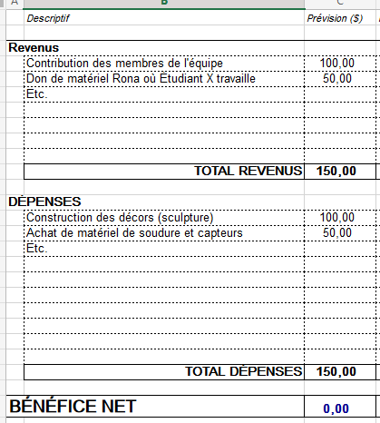

# Préproduction
> C'est ici qu'on dépose les éléments de la préproduction.

> Au besoin, se référer à l'[Appel de projet](https://cmontmorency365.sharepoint.com/:w:/s/TIM-58266B-Expriencemultimdiainteractive-Enseignants/EQ3PqvTQPzFDnpeccqWYOAgBZowMn5-3gtl0I_OxsEGC-Q?e=DuUbuG), au [Plan de cours](https://cmontmorency365.sharepoint.com/:w:/s/TIM-58266B-Expriencemultimdiainteractive-Enseignants/EWLLhctc9WZJiDCSjlMXcFoBA9fMhQRS4PHbGXHCH2Irxw?e=qGOnLf) et à la [Grille d'évaluation de la préprodution](https://cmontmorency365.sharepoint.com/:w:/s/TIM-58266B-Expriencemultimdiainteractive-Enseignants/ETcbkxD6vp1EmhhiZ3Di5_sBZwSyqisa7s3543kMy28dSg?e=gnu6Bt).

# Table des matières
1. [Intention ou concept](#Intention-ou-concept)
    - [Synopsis](#Synopsis)
    - [Intention de départ](#Intention-de-départ)
    - [Tableau d'ambiance (*moodboard*)](#Tableau-d'ambiance-(*moodboard*))
    - [Scénario, scénarimage ou document audio/visuel](#Scénario,-scénarimage-ou-document-audio/visuel)
2. [Contenu multimédia à intégrer](#Contenu-multimédia-à-intégrer)
    - [Inventaire du contenu multimédia](#Inventaire-du-contenu-multimédia)
    - [Univers artistique des éléments](#Univers-artistique-des-éléments-centraux)
3. [Planification technique (devis technique)](#Planification-technique-(devis-technique))
    - [Schémas ou plans techniques](#Schémas-ou-plans-techniques)
    - [Matériaux requis](#Matériaux-requis)
    - [Équipements requis](#Équipements-requis)
    - [Logiciels requis](#Logiciels-requis)
    - [Ressources humaines requises](#Ressources-humaines-requises)
    - [Ressources spatiales requises (rangement et locaux)](#Ressources-spatiales-requises-(rangement-et-locaux))
4. [Planification de la production (budget et étapes de réalisation)](#Planification-de-la-production-(budget-et-étapes-de-réalisation))
    - [Budget prévisionnel](#Budget-prévisionnel)
    - [Échéancier global](#Échéancier-global)
    - [Liste des tâches à réaliser](#Liste-des-tâches-à-réaliser)
    - [Rôles et responsabilités des membres de l'équipe](#Rôles-et-responsabilités-des-membres-de-l'équipe))
    - [Moments des rencontres d'équipe](#Moments-des-rencontres-d'équipe)

# Intention ou concept
## Synopsis
Laurence et Simone demeurent ensemble et s’aiment. Un événement tragique vient bouleverser leur vie de couple. Incapable de se comprendre, ils finissent par se séparer. 

Le public est appelé à découvrir le mystère entourant cette difficile séparation.

## Intention de départ
Par ce projet, nous souhaitons exposer la grande fragilité des relations sociales et amoureuses qui traverse nos vies.

## Tableau d'ambiance (*moodboard*)
> Ajoutez ici une liste d'images, de vidéos, de documents audios ou multimédias qui vous inspirent. Une palette de couleur ainsi qu'un choix de typographie devrait également s'y trouver selon la nature du projet.

> Insérez directement des captures d'écran et liens vers des médias ici.`*

[Exemple de tableaux d'ambiance visuels (images, couleurs, typographie)](https://cmontmorency365.sharepoint.com/sites/TIM-58266B-Expriencemultimdiainteractive-Enseignants/Documents%20partages/Enseignants/hiv2021_expMulti_582-66BMO/4_Contenu/Modeles/tableau_ambiance/1_tableau_ambiance_exemple.pdf)

## Scénario, scénarimage ou document audio/visuel
[Exemple de scénarimage visuel pour vidéo d'animation](https://cmontmorency365.sharepoint.com/sites/TIM-58266B-Expriencemultimdiainteractive-Enseignants/Documents%20partages/Enseignants/hiv2021_expMulti_582-66BMO/4_Contenu/Modeles/scenarimage/storyboard_animation_exemple2.pdf)

# Contenu multimédia à intégrer
## Inventaire du contenu multimédia

- 15 icônes de navigation (pour les utilisateur-trices)
- 8 montages d'image
- 3 paysages sonores
- 5 vidéos d'animation 2d
- 3 textes poétiques
- 7 modules multimédias (ex. captation des données, interprétation des données, contrôle d'éclairage, effets audiovisuels, contrôle vidéo, contrôle de la navigation utilisateur & des diifférents sous-modules, diffusion et interaction en ligne...).
- ...

Pour plus de détails: [Inventaire du contenu à intégrer](https://cmontmorency365.sharepoint.com/sites/TIM-58266B-Expriencemultimdiainteractive-Enseignants/_layouts/15/Doc.aspx?OR=teams&action=edit&sourcedoc={8D242B82-E599-49CF-BE4C-EA9539D2D1C3})

## Univers artistique des éléments
Voir colonne *Exemples de réalisaton* dans l'[Inventaire du contenu à intégrer](https://cmontmorency365.sharepoint.com/sites/TIM-58266B-Expriencemultimdiainteractive-Enseignants/_layouts/15/Doc.aspx?OR=teams&action=edit&sourcedoc={8D242B82-E599-49CF-BE4C-EA9539D2D1C3}).

# Planification technique (devis technique)
## Schémas ou plans techniques
(GUILAUME- Insérer directement des images ici + lien vers un document?)

## Matériaux requis
(GUILAUME- lien vers un onglet d'un fichier excell global portant sur le matériel?)

## Équipements requis
(GUILAUME- lien vers un onglet d'un fichier excell global portant sur le matériel?)

## Logiciels requis
(GUILAUME- lien vers un onglet d'un fichier excell global portant sur le matériel?)

## Ressources humaines requises
(GUILAUME- lien vers un onglet d'un fichier excell global portant sur le matériel?)

## Ressources spatiales requises (rangement et locaux)
(GUILAUME- lien vers un onglet d'un fichier excell global portant sur le matériel?)

# Planification de la production (budget et étapes de réalisation)
## Budget prévisionnel

[Lien vers document](https://cmontmorency365.sharepoint.com/:x:/s/TIM-58266B-Expriencemultimdiainteractive-Enseignants/ERS3zx4iKAlLn03N_0h3cyQBOV_nxNuKvrKnqmrXGcgDYg?e=Rjq9Uc)

## Échéancier global
Étapes importantes du projet visualisé dans GitHub (*milestones*):  
https://github.com/tim-montmorency/66B-modele_de_projet/milestones

## Liste des tâches à réaliser
Visualisation des tâches à réaliser dans GitHub selon la méthode Kanban:  
https://github.com/tim-montmorency/66B-modele_de_projet/projects/2?add_cards_query=is%3Aopen

Inventaire des tâches à réaliser dans GitHub selon le répertoire d'*issues*:  
https://github.com/tim-montmorency/66B-modele_de_projet/issues

## Rôles et responsabilités des membres de l'équipe
> Il vous est proposé ici de nommer une personne à la coordination générale du projet, à la coordination technique, à la coordination de la diffusion et à la coordination artistique. Les grandes décisions sur les grandes orientations du projet devraient se prendre en groupe lors des rencontres d'équipe quotidiennes et hebdomadaires. Cependant, les décisions entre vos rencontres de groupe devraient appartenir à ces personnes.

**Étudiant E**
- Coordination générale du projet (coordination de l'échéancier, du budget, suivi de la liste des tâches à réaliser, s'assurer de la répartition du rôle et des responsabilités des membres de l'équipe);
- Création du module d'interprétation des données;
- Programmation du module Max de contrôle vidéo.

Liste des tâches dans Git Hub:  
https://github.com/tim-montmorency/66B-modele_de_projet/issues/assigned/DarylMomo  
https://github.com/tim-montmorency/66B-modele_de_projet/projects/2?card_filter_query=assignee%3Adarylmomo

**Étudiant D**
- Comité Technique et coordination technique (suivi du devis technique);
- Création des paysages sonores sonores;
- Programmation du module Max d'effet et de contrôle audio;
- Installation de l'équipement dans l'espace physique.

Liste des tâches dans Git Hub:  
https://github.com/tim-montmorency/66B-modele_de_projet/issues/assigned/DarylMomo  
https://github.com/tim-montmorency/66B-modele_de_projet/projects/2?

**Étudiant C**
- Comité Diffusion et coordination de la diffusion (mise en ligne du Site web, organisation de la plateforme et de l'événement de diffusion);
- Installation et mise en place de la capture audiovidéo du projet en temps réel;
- Programmation du module de captation des données;
- Programmation du module de diffusion et d'interaction en ligne (page Web, diffusion vidéo dans Twitch via OBS, interface utilisateur dans Open Stage Control).

Liste des tâches dans Git Hub:  
https://github.com/tim-montmorency/66B-modele_de_projet/issues/assigned/DarylMomo  
https://github.com/tim-montmorency/66B-modele_de_projet/projects/2?

**Étudiant B**
- Coordination artistique (attention plus particulière pour s'assurer que l'intention/concept artistique du projet initial reste, sinon consulter les membres de l'équipe);
- Création des textes poétiques;
- Création des vidéos d'animation 2D;
- Programmation du module Unity d'effets visuels et intégration dans Max.

Liste des tâches dans Git Hub:  
https://github.com/tim-montmorency/66B-modele_de_projet/issues/assigned/DarylMomo  
https://github.com/tim-montmorency/66B-modele_de_projet/projects/2?

**Étudiant A**
- Création des images;
- Création des icones de navigation;
- Programmation du module Max d'éclairage;
- Programmation du module Max de contrôle de la navigation utilisateur & des diifférents sous-modules.

Liste des tâches dans Git Hub:  
https://github.com/tim-montmorency/66B-modele_de_projet/issues/assigned/DarylMomo  
https://github.com/tim-montmorency/66B-modele_de_projet/projects/2?

**Tâches pas encore attribuées**  
https://github.com/tim-montmorency/66B-modele_de_projet/issues?q=is%3Aopen+is%3Aissue+no%3Aassignee

## Moments des rencontres d'équipe
Quotidien
- **Chaque jour 16h30 (*srum* de 30min max)**: Rencontre d'équipe pour régler les urgences

Hebdomadaire
- **Mardis 10h (environ 1h)** : Rencontre d'équipe avec professeur
- **Vendredis 9h50 (environ 2h)** : Rencontre générale de classe
- **Vendredis 13h (environ 2h)** : Rencontre de mise à jour d'équipe 

Autre: 
- **Jeudi 10h (environ 1h30)** : Comité Diffusion
- **Jeudi 13h (environ 1h30)** : Comité Technique