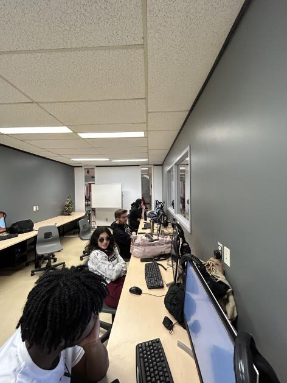
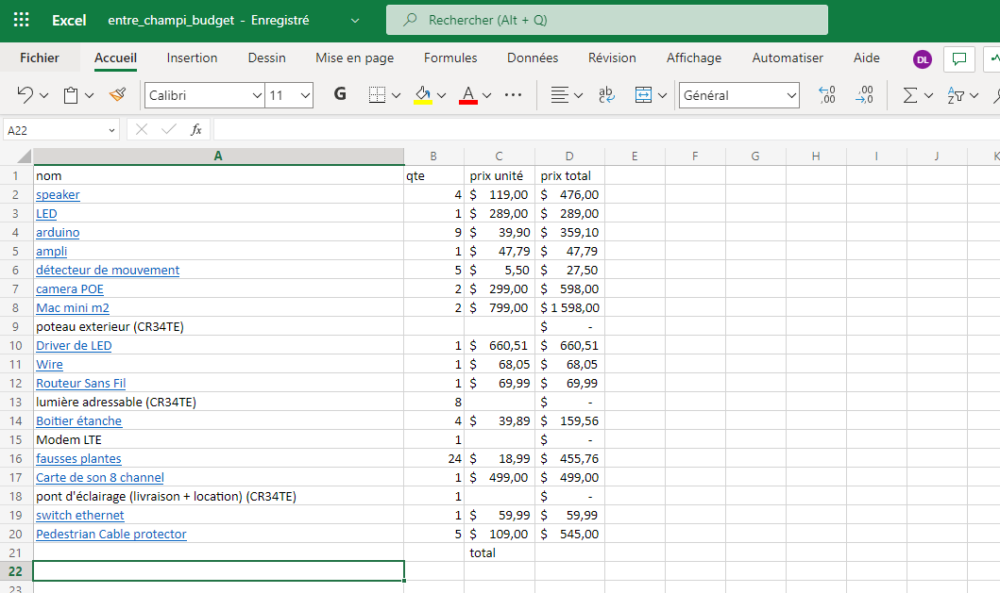

# Journal de création

## Semaine 1
> Contenu personnalisé à remplir par les équipes à chaque semaine faisant part du processus de création: résumé des réalisations d'équipe effectuées et des défis rencontrés sous forme d'un texte; ajout de vidéos, images, documents audios ou de contenu multimédia.)

Tout d'abord, ce retour en classe nous a permis d'effectuer plusieurs réunions d'équipe, entre nous et avec les professeurs, afin de réorganiser nos idées et redéfinir nos priorités par rapport au projet. 

Par la suite, nous devons réarranger notre préproduction. En effet, suite aux changements de directions par rapport à notre projet, beaucoup d'équipements et d'installations que nous avions prévu s'en retrouvent altérés. Nous avons refait une liste de notre budget et de nos besoins de matériel en tenant compte de ce que cr34te peut nous offrir. (Pas final)

Nous avons prévu de tourner la vidéo de présentation de préproduction dans le weekend à venir, il faut donc une préproduction complète à temps. 

Nous avons bien hâte d'avoir accès à des échantillons du matériel de cr34te!

## Semaine 2

## Semaine 3

## Semaine 4

## Semaine 5

## Semaine 6

## Semaine 7

## Semaine 8

## Semaine 9

