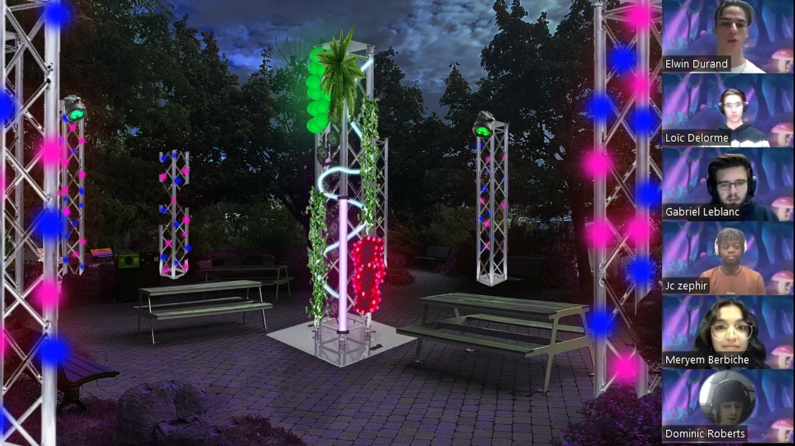
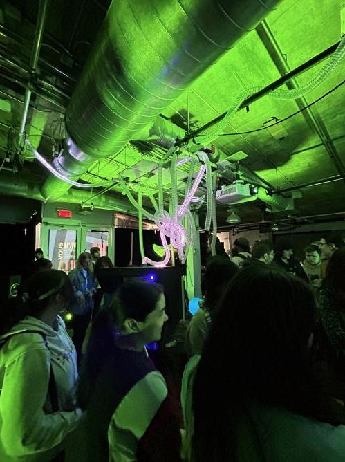
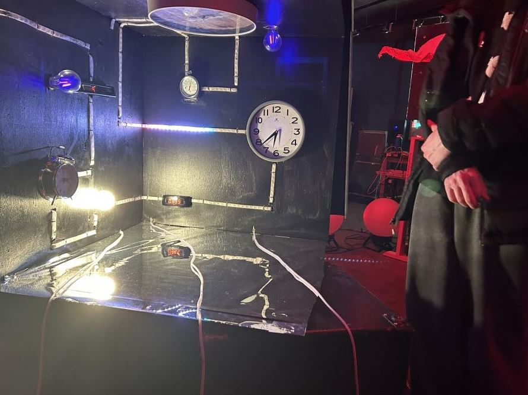
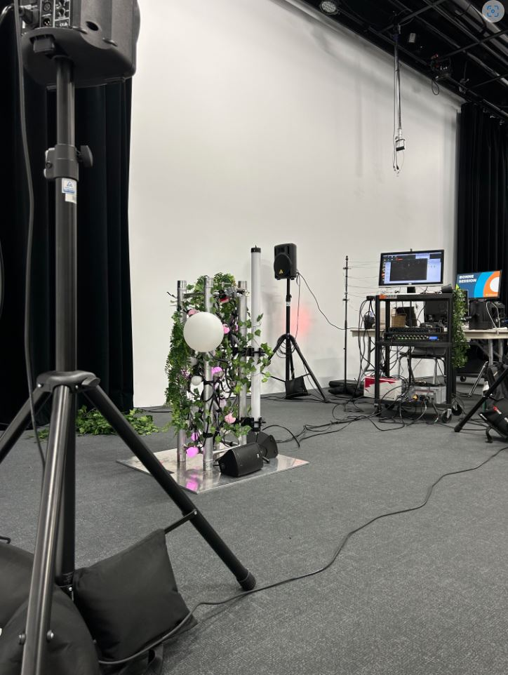

# Journal de création

## Semaine 1
> Contenu personnalisé à remplir par les équipes à chaque semaine faisant part du processus de création: résumé des réalisations d'équipe effectuées et des défis rencontrés sous forme d'un texte; ajout de vidéos, images, documents audios ou de contenu multimédia.)

Tout d'abord, ce retour en classe nous a permis d'effectuer plusieurs réunions d'équipe, entre nous et avec les professeurs, afin de réorganiser nos idées et redéfinir nos priorités par rapport au projet. 

Par la suite, nous devons réarranger notre préproduction. En effet, suite aux changements de directions par rapport à notre projet, beaucoup d'équipements et d'installations que nous avions prévu s'en retrouvent altérés. Nous avons refait une liste de notre budget et de nos besoins de matériel en tenant compte de ce que cr34te peut nous offrir. (Pas final)

Nous avons prévu de tourner la vidéo de présentation de préproduction dans le weekend à venir, il faut donc une préproduction complète à temps. 

Nous avons bien hâte d'avoir accès à des échantillons du matériel de cr34te!

## Semaine 2

Cette semaine a été riche en rebondissements. En premier lieu, nous avons changé la façon dont notre interactivité allait marcher. L'idée de la structure centrale semble promettante, et simplifie notre projet. 

En 2e lieu, nous avons refait la vidéo de présentation de la préproduction. Suite aux commentaires des professeurs sur la première, cette 2e vidéo est plus précise et concise. Elle devrait bien permettre à n'importe qui de comprendre la direction de notre projet.

En 3e lieu, les équipes d'intégration ainsi que d'installations ont réalisé des schémas/scénarimages détaillés. Ces réalisations donnent vraiment une idée claire du déroulement de l'expérience.

Le budget est assez complet, nous attendons donc les échantillons de cr34te afind de pouvoir jouer avec. La grande majorité des préparatifs sont terminés, nous pourrons normalement commencer la production la semaine prochaine.

## Semaine 3

Cette semaine nous a permis de commencer la production concrète de notre projet. D'abord, nous avons rendu visite aux étudiants de l'UQAM. L'objectif était d'observer les avancées des projets tout en révélant les notres, avec les videos de préproduction que nous avions préparé.

Par la suite, nous avons effectué des rencontres en groupe et individuelles avec Elwin. Nous manquions d'échéanciers précis, et chaque membre de l'équipe possède des dealines qui leur sont propres. Afin de rendre le processus clair, un échéancier global a été établi. 

Suite à cela, il était normalement prévu d'aller chercher des échantillons chez cr34te jeudi 9 Février, mais la sortie n'a pas pu se faire suite suite à un manque de communication de la compagnie. La team d'intégration a commencé a tester des médias sur les logiciels importants, comme madmapper par exemple. 

Nous espérons vraiment avoir accès à du matériel de cr34te pour la semaine prochaine, la team d'installation en a vraiment besoin. Autre que ça, nous avançons bien, et chacun s'attelle à ses tâches respectives. 
## Semaine 4

Cette semaine, nous avons reçu des exemplaires de matériel de cr34te. Cependant, le matériel ne nous est prêté que pour 1 semaine (donc à remettre lundi 20 février). Nous nous sommes donc activés afin de délivrer un prototype d'installation et d'interactivité pour le vendredi 17 février. Chacun s'est concentré sur ses tâches respectives, et le résultat final a donné un résultat satisfaisant, même avec cette limite de temps conçernant le matériel. 

Pour la team d'installation, Dominic, Loic et Elwin se sont attelés à simuler le poteau central qui servira de support pour l'interactivité. La structure fait environ le 2/5 de la taille finale que nous utiliserons, et les speakers sont également disposés aux alentours. Nous avons également ajouté des fausses plantes pour avoir un aperçu esthétique du poteau.

Pour la team d'intégration, les médias sont en train de se créer et avancent a bon rythme. Nous avons pu en tester quelques uns pour le prototype.
La liaison puredata entre les données captées par les sensors et le logi9 permet au utilisateurs de bien être détectés lorsque quelqu'un se place devant le sensor. 

Certains agencements de lumière on été changés en cours de route afin de rendre la structure centrale plus belle esthétiquement parlant (elle peut paraitre surchargée lorsque toutes les lumières sonmt ouvertes en même temps). 

Les animations de lumière avancent à bon rythme en accordance avec les sons qui sont créés. Chaque animation de lumière dépend de l'ambiance sonore, nous essayons donc de toujours garder en tête l'influence qu'aura le son dans la scène.

Pour la semaine prochaine, nous devrons rendre la mtériel qui nous a servi de prototype. La team d'installation commencera les plans détaillés qui serviront de référence pour cr34te lorsqu'ils viendront installer le matériel. Pour la team d'intégration, il s'aggira d'avancer les médias le plus possible afin de couvrir les différentes phases Sommeil-Éveil-Climax. 

Nous aurons également des présentations à faire dans le cadre de la technique. Nos tests ont été plutôt concluants, nous saurons expliquer en détail les divers méchanismes et interactions entre les différentes technologies présentes dans Edria.
## Semaine 5

## Semaine 6

## Semaine 7

## Semaine 8

## Semaine 9

