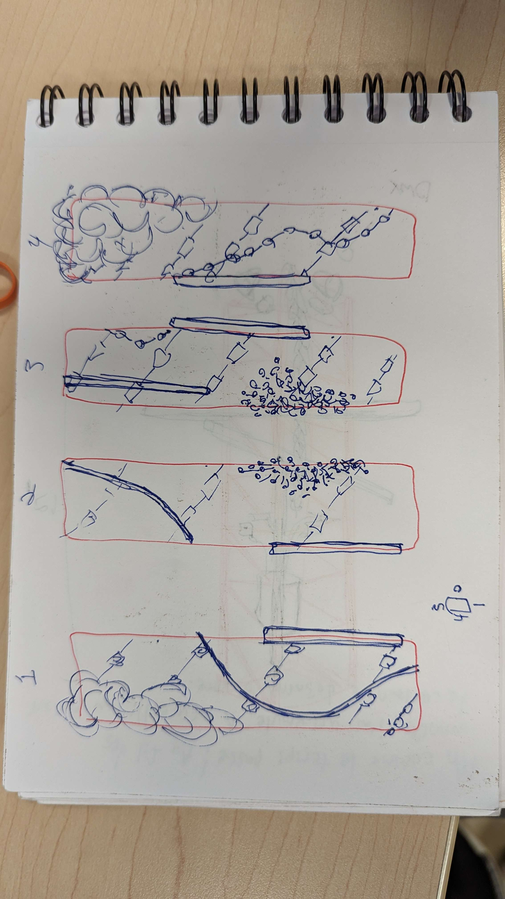
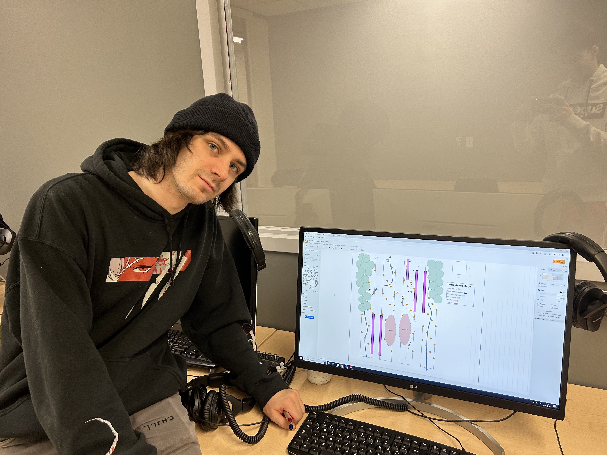
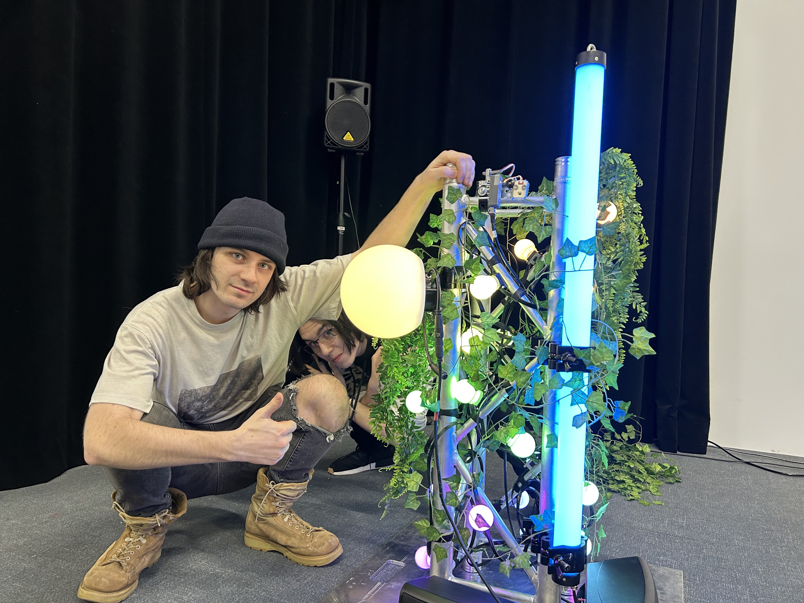
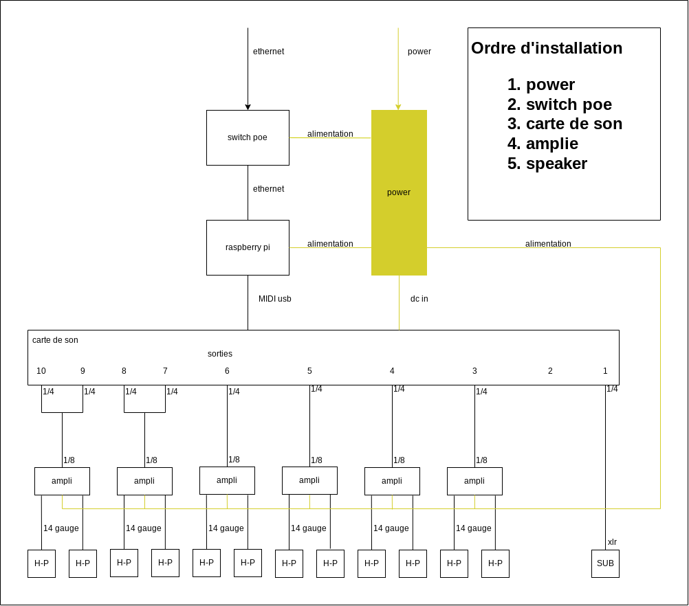

# Journal de "Dominic Roberts"

* [Semaine 1](#semaine-1)
* [Semaine 2](#semaine-2)
* [Semaine 3](#semaine-3)
* [Semaine 4](#semaine-4)
* [Semaine 5](#semaine-5)
* [Semaine de rattrapage](#semaine-de-rattrapage)
* [Semaine 6](#semaine-6)
* [Semaine 7](#semaine-7)
* [Semaine 8](#semaine-8)
* [Semaine 9](#semaine-9)

## Semaine 1

### Résumé des réalisations effectuées
- Faire le lien entre le journal .html et .md
- Rencontre sur l'attraction du projet. Conclusion: nous avons décidé d'utiliser le poteau du milieu comme baromètre qui compte le nombre de personne dans l'installation, et les poteaux extérieurs pour faire de l'interactivité avec le sensor qui détecte l'arrivée et le départ des utilisateurs. 
- Rencontre comité technique. Conclusion: nous avons décidé de centraliser l'interactivité du projet. Les lumières et le son à partir d'un ordinateur placé dans une petite cabane situé à l'extérieur de l'installation, et nous allons faire passer les fils par terre à l'aide de passe-fils.
- Réalisation schéma de branchage centralisé

### Image d'une réalisation dont tu es la ou le plus fier

### Est-ce que j'ai accompli l'ensemble des tâches et objectifs que je m'étais fixés pour cette semaine?	
- [ ] Complètement
- [x] Assez
- [ ] Peu
- [ ] Pas du tout

#### Décrivez pourquoi.
Les incertitudes restante sur les enjeux techniques relié à notre installation ont été répondu, et nous avons rectifié notre préprod.  

### Mon projet s'est-il réalisé selon l’échéancier prévu?

- [ ] Complètement
- [x] Assez
- [ ] Un peu
- [ ] Pas tout à fait

#### S'il y a des écarts, décrivez-les.
Il n'y a pas d'écart à proprement parler, mais nous avons passé beaucoup de temps à répondre à des questions auxquelles nous aurions dû penser la session dernière, pour pouvoir commencer le projet solidement.  

#### S'il y a lieu, qu'allez-vous faire pour remédier à la situation?
Nous avons su cerner les enjeux problématiques de notre projet et avons posé des questions pertinentes reliées à ces dits enjeux et avons fait les ajustements nécessaires.

### Défis pour la prochaine semaine
Les défis de la prochaine semaine seront de s'assurer que nous allons avoir le matériel nécessaire au déployement de notre installation.

---
## Semaine 2
### Résumé des réalisations effectuées
- Rencontre d'équipe mardi le 31 janvier. Conclusion: nous avons décidé de se concentrer sur le poteau central. Nous allons garder les poteaux extérieurs pour donner une ambiance, mais ces-derniers ne seront dotés d'aucun détecteur de mouvement. Les poteaux extérieur n'auront qu'une bande LED, des fausses plantes en décoration, et les haut-parleurs. Les amplificateurs nécessaires seront situés dans notre cabine à l'extérieur de l'installation. Tout les éléments intéractifs seront sur le poteau central. Le seul capteur utilisé sera un détecteur de distance.
- Sélection des fausses plantes pour la décoration des poteaux
- Schéma de connection général
- Design du poteau central
- Liste de matériel à acheter et location

### Image d'une réalisation dont tu es la ou le plus fier

### Est-ce que j'ai accompli l'ensemble des tâches et objectifs que je m'étais fixés pour cette semaine?

- [ ] Complètement
- [x] Assez
- [ ] Peu
- [ ] Pas du tout

#### Décrivez pourquoi.
 Nous avons accompli la majorité des tâches en lien avec l'installation. Il nous restera plusieurs tests à faire avec l'équipement, mais nous avons réussi à lister de façon exhaustive les composantes nécessaire à la réalisation de notre projet.

#### S'il y a lieu, qu'allez-vous faire pour remédier à la situation?
Éventuellement, nous allons devoir faire un schéma précis du branchement de chaque poteau, mais nous devons, de prime à bord, confirmer à 100% le schéma de branchement général. 

### Mon projet s'est-il réalisé selon l’échéancier prévu?

- [ ] Complètement
- [x] Assez
- [ ] Un peu
- [ ] Pas tout à fait

#### S'il y a des écarts, décrivez-les.
Nous avons terminé tout ce que nous devions faire pour passer à la prochaine étape de notre projet.
Nous devons impérativement recevoir des échantillons et commencer nos tests la semaine prochaine.

#### S'il y a lieu, qu'allez-vous faire pour remédier à la situation?
Nous avons terminé les listes de matériels. Nous sommes donc prêts à commander des échantillons.

### Défis pour la prochaine semaine
Amener à complétion les différents tests nécessaires à la réalisation de notre installation.

---
## Semaine 3 
### Résumé des réalisations effectuées
 - Derniers petits ajustements au budget
 - Rencontre avec Daryl (08/02/2023), conclusion: centralisation dans le studio. Pour le son, quatre haut-parleurs au centre plus huit autour.
 - Schéma détaillé du poteau central et ordre de montage.
 - Rencontre avec Elwin: liste des dates importantes pour mon échéancier.
 - Recherche pure data

### Image d'une réalisation dont tu es la ou le plus fier

### Est-ce que j'ai accompli l'ensemble des tâches et objectifs que je m'étais fixés pour cette semaine?

- [ ] Complètement
- [ ] Assez
- [x] Peu
- [ ] Pas du tout

#### Décrivez pourquoi.
Malheureusement, nous n'avons pas pu aller chez cr34te pour prendre des échantillons, alors je n'ai pas pu commencer mes tests.  Malgré tout, j'ai pu mettre du temps pour me familiariser avec pure data, ce qui sera utile lors de l'intégration.

#### S'il y a lieu, qu'allez-vous faire pour remédier à la situation?
Je m'assure de me trouver des tâches que je peux faire pour que mon équipe ne prenne pas de retard. 

### Mon projet s'est-il réalisé selon l’échéancier prévu?

- [ ] Complètement
- [x] Assez
- [ ] Un peu
- [ ] Pas tout à fait

#### S'il y a des écarts, décrivez-les.
Dû à certaines découvertes récentes, nous allons centraliser notre projet dans le studio. Ceci me force à revisiter le schéma de branchement. Heureusement, les changements sont assez mineurs.

#### S'il y a lieu, qu'allez-vous faire pour remédier à la situation?
Je garde mes anciens schémas de branchement, dans l'idée d'en avoir un pour toutes les possibilités possibles, et avoir des back-up au cas où nous devrions étrangement nous adapter une énième fois. 

### Défis pour la prochaine semaine

---
## Semaine 4
### Résumé des réalisations effectuées
- Récupération des échantillons chez cr34te (14/02/2023)
- Installation du dot string (festoon), tube Opal et boule 200mm sur le pont d'éclairage [test matériel] conclusion: nous devons nous procurer des clamps et des zip ties pour installer efficacement les différentes lumières. (14/02/2023)
- Connection des différentes composantes allant se trouver dans le cabanon sur un chariot. (15/02/2023)
- Installation des speakers sur notre prototype. (16/02/2023)
- Test des haut-parleurs. Conclusion: nous avons réussi à faire fonctionner les haut-parleurs Dual, les haut-parleurs externes et le subwoofer. Nous aurons besoin d'un deuxième cabanon pour le sub. 

### Image d'une réalisation dont tu es la ou le plus fier

### Est-ce que j'ai accompli l'ensemble des tâches et objectifs que je m'étais fixés pour cette semaine?

- [x] Complètement
- [ ] Assez
- [ ] Peu
- [ ] Pas du tout

#### Décrivez pourquoi.
Je pense que nous avons accompli la majorité des tests possible en ce qui concerne l'installation physique des lumières sur le pont d'éclairage (conclusion: voir réalisation de la semaine).  

#### S'il y a lieu, qu'allez-vous faire pour remédier à la situation?
n/a

### Mon projet s'est-il réalisé selon l’échéancier prévu?

- [ ] Complètement
- [x] Assez
- [ ] Un peu
- [ ] Pas tout à fait

#### S'il y a des écarts, décrivez-les.
Ce n'est pas un écart, mais nous devons retourner les échantillons de cr34te lundi, alors nous n'avons pas beaucoup de temps pour se familiariser avec le matériel que nous allons utiliser pour le produit final.  

#### S'il y a lieu, qu'allez-vous faire pour remédier à la situation?

### Défis pour la prochaine semaine
Mon objectif principal pour la semaine prochaine sera de créer un plan de déploiement complet et détaillé en préparation de la journée du 13 mars 2023, quand cr34te va venir installer le matériel. 

---
## Semaine 5
### Résumé des réalisations effectuées
- Schéma de branchement pour les composantes audio de l'installation. 
- Schéma d'installation des hauts-parleurs
- Finalisation de la liste de matériel 

### Image d'une réalisation dont tu es la ou le plus fier

### Est-ce que j'ai accompli l'ensemble des tâches et objectifs que je m'étais fixés pour cette semaine?

- [ ] Complètement
- [x] Assez
- [ ] Peu
- [ ] Pas du tout

#### Décrivez pourquoi.
 J'ai fait tous les test que je pouvais faire avec le matériel que j'ai pour le moment et j'ai commencé les schémas d'installation. De plus, nous avons réussi à faire un prototype fonctionnel avec deux capteurs.

#### S'il y a lieu, qu'allez-vous faire pour remédier à la situation?

### Mon projet s'est-il réalisé selon l’échéancier prévu?

- [ ] Complètement
- [x] Assez
- [ ] Un peu
- [ ] Pas tout à fait

#### S'il y a des écarts, décrivez-les.
Je n'ai pas pu tester certaines technologies comme les dmx pixel 5v ou bien avoir plusieurs boules 200mm à la fois.
Les capteurs TOF ne sont pas étanches, alors nous allons probablement les changer pour des capteurs de recule d'automobile. 
Nous allons avoir la nécessité d'acquérir un connecteur 4 broches à 5 broches pour connecter les fixture colordash au cr34te 8 node.

#### S'il y a lieu, qu'allez-vous faire pour remédier à la situation?
Ces problèmes sont mineurs pour le moment puisqu'il nous reste encore du temps pour les régler. Cependant, plus nous les réglons rapidement, moins ils grossissent.   

### Défis pour la prochaine semaine
Mon défi pour la semaine prochaine sera de simuler le rack extérieur dans un chariot avec le nouveau système artnet que cr34te nous a prêté.
Peut-être essayer de monter les haut-parleurs Dual sur les supports que nous utilisons pour simuler nos poteaux extérieurs dans notre prototype.

---
## Semaine de rattrapage
### Résumé des réalisations effectuées
- Réorganisation du prototype du rack extérieur pour inclure le nouveau module artnet.
- Installation des haut-parleurs Dual sur les poteaux ext. de notre prototype.
- Gestion des câbles
- Essai de la gaine pour les bundles de fils.
- Création de schémas de branchement détaillé pour les différents modules du rack ext.
- Peinture sur les fausses plantes.

### Image d'une réalisation dont tu es la ou le plus fier

### Est-ce que j'ai accompli l'ensemble des tâches et objectifs que je m'étais fixés pour cette semaine?

- [x] Complètement
- [ ] Assez
- [ ] Peu
- [ ] Pas du tout

#### Décrivez pourquoi.
 J'ai réalisé tous les défis que je m'étais donné pour cette semaine et même plus.

#### S'il y a lieu, qu'allez-vous faire pour remédier à la situation?
n/a

### Mon projet s'est-il réalisé selon l’échéancier prévu?

- [x] Complètement
- [ ] Assez
- [ ] Un peu
- [ ] Pas tout à fait

#### S'il y a des écarts, décrivez-les.

#### S'il y a lieu, qu'allez-vous faire pour remédier à la situation?

### Défis pour la prochaine semaine
Dépendemment de ce qu'il va être possible pour moi de réaliser la semaine prochaine, j'aimerais soit commencer l'installation des modules dans le vrai rack ext., soit faire l'installation et les schémas de branchement détaillés des systèmes pour les capteurs, et si j'ai le temps, avoir terminé tout ce qui est DA sur le prototype.

---
## Semaine 6
### Résumé des réalisations effectuées
- Installation des car sonar sur le prototype
- Branchement des modules dans le rack extérieur
- Déneigement
- Création de schéma détaillé pour les boitier étanche et les capteurs

### Image d'une réalisation dont tu es la ou le plus fier

### Est-ce que j'ai accompli l'ensemble des tâches et objectifs que je m'étais fixés pour cette semaine?

- [x] Complètement
- [ ] Assez
- [ ] Peu
- [ ] Pas du tout

#### Décrivez pourquoi.
Quand je suis arrivé mardi, Antoine avait déjà installé quelques modules dans le rack ext. et j'ai réussi à accomplir le restant des tâches que je m'étais assigné.

#### S'il y a lieu, qu'allez-vous faire pour remédier à la situation?
n/a

### Mon projet s'est-il réalisé selon l’échéancier prévu?

- [ ] Complètement
- [x] Assez
- [ ] Un peu
- [ ] Pas tout à fait

#### S'il y a des écarts, décrivez-les.
Dépendemment de ce que je vais pouvoir faire demain et du temps que mes collègues auront besoin pour terminer leurs tests, j'aimerais avoir démonté le prototype et être prêt à déployer pour mardi matin. 

#### S'il y a lieu, qu'allez-vous faire pour remédier à la situation?
n/a

### Défis pour la prochaine semaine
Déployer lol xD ptdr lmfao

---
## Semaine 7
### Résumé des réalisations effectuées
- Installation des poteaux ext. et central
- Cablage entre les différent poteaux
- Installation des technologies sur les poteaux
- Installation des speakers sur les poteaux
- Cable management dans le cabanon extérieur
- Installation des capteurs
- Direction Artistique

### Image d'une réalisation dont tu es la ou le plus fier

### Est-ce que j'ai accompli l'ensemble des tâches et objectifs que je m'étais fixés pour cette semaine?

- [x] Complètement
- [ ] Assez
- [ ] Peu
- [ ] Pas du tout

#### Décrivez pourquoi.
 Tout à été installé et fonctionnel à temps

#### S'il y a lieu, qu'allez-vous faire pour remédier à la situation?

### Mon projet s'est-il réalisé selon l’échéancier prévu?

- [x] Complètement
- [ ] Assez
- [ ] Un peu
- [ ] Pas tout à fait

#### S'il y a des écarts, décrivez-les.

#### S'il y a lieu, qu'allez-vous faire pour remédier à la situation?

### Défis pour la prochaine semaine

## Semaine 8

## Semaine 9
