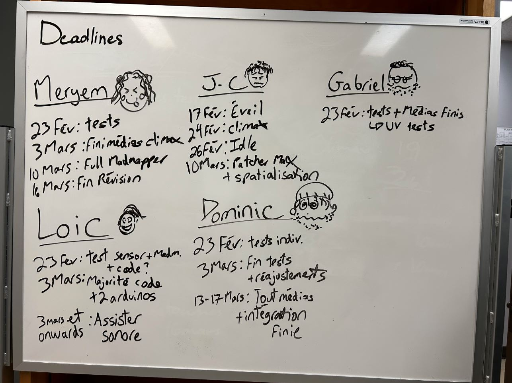
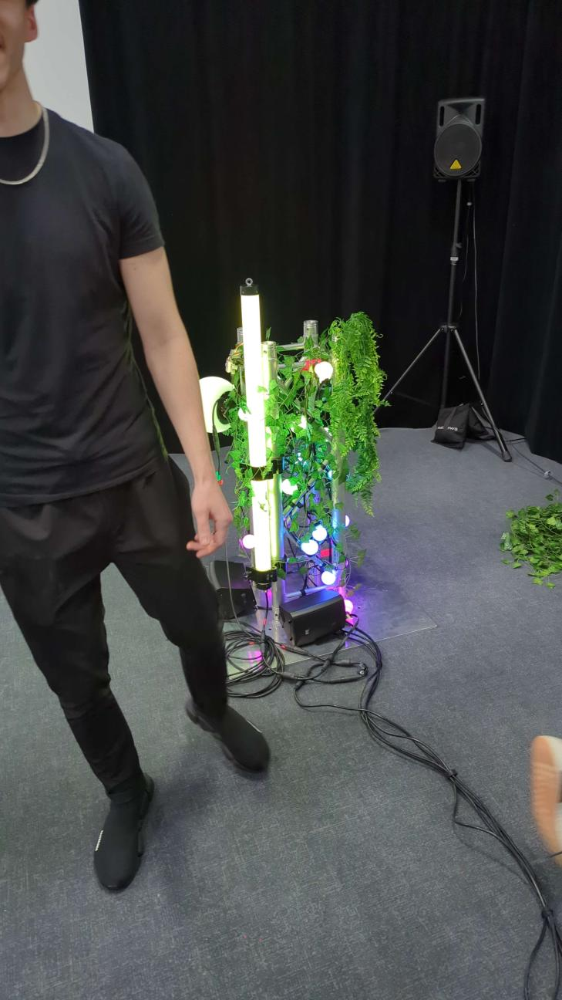
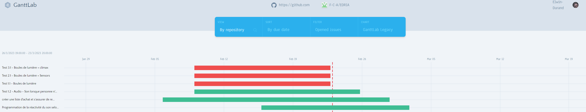

# Journal de "Elwin Durand"

* [Semaine 1](#semaine-1)
* [Semaine 2](#semaine-2)
* [Semaine 3](#semaine-3)
* [Semaine 4](#semaine-4)
* [Semaine 5](#semaine-5)
* [Semaine de rattrapage](#semaine-de-rattrapage)
* [Semaine 6](#semaine-6)
* [Semaine 7](#semaine-7)
* [Semaine 8](#semaine-8)
* [Semaine 9](#semaine-9)

## Semaine 1

### Résumé des réalisations effectuées

-Ajustements de plusieurs aspects github

-Ajustements de la préproduction

-Représentants Comité Diffusion et le Comité Technique déterminés

-Mise en ligne du journal d'équipe

### Image d'une réalisation dont tu es la ou le plus fier

### Est-ce que j'ai accompli l'ensemble des tâches et objectifs que je m'étais fixés pour cette semaine?	
- [ ] Complètement
- [x] Assez
- [ ] Peu
- [ ] Pas du tout

#### Décrivez pourquoi.
Étant donné que c'est la première semaine, il y a beaucoup de planification à faire et les tâches importantes ne sont pas encore amorçées. Cependant, je me dois de rester au courant de toutes les avancées et changements de l'équipe.

#### S'il y a lieu, qu'allez-vous faire pour remédier à la situation?
Pour l'instant, continuer à faire ce que je fais. 

### Mon projet s'est-il réalisé selon l’échéancier prévu?

- [ ] Complètement
- [ ] Assez
- [x] Un peu
- [ ] Pas tout à fait

#### S'il y a des écarts, décrivez-les.
Et bien, nous n'avons pas des échantillons de l'équipement qui nous servira à la réalisation du projet. Une liste de matériel doit être créée afin de pouvoir déterminer l'équipement nécessaire. Nos pourrons ensuite commander le reste en plus grande quantité.
#### S'il y a lieu, qu'allez-vous faire pour remédier à la situation?
M'occuper des tâches administratives en étant le plus à jour possible (en temps réel). 

### Défis pour la prochaine semaine
Tenter d'avoir le github complètement à jour, avec la liste de matériel prête à être envoyée. 

---
## Semaine 2
### Résumé des réalisations effectuées

- Changements majeurs pour l'installation, le poteau central occupera une importance plus grosse et sera le centre de l'attention
- Mise à jour complète de la préproduction
- Journal de l'équipe
- Tournage de la vidéo de présentation de la préproduction
- Rencontre commité communication

### Image d'une réalisation dont tu es la ou le plus fier

Il s'agit ici de la rencontre qui a changé la direction de notre projet. Nous étions plutôt productifs, et nous avions les professeurs pour juger de nos idées.
### Est-ce que j'ai accompli l'ensemble des tâches et objectifs que je m'étais fixés pour cette semaine?

- [ ] Complètement
- [x] Assez
- [ ] Peu
- [ ] Pas du tout

#### Décrivez pourquoi.
 
 Oui, dans l'ensemble, le github est oas mal à jour, les seuls changements qui pourraient occurer concernent les difficultés que nous pourrions rencontrer au fur et à mesure que la team installation et la team intégration avancent. Ces incertitudes font en sorte que je m'octroie la note assez.

#### S'il y a lieu, qu'allez-vous faire pour remédier à la situation?

Pour l'instant,pas grand chose, si ce n'est s'en tenir aux échéanciers et régler les problèmes au fur et à mesure qu'ils arrivent (ne pas les laisser s'accumuler car je crois qu'ils seront réglés à l'avenir)

### Mon projet s'est-il réalisé selon l’échéancier prévu?

- [ ] Complètement
- [x] Assez
- [ ] Un peu
- [ ] Pas tout à fait

#### S'il y a des écarts, décrivez-les.

Il n'y a pas vraiment eu d'écart pour le moment, il s'agit plutôt d'avoir toutes les ressources et références nécessaire maintenant afin de pouvoir avancer rapidement lors de l'installation et de l'intégration. Les rencontres des comités se sont montrées productives et efficaces.

#### S'il y a lieu, qu'allez-vous faire pour remédier à la situation?

Toujours resté up to date dans les micro échéanciers que nous nous donnons et, si possible, poser des questions aux professeurs lors d'incertitudes. Ils donnent toujours de bons conseils, il est donc judicieux d'aller les voir souvent. 

### Défis pour la prochaine semaine
Liste de matériel et commande amazon envoyée définitevement. Il faut également que la préproduction soit complète pour l'UQAM. Si possible, avoir des échantillons/prototypes de matériel ou de médias (ex: demander à jean-christophe zephir de réaliser des tests de son.)

---
## Semaine 3 
### Résumé des réalisations effectuées
-Rencontres individuelles et en groupe afin d'établir un échéancier qui devrait arranger tout le monde pour les prochaines semaines
-Visite à l'UQAM et Présentation de notre projet
-Préproduction terminée
-Comité communication: Mon texte est apprécié
-Amélioration du github avec des milestones plus spécifiques par rapport aux issues

### Image d'une réalisation dont tu es la ou le plus fier

### Est-ce que j'ai accompli l'ensemble des tâches et objectifs que je m'étais fixés pour cette semaine?

- [ ] Complètement
- [x] Assez
- [ ] Peu
- [ ] Pas du tout

#### Décrivez pourquoi.
 L'ensemble des tâches me conçernant sont concluantes. Cependant, celles qui sont hors de notre contrôle sont difficiles à évaluer, majoritairement conçernant cr34te. Nous n'aurons pas réussi à avoir des échantillons de leur matériel cette semaine, ce n'est pas bien grave mais il faudra les obtenir le plus tôt possible. Les listes de matériel devraient être envoyées sous peu.

#### S'il y a lieu, qu'allez-vous faire pour remédier à la situation?
Avancer le plus possible avec les choses qui sont sous notre contrôle. La team d'intégration est bien partie de ce côté, et la création de médias suit son cours.

### Mon projet s'est-il réalisé selon l’échéancier prévu?

- [ ] Complètement
- [x] Assez
- [ ] Un peu
- [ ] Pas tout à fait

#### S'il y a des écarts, décrivez-les.
Pas d'écart de mon côté, si ce n'est que la visite chez cr34te n'a pas pu se faire.

#### S'il y a lieu, qu'allez-vous faire pour remédier à la situation?
Avancer le plus possible avec ce qui ne concerne pas les éléments extérieurs.

### Défis pour la prochaine semaine
Commencer à jouer avec de l'équipement d'installation si possible, et avoir des médias de prêt pour la présentation des 1ere année.
---
## Semaine 4
### Résumé des réalisations effectuées
-Aide générale d'installation (cable management, agencement des technologies ensemble)
-Documentation des avancées de prototype de l'équipe
-Devoirs du comité communication 

### Image d'une réalisation dont tu es la ou le plus fier

### Est-ce que j'ai accompli l'ensemble des tâches et objectifs que je m'étais fixés pour cette semaine?

- [ ] Complètement
- [x] Assez
- [ ] Peu
- [ ] Pas du tout

#### Décrivez pourquoi.
 J'aurais tendance à dire assez, cependant, nous avons commencé la production d'un prototype quand même fonctionnel cette semaine, étant donné que cr34te ne nous donne du matériel que pour 1 semaine. J'aide donc Dominic en installation, mais je ne peux aider qu'aux petites tâches, étant donné que nous sommes pressés d'avoir un prototype qui fonctionne, même s'il parait ''bootleg''. Nous devons donc lier le peu de médias que nous avons avec l'équipement qui arrivera plus tard.

#### S'il y a lieu, qu'allez-vous faire pour remédier à la situation?

Personellement, je n'ai pas de problème à régler en tant que tel. Après les essais de prototypage, les milestones commenceront à s'atteindre. Je continuerai de faire de la documentation et d'aider en installation lorsque nos tests seront concluants et que nous aurons une bonne idée claire de l,ensemble de l'installation.

### Mon projet s'est-il réalisé selon l’échéancier prévu?

- [ ] Complètement
- [x] Assez
- [ ] Un peu
- [ ] Pas tout à fait

#### S'il y a des écarts, décrivez-les.

La team intégration s'active dans la création de leurs médias. Normalement ils devraient être dans les temps, et nous transfèrent ce qu'ils ont réalisés au fur et à mesure pour que nous fassions des tests en installation. Nous avons un prototype plutôt satisfaisant, et nous aurons donc des bonnes explications à donner aux 1ere années la semaine prochaine.

#### S'il y a lieu, qu'allez-vous faire pour remédier à la situation?
Continuer d'expérimenter le plus possible dans nos délais.

### Défis pour la prochaine semaine
-Avoir un logo pour l'équipe (comité communication)
-Avoir un prototype bien complet
-Avancer les issues/milestones de github
-Mardi participer au tournage de 2square afin de promouvoir/expliquer notre projet
-Jeudi/Vendredi Montrer tout le processus de création de notre projet aux 1ere années

---
## Semaine 5
### Résumé des réalisations effectuées
- Comité communication, Confection d'un logo, synopsis et intention ainsi que texte d'invitation
- GantLab chart
- Tournage de 2square et Présentation aux 1ere années
- Prototype plutôt complet

### Image d'une réalisation dont tu es la ou le plus fier

### Est-ce que j'ai accompli l'ensemble des tâches et objectifs que je m'étais fixés pour cette semaine?

- [ ] Complètement
- [x] Assez
- [ ] Peu
- [ ] Pas du tout

#### Décrivez pourquoi.
 J'ai effectué les tâches que je m'étais données. Cependant, le gantlab que j'ai réalisé est moyennement clair, il y a beaucoup de barres qui font penser à des blocs, ce qui indique pas trop les objectifs de chaque semaine. Soit il faudrait changer ça par personne, ou demander à Daryl une autre façon d'organiser cela. Notre prototype de la semaine passée était bien complet, cette semaine je n'ai pas mal participé qu'à des retouches et ajustements en fonction du matériel que nous recevons au fur et à mesure.

#### S'il y a lieu, qu'allez-vous faire pour remédier à la situation?
Tenter de prendre plus d'initiatives de moi-même ainsi que me faire expliquer par Dominic les schémas d'installation qu'il réalise. Trouver une manière de rendre le gantlab plus lisible ou bien de trouver un autre site/logiciel.

### Mon projet s'est-il réalisé selon l’échéancier prévu?

- [x] Complètement
- [ ] Assez
- [ ] Un peu
- [ ] Pas tout à fait

#### S'il y a des écarts, décrivez-les.
Cette semaine pour moi oui. Cependant, certaines tâches assignées aux autres coéquipier peuvent prendre du retard, par exemple pour le son. Cela pourrait décaler les deadline et changer les dates pour le github.

#### S'il y a lieu, qu'allez-vous faire pour remédier à la situation?
Comme d'habitude, garder le github à jour.

### Défis pour la prochaine semaine

- Continuer de participer pour l'installation, il y a toujours des ajustements et des test de matériel à faire
- AVoir un gant ou autre système de calendrier plus clair
---
## Semaine de rattrapage
### Résumé des réalisations effectuées

-Aide pour l'installation (nouveaux sensors de voiture, Ajout de tous les speakers, etc.)

-Bannière pour le site Web(?)

-Avancées du github (issues, milestones, etc)

### Image d'une réalisation dont tu es la ou le plus fier

### Est-ce que j'ai accompli l'ensemble des tâches et objectifs que je m'étais fixés pour cette semaine?

- [ ] Complètement
- [x] Assez
- [ ] Peu
- [ ] Pas du tout

#### Décrivez pourquoi.
 
 J'ai pas mal focus sur l'installation avec dominic, tout en accomplissant des tâches différentes de ce que je fais d'habitude (comme percer des trous dans les supports des speakers afin d'y faire rentrer des boulons). Je n'ai pas réfléchi à d'autre moyens de faire un agenda, rendu loin dans le projet comme nous le sommes en ce moment, tout le monde sait exactement quoi faire chaque semaine.

#### S'il y a lieu, qu'allez-vous faire pour remédier à la situation?

Toujours tenter de sortir de ma zone de confort et d'en apprendre plus. 

### Mon projet s'est-il réalisé selon l’échéancier prévu?

- [ ] Complètement
- [x] Assez
- [ ] Un peu
- [ ] Pas tout à fait

#### S'il y a des écarts, décrivez-les.
Mes seuls écarts sont la bannière du site web, je n'ai pas encore produit un résultat qui me satisfait.

#### S'il y a lieu, qu'allez-vous faire pour remédier à la situation?
Chercher de l'insspiration en ligne. 

### Défis pour la prochaine semaine

Si possible, commencer à installer des modules de matériel dans le rack qui ira à l'extérieur, finir la bannière et continuer d'aider en installation
---
## Semaine 6
### Résumé des réalisations effectuées

### Image d'une réalisation dont tu es la ou le plus fier

### Est-ce que j'ai accompli l'ensemble des tâches et objectifs que je m'étais fixés pour cette semaine?

- [ ] Complètement
- [ ] Assez
- [ ] Peu
- [ ] Pas du tout

#### Décrivez pourquoi.
 

#### S'il y a lieu, qu'allez-vous faire pour remédier à la situation?

### Mon projet s'est-il réalisé selon l’échéancier prévu?

- [ ] Complètement
- [ ] Assez
- [ ] Un peu
- [ ] Pas tout à fait

#### S'il y a des écarts, décrivez-les.

#### S'il y a lieu, qu'allez-vous faire pour remédier à la situation?

### Défis pour la prochaine semaine

---
## Semaine 7
### Résumé des réalisations effectuées

### Image d'une réalisation dont tu es la ou le plus fier

### Est-ce que j'ai accompli l'ensemble des tâches et objectifs que je m'étais fixés pour cette semaine?

- [ ] Complètement
- [ ] Assez
- [ ] Peu
- [ ] Pas du tout

#### Décrivez pourquoi.
 

#### S'il y a lieu, qu'allez-vous faire pour remédier à la situation?

### Mon projet s'est-il réalisé selon l’échéancier prévu?

- [ ] Complètement
- [ ] Assez
- [ ] Un peu
- [ ] Pas tout à fait

#### S'il y a des écarts, décrivez-les.

#### S'il y a lieu, qu'allez-vous faire pour remédier à la situation?

### Défis pour la prochaine semaine

## Semaine 8

## Semaine 9
