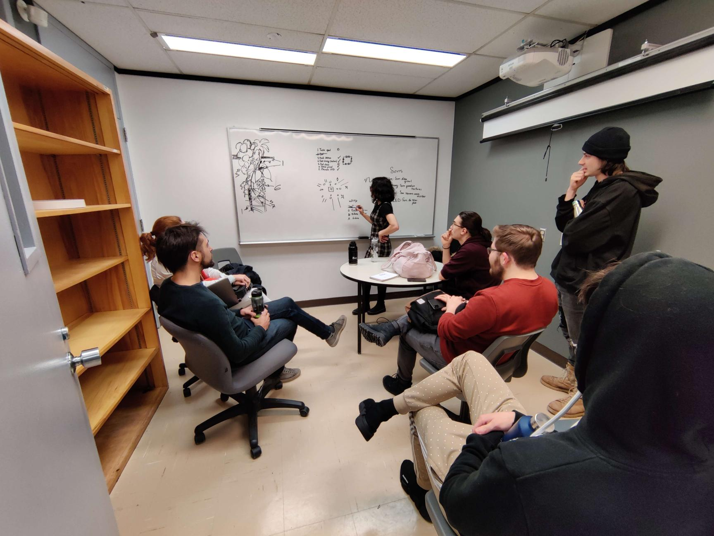

# Journal de "Elwin Durand"

* [Semaine 1](#semaine-1)
* [Semaine 2](#semaine-2)
* [Semaine 3](#semaine-3)
* [Semaine 4](#semaine-4)
* [Semaine 5](#semaine-5)
* [Semaine de rattrapage](#semaine-de-rattrapage)
* [Semaine 6](#semaine-6)
* [Semaine 7](#semaine-7)
* [Semaine 8](#semaine-8)
* [Semaine 9](#semaine-9)

## Semaine 1

### Résumé des réalisations effectuées

-Ajustements de plusieurs aspects github

-Ajustements de la préproduction

-Représentants Comité Diffusion et le Comité Technique déterminés

-Mise en ligne du journal d'équipe

### Image d'une réalisation dont tu es la ou le plus fier

### Est-ce que j'ai accompli l'ensemble des tâches et objectifs que je m'étais fixés pour cette semaine?	
- [ ] Complètement
- [x] Assez
- [ ] Peu
- [ ] Pas du tout

#### Décrivez pourquoi.
Étant donné que c'est la première semaine, il y a beaucoup de planification à faire et les tâches importantes ne sont pas encore amorçées. Cependant, je me dois de rester au courant de toutes les avancées et changements de l'équipe.

#### S'il y a lieu, qu'allez-vous faire pour remédier à la situation?
Pour l'instant, continuer à faire ce que je fais. 

### Mon projet s'est-il réalisé selon l’échéancier prévu?

- [ ] Complètement
- [ ] Assez
- [x] Un peu
- [ ] Pas tout à fait

#### S'il y a des écarts, décrivez-les.
Et bien, nous n'avons pas des échantillons de l'équipement qui nous servira à la réalisation du projet. Une liste de matériel doit être créée afin de pouvoir déterminer l'équipement nécessaire. Nos pourrons ensuite commander le reste en plus grande quantité.
#### S'il y a lieu, qu'allez-vous faire pour remédier à la situation?
M'occuper des tâches administratives en étant le plus à jour possible (en temps réel). 

### Défis pour la prochaine semaine
Tenter d'avoir le github complètement à jour, avec la liste de matériel prête à être envoyée. 

---
## Semaine 2
### Résumé des réalisations effectuées

- Changements majeurs pour l'installation, le poteau central occupera une importance plus grosse et sera le centre de l'attention
- Mise à jour complète de la préproduction
- Journal de l'équipe
- Tournage de la vidéo de présentation de la préproduction
- Rencontre commité communication

### Image d'une réalisation dont tu es la ou le plus fier

Il s'agit ici de la rencontre qui a changé la direction de notre projet. Nous étions plutôt productifs, et nous avions les professeurs pour juger de nos idées.
### Est-ce que j'ai accompli l'ensemble des tâches et objectifs que je m'étais fixés pour cette semaine?

- [ ] Complètement
- [x] Assez
- [ ] Peu
- [ ] Pas du tout

#### Décrivez pourquoi.
 
 Oui, dans l'ensemble, le github est oas mal à jour, les seuls changements qui pourraient occurer concernent les difficultés que nous pourrions rencontrer au fur et à mesure que la team installation et la team intégration avancent. Ces incertitudes font en sorte que je m'octroie la note assez.

#### S'il y a lieu, qu'allez-vous faire pour remédier à la situation?

Pour l'instant,pas grand chose, si ce n'est s'en tenir aux échéanciers et régler les problèmes au fur et à mesure qu'ils arrivent (ne pas les laisser s'accumuler car je crois qu'ils seront réglés à l'avenir)

### Mon projet s'est-il réalisé selon l’échéancier prévu?

- [ ] Complètement
- [x] Assez
- [ ] Un peu
- [ ] Pas tout à fait

#### S'il y a des écarts, décrivez-les.

Il n'y a pas vraiment eu d'écart pour le moment, il s'agit plutôt d'avoir toutes les ressources et références nécessaire maintenant afin de pouvoir avancer rapidement lors de l'installation et de l'intégration. Les rencontres des comités se sont montrées productives et efficaces.

#### S'il y a lieu, qu'allez-vous faire pour remédier à la situation?

Toujours resté up to date dans les micro échéanciers que nous nous donnons et, si possible, poser des questions aux professeurs lors d'incertitudes. Ils donnent toujours de bons conseils, il est donc judicieux d'aller les voir souvent. 

### Défis pour la prochaine semaine
Liste de matériel et commande amazon envoyée définitevement. Il faut également que la préproduction soit complète pour l'UQAM. Si possible, avoir des échantillons/prototypes de matériel ou de médias (ex: demander à jean-christophe zephir de réaliser des tests de son.)

---
## Semaine 3 
### Résumé des réalisations effectuées
-Rencontres individuelles et en groupe afin d'établir un échéancier qui devrait arranger tout le monde pour les prochaines semaines
-Visite à l'UQAM et Présentation de notre projet
-Préproduction terminée
-Comité communication: Mon texte est apprécié
-Amélioration du github avec des milestones plus spécifiques par rapport aux issues

### Image d'une réalisation dont tu es la ou le plus fier

### Est-ce que j'ai accompli l'ensemble des tâches et objectifs que je m'étais fixés pour cette semaine?

- [ ] Complètement
- [x] Assez
- [ ] Peu
- [ ] Pas du tout

#### Décrivez pourquoi.
 L'ensemble des tâches me conçernant sont concluantes. Cependant, celles qui sont hors de notre contrôle sont difficiles à évaluer, majoritairement conçernant cr34te. Nous n'aurons pas réussi à avoir des échantillons de leur matériel cette semaine, ce n'est pas bien grave mais il faudra les obtenir le plus tôt possible. Les listes de matériel devraient être envoyées sous peu.

#### S'il y a lieu, qu'allez-vous faire pour remédier à la situation?
Avancer le plus possible avec les choses qui sont sous notre contrôle. La team d'intégration est bien partie de ce côté, et la création de médias suit son cours.

### Mon projet s'est-il réalisé selon l’échéancier prévu?

- [ ] Complètement
- [x] Assez
- [ ] Un peu
- [ ] Pas tout à fait

#### S'il y a des écarts, décrivez-les.
Pas d'écart de mon côté, si ce n'est que la visite chez cr34te n'a pas pu se faire.

#### S'il y a lieu, qu'allez-vous faire pour remédier à la situation?
Avancer le plus possible avec ce qui ne concerne pas les éléments extérieurs.

### Défis pour la prochaine semaine
Commencer à jouer avec de l'équipement d'installation si possible, et avoir des médias de prêt pour la présentation des 1ere année.
---
## Semaine 4
### Résumé des réalisations effectuées

### Image d'une réalisation dont tu es la ou le plus fier

### Est-ce que j'ai accompli l'ensemble des tâches et objectifs que je m'étais fixés pour cette semaine?

- [ ] Complètement
- [ ] Assez
- [ ] Peu
- [ ] Pas du tout

#### Décrivez pourquoi.
 

#### S'il y a lieu, qu'allez-vous faire pour remédier à la situation?

### Mon projet s'est-il réalisé selon l’échéancier prévu?

- [ ] Complètement
- [ ] Assez
- [ ] Un peu
- [ ] Pas tout à fait

#### S'il y a des écarts, décrivez-les.

#### S'il y a lieu, qu'allez-vous faire pour remédier à la situation?

### Défis pour la prochaine semaine

---
## Semaine 5
### Résumé des réalisations effectuées

### Image d'une réalisation dont tu es la ou le plus fier

### Est-ce que j'ai accompli l'ensemble des tâches et objectifs que je m'étais fixés pour cette semaine?

- [ ] Complètement
- [ ] Assez
- [ ] Peu
- [ ] Pas du tout

#### Décrivez pourquoi.
 

#### S'il y a lieu, qu'allez-vous faire pour remédier à la situation?

### Mon projet s'est-il réalisé selon l’échéancier prévu?

- [ ] Complètement
- [ ] Assez
- [ ] Un peu
- [ ] Pas tout à fait

#### S'il y a des écarts, décrivez-les.

#### S'il y a lieu, qu'allez-vous faire pour remédier à la situation?

### Défis pour la prochaine semaine

---
## Semaine de rattrapage
### Résumé des réalisations effectuées

### Image d'une réalisation dont tu es la ou le plus fier

### Est-ce que j'ai accompli l'ensemble des tâches et objectifs que je m'étais fixés pour cette semaine?

- [ ] Complètement
- [ ] Assez
- [ ] Peu
- [ ] Pas du tout

#### Décrivez pourquoi.
 

#### S'il y a lieu, qu'allez-vous faire pour remédier à la situation?

### Mon projet s'est-il réalisé selon l’échéancier prévu?

- [ ] Complètement
- [ ] Assez
- [ ] Un peu
- [ ] Pas tout à fait

#### S'il y a des écarts, décrivez-les.

#### S'il y a lieu, qu'allez-vous faire pour remédier à la situation?

### Défis pour la prochaine semaine

---
## Semaine 6
### Résumé des réalisations effectuées

### Image d'une réalisation dont tu es la ou le plus fier

### Est-ce que j'ai accompli l'ensemble des tâches et objectifs que je m'étais fixés pour cette semaine?

- [ ] Complètement
- [ ] Assez
- [ ] Peu
- [ ] Pas du tout

#### Décrivez pourquoi.
 

#### S'il y a lieu, qu'allez-vous faire pour remédier à la situation?

### Mon projet s'est-il réalisé selon l’échéancier prévu?

- [ ] Complètement
- [ ] Assez
- [ ] Un peu
- [ ] Pas tout à fait

#### S'il y a des écarts, décrivez-les.

#### S'il y a lieu, qu'allez-vous faire pour remédier à la situation?

### Défis pour la prochaine semaine

---
## Semaine 7
### Résumé des réalisations effectuées

### Image d'une réalisation dont tu es la ou le plus fier

### Est-ce que j'ai accompli l'ensemble des tâches et objectifs que je m'étais fixés pour cette semaine?

- [ ] Complètement
- [ ] Assez
- [ ] Peu
- [ ] Pas du tout

#### Décrivez pourquoi.
 

#### S'il y a lieu, qu'allez-vous faire pour remédier à la situation?

### Mon projet s'est-il réalisé selon l’échéancier prévu?

- [ ] Complètement
- [ ] Assez
- [ ] Un peu
- [ ] Pas tout à fait

#### S'il y a des écarts, décrivez-les.

#### S'il y a lieu, qu'allez-vous faire pour remédier à la situation?

### Défis pour la prochaine semaine

## Semaine 8

## Semaine 9
