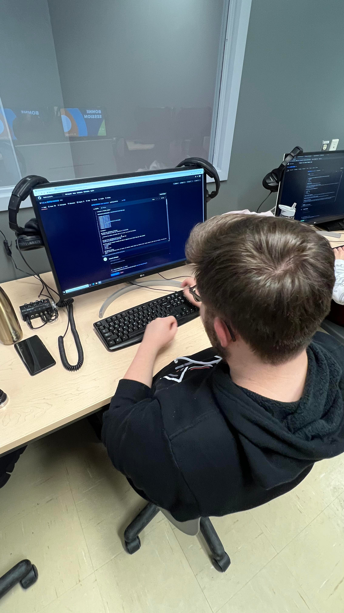
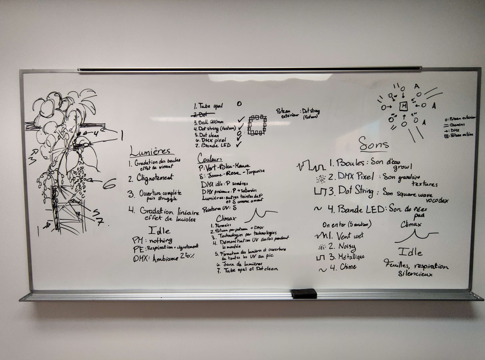
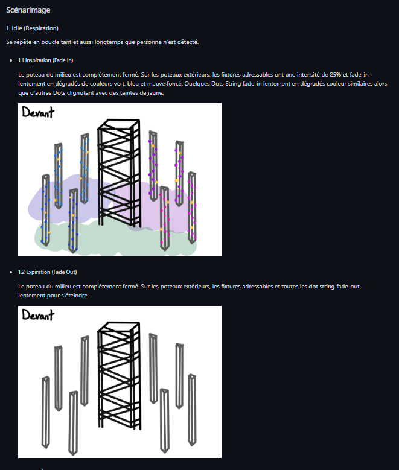
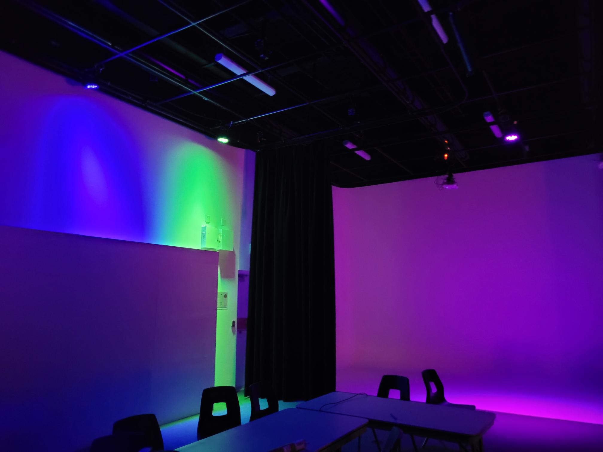
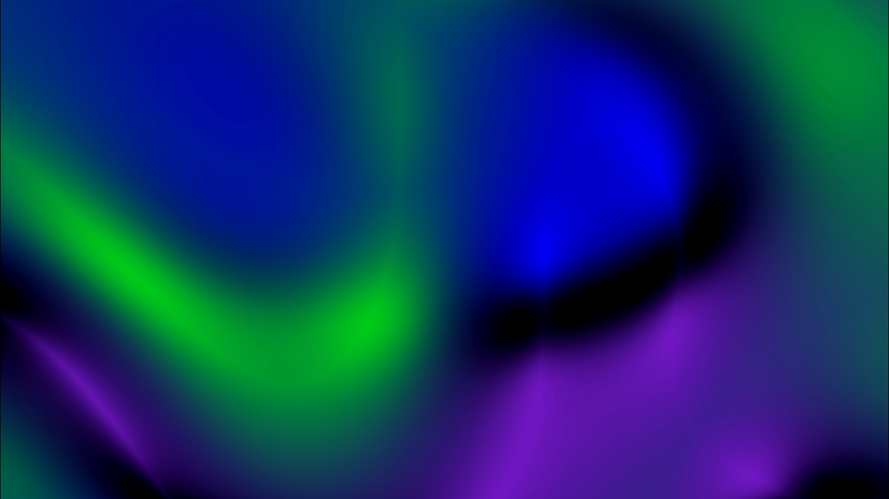
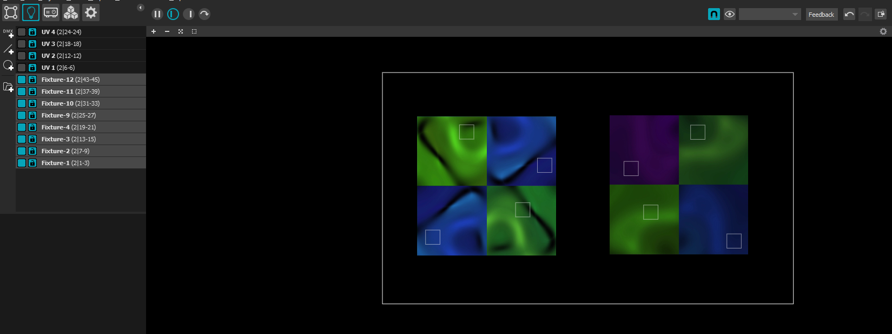
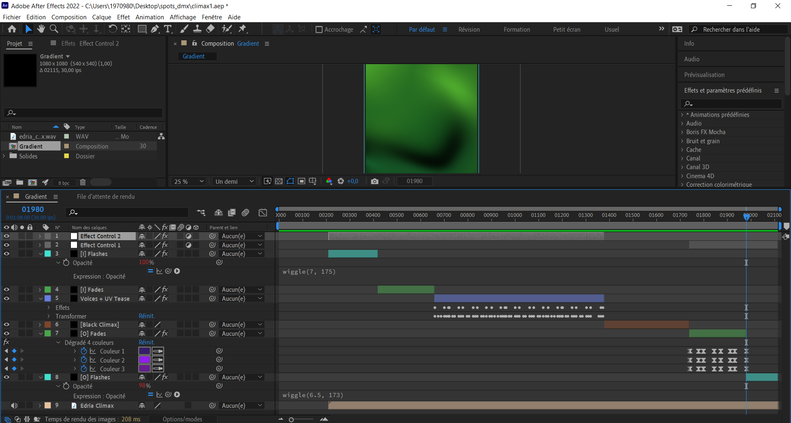
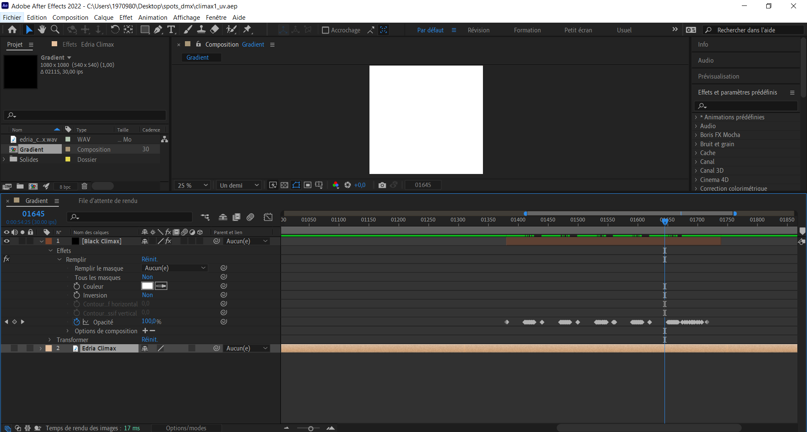
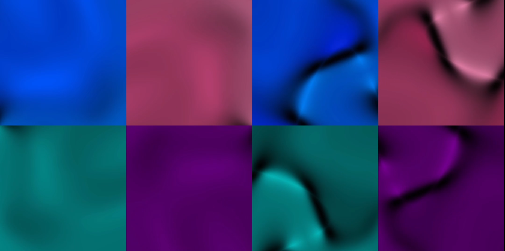

# Journal de "Gabriel Leblanc"

* [Semaine 1](#semaine-1)
* [Semaine 2](#semaine-2)
* [Semaine 3](#semaine-3)
* [Semaine 4](#semaine-4)
* [Semaine 5](#semaine-5)
* [Semaine de rattrapage](#semaine-de-rattrapage)
* [Semaine 6](#semaine-6)
* [Semaine 7](#semaine-7)
* [Semaine 8](#semaine-8)
* [Semaine 9](#semaine-9)

## Semaine 1

### Résumé des réalisations effectuées
- Rencontre d'équipe avec Daryl pour montrer notre concept et les différentes composantes du projet.

  -> Simplification de l'audio réactivité. Il y aura plutôt un semblant d'audio réactivité, c'est-à-dire qu'il y aura de l'échantillonnage de vidéos de couleur montées sur l'audio de Jean-Christophe afin de donner un semblant des différentes textures et sons entendus.
  
  -> Progression de l'activion des lumières. Au début, 2 lumières, puis les lumières s'allume et interagissent de plus en plus qu'il y a des personnes.

- Rencontre d'équipe pour clarifier l'intention du projet.

  -> Réduction du nombre de lumières adressables DMX de 7 à 4 (les 3 au sol ont été enlevées).
  
- Rencontre d'équipe/travail pour modifier et améliorer la préproduction.
- Apporter des modifications au plan de lumières.

### Image d'une réalisation dont tu es la ou le plus fier

### Est-ce que j'ai accompli l'ensemble des tâches et objectifs que je m'étais fixés pour cette semaine?	
- [ ] Complètement
- [x] Assez
- [ ] Peu
- [ ] Pas du tout

#### Décrivez pourquoi.
J'aurais voulu faire un prototypage des couleurs des lumières et peut-être explorer des "patterns" de lumière qui m'intéresserait, mais je n'avais pas accès aux DMX de CR34TE.

#### S'il y a lieu, qu'allez-vous faire pour remédier à la situation?
Cette fin de semaine, je vais commencer à travailler sur des "patterns" de lumières dans QLC+ pour avancer et rattraper un peu le travail que j'aurais voulu faire.

### Mon projet s'est-il réalisé selon l’échéancier prévu?

- [x] Complètement
- [ ] Assez
- [ ] Un peu
- [ ] Pas tout à fait

#### S'il y a des écarts, décrivez-les.
Étant donné que nous sommes à la première semaine, nous avons moins de travail pour l'instant, puisque notre préproduction est déjà bien avancée.

#### S'il y a lieu, qu'allez-vous faire pour remédier à la situation?

### Défis pour la prochaine semaine
- Continuer à avancer la préproduction et faire des modifications où il y a besoin.
- Essayer d'avancer les lumières dans QLC+ ou en créant des vidéos de couleurs pour MadMapper.

---
## Semaine 2
### Résumé des réalisations effectuées
- Rencontre de clarification de l'intention de l'installation.

- 3 Rencontres pour le scénarimage de l'installation.

- Écriture des textes des images du scénarimage.

- Mise en ligne sur github du scénarimage.

- Écriture des références du moodboard d'ambiance générale.

### Image d'une réalisation dont tu es la ou le plus fier
Notre travail sur le scénarimage!

### Est-ce que j'ai accompli l'ensemble des tâches et objectifs que je m'étais fixés pour cette semaine?

- [ ] Complètement
- [x] Assez
- [ ] Peu
- [ ] Pas du tout

#### Décrivez pourquoi.
Je m'étais dis que j'allais commencé à faire du prototypage de couleur pour les fixtures adressables lors de la soirée des portes ouvertes, mais j'avais un mal de tête insupportable, donc je n'ai pas pu être présent. Cependant, même si je n'ai pas rempli complètement mes objectifs, j'ai réalisé d'autres tâches qui ont pris la grande majorité de mon temps et qui a fait avancer le projet davantage.

#### S'il y a lieu, qu'allez-vous faire pour remédier à la situation?
Remettre à la semaine prochaine le travail que je m'étais fixé, c'est-à-dire le prototypage de couleur. Je vais demander au TTP le matériel pour brancher au moins une lumière et faire des tests de couleur. 

### Mon projet s'est-il réalisé selon l’échéancier prévu?

- [ ] Complètement
- [x] Assez
- [ ] Un peu
- [ ] Pas tout à fait

#### S'il y a des écarts, décrivez-les.
Pas tant d'écart pour l'instant je trouve. Je sens que notre projet avance à une bonne vitesse grâce à nos multiples rencontres, réunions et suivis. Il se concrétise de plus en plus. Cependant, nous devons filmer notre vidéo demain, le vendredi 3 Février 2023, mais je sais qu'il nous reste quelques petits détails à ajouter à la préproduction et avec la soirée porte ouverte, ça enlève du temps pour travailler dessus.

#### S'il y a lieu, qu'allez-vous faire pour remédier à la situation?
Je sens que nos réunions prennent souvent beaucoup de temps à cause de la complexité et la grosseur de notre projet. Je crois qu'on serait capable de les réduirent pour moins qu'elles s'éternisent.

### Défis pour la prochaine semaine
- Faire le prototypage des couleurs pour les fixtures adressables

---
## Semaine 3

### Résumé des réalisations effectuées
- Détermination des dates d'échéances pour la création des médias et pour les tests des fixtures adressables.

- Création d'une animation 2D de drégadés de couleurs tournant en rond dans After Effects pour l'état de sommeil.

- Test en studio des fixtures adressables :

  -> Test de l'animation 2D de l'état de sommeil dans MadMapper.
  
  -> Détermination précise des valeurs RGB des fixtures adressables.
  
  -> Détermination des valeurs d'intensité de lumière pour les états de sommeil et d'éveil (15% et 50% respectivement).
  
  -> Apprentissage et appropriation du logiciel MadMapper.

### Image d'une réalisation dont tu es la ou le plus fier

### Est-ce que j'ai accompli l'ensemble des tâches et objectifs que je m'étais fixés pour cette semaine?

- [x] Complètement
- [ ] Assez
- [ ] Peu
- [ ] Pas du tout

#### Décrivez pourquoi.
Mes objectifs que je m'étais fixés étaient plus rapides à réaliser que je le pensais. J'ai donc été plus loin en explorant MadMapper et faisant des tests.

#### S'il y a lieu, qu'allez-vous faire pour remédier à la situation?
Je n'ai pas de problème qui nécessite une solution pour y remédier cette semaine, mais je crois me fixer plus d'objectifs pour la semaine prochaine.

### Mon projet s'est-il réalisé selon l’échéancier prévu?

- [ ] Complètement
- [x] Assez
- [ ] Un peu
- [ ] Pas tout à fait

#### S'il y a des écarts, décrivez-les.
Nous n'avons pas pu aller chez CR34TE pour emprunter des échantillons ce qui a ralenti un peu notre travail. J'aurais aimé avoir déjà des COLORado 2 Solo.

#### S'il y a lieu, qu'allez-vous faire pour remédier à la situation?
Continuer pour l'instant avec les 5p Hex de American DJ, car de toute façon, j'ai réalisé que les COLORado 2 Solo n'ont pas de channel de UV, donc  il faut trouver une solution pour y remédier. Cependant, je peux alors concentrer mes efforts sur la création d'animations 2D pour animer nos fixtures adressables.

### Défis pour la prochaine semaine
- Recréer l'animation de l'état de sommeil (si possible sur l'audio) pour que les lumières s'animent plus fluidement.
- Créer l'animation de l'état d'éveil (4 animations? 1 par technologie?)
- Continuer à faire des tests et m'approprier le logiciel MadMapper

---
## Semaine 4
### Résumé des réalisations effectuées
- Apprentissage plus approfondi de After Effects et MadMapper

- Réalisation de tests d'animation dans After Effects et MadMapper

- Création dans After Effects d'une animation 2D de dégradés animés à l'aide d'effets pour l'état d'éveil

### Image d'une réalisation dont tu es la ou le plus fier
Animation d'un dégradé de couleur dans After Effects pour l'état d'éveil

### Est-ce que j'ai accompli l'ensemble des tâches et objectifs que je m'étais fixés pour cette semaine?

- [ ] Complètement
- [x] Assez
- [ ] Peu
- [ ] Pas du tout

#### Décrivez pourquoi.
J'ai créé une animation prototype de l'état d'éveil et continué à réaliser des tests dans MadMapper de plus que dans After Effects. Par contre, je n'ai pas fait l'animation d'état de sommeil, car elle est surtout basée sur l'audio et c'est l'audio de cet état-ci qui est réalisé en dernier.

#### S'il y a lieu, qu'allez-vous faire pour remédier à la situation?
Pas grand chose que je peux faire, car l'audio pour l'état de sommeil était pas encore réalisé, mais je peux concentrer mes efforts sur un état à la fois au lieu d'en faire plusieurs à la fois.

### Mon projet s'est-il réalisé selon l’échéancier prévu?

- [ ] Complètement
- [x] Assez
- [ ] Un peu
- [ ] Pas tout à fait

#### S'il y a des écarts, décrivez-les.
Je crois que ma partie des fixtures adressables a pris du retard, puisque j'ai été beaucoup distrait par mon environnement, mais à part de cela, le prototype final sera terminé pour vendredi et à mes yeux tout le reste semble avancer à un bon rythme.

#### S'il y a lieu, qu'allez-vous faire pour remédier à la situation?
Pour me concentrer et arrêter d'être distrait par mon environnment, je vais commencer à mettre des écouteurs avec de la musique pour me concentrer sur mon ordinateur.

### Défis pour la prochaine semaine
- Réussir à travailler efficacement en me concentrant sur mon travail
- Discuter avec Meryem pour les couleurs utilisées afin de ne pas avoir des couleurs qui se répètent
- Refaire l'animation de l'état d'éveil si elle ne marche pas bien lors du prototypage de vendredi
- Aider où les personnes de mon équipe en ont de besoin

---
## Semaine 5
### Résumé des réalisations effectuées
- Animations finales de l'état d'éveil pour les fixtures adressables aposées sur les poteaux extérieurs :

  -> Création de 4 animations de dégradés animés (40s chaque)
  
  -> Copie des 4 animations, puis inversement de celles-ci pour créer 8 animations
  
  -> Chaque paire d'animations (normale et inversées) sont rotationnées selon les valeurs respectives (0°, 90°, 180° et 270°)
  
  -> Création de 2 mosaïques 2x2 de 4 animations du même type (vidéo normale ou inversée)

### Image d'une réalisation dont tu es la ou le plus fier
Animation Éveil Finale

### Est-ce que j'ai accompli l'ensemble des tâches et objectifs que je m'étais fixés pour cette semaine?

- [ ] Complètement
- [x] Assez
- [ ] Peu
- [ ] Pas du tout

#### Décrivez pourquoi.
J'ai refait l'animation d'éveil comme j'avais dit que j'allais refaire, j'ai réussi à me débloquer de mon état distrait et réussi à avancer sur les animations en travaillant de la maison et en mettant de la musique lorsqu'à l'école. Par contre, je n'ai pas encore parlée avec Meryem pour les couleurs, mais je ne crois pas en avoir besoin avant le climax seulement, donc j'étais un peu trop d'avance dans mes défis.

#### S'il y a lieu, qu'allez-vous faire pour remédier à la situation?
Continuer à avancer en créant des animations pour les états de sommeil et pour le climax. Il n'y a pas de situation qui a besoin de solution pour l'instant, je m'étais simplement fixé un objectif trop tôt, car il sera réalisé seulement plus tard dans la création de médias.

### Mon projet s'est-il réalisé selon l’échéancier prévu?

- [ ] Complètement
- [x] Assez
- [ ] Un peu
- [ ] Pas tout à fait

#### S'il y a des écarts, décrivez-les.
Pour ma part j'avance accordément à l'échéancier, mais on change de capteur, donc au niveau du projet complet, nous aurons d'autres tests à réaliser pour les nouveaux capteurs ce qui fait en sorte que nous aurons à refaire une partie étant déjà supposée être faite, ce qui ralentira le travail le l'intégration. De plus, ces capteurs nous seront disponibles seulement dans 2 semaines

#### S'il y a lieu, qu'allez-vous faire pour remédier à la situation?
Pas grand chose que l'on peut faire pour le changement de capteurs. On peut tout de même faire des recherches sur le fonctionnement de ceux-ci et régler le plus de problèmes pour les capteurs que nous avons à l'instant pour espérer qu'ils règleront aussi ceux des nouveaux capteurs.

### Défis pour la prochaine semaine
- Ajustements finaux pour les animations d'état d'éveil
- Création de l'animation finale de l'état de sommeil

---
## Semaine de rattrapage
### Résumé des réalisations effectuées
- Rencontre avec Meryem et Jean-Christophe pour parler du climax
- Planification du climax
- Animation du climax pour les fixtures adressables + UV
- Ajustements minimes de l'animation de l'état d'éveil

### Image d'une réalisation dont tu es la ou le plus fier
Travail sur l'animation du climax des fixtures adressables

### Est-ce que j'ai accompli l'ensemble des tâches et objectifs que je m'étais fixés pour cette semaine?

- [x] Complètement
- [ ] Assez
- [ ] Peu
- [ ] Pas du tout

#### Décrivez pourquoi.
J'ai réalisé les quelques ajustements que je m'étais fixé pour l'animation de l'état d'éveil, puis, même si je n'ai pas fait l'animation de l'état de sommeil, j'ai fait plutôt l'animation du climax, car Jean-Christophe avait finit la bande sonore pour cet état. Le climax est plus demandant en terme de temps à réaliser, donc je suis satisfait du travail accompli.

#### S'il y a lieu, qu'allez-vous faire pour remédier à la situation?

### Mon projet s'est-il réalisé selon l’échéancier prévu?

- [ ] Complètement
- [x] Assez
- [ ] Un peu
- [ ] Pas tout à fait

#### S'il y a des écarts, décrivez-les.
Je n'étais pas là à travailler au studio pour la majorité de la semaine, car nous avons manquez de courant dans les prises électriques, donc je ne suis pas au courant de nos écarts d'équipe. Je sais que cette situation nous a ralenti/empêchés de travail 1-2 jours de la semaine, mais grâce aux rallonges électriques que Guillaume a installé, j'ai entendu auprès mon équipe que nous avons été tout de même capable d'avancer. Personnellement, je n'ai pas d'écart. La semaine prochaine je m'attaque à la finalisation du contenu à créer (animations des différents états).

#### S'il y a lieu, qu'allez-vous faire pour remédier à la situation?

### Défis pour la prochaine semaine
- Ajustements de l'animation du climax + UV
- Animation de l'état de sommeil

---
## Semaine 6
### Résumé des réalisations effectuées
- Rectification des couleurs générales des lumières avec Meryem
- Animation de l'état d'éveil refaite avec les bonnes couleurs
- Mosaïque complète de 8 vidéos pour l'état d'éveil
- Animation du climax refaite avec les bonnes couleurs
- Ajustements supplémentaires apportés à l'animation du climax
- Ajustements minimes à l'animation des UV dans le climax
- Test de l'intensité des lumières à l'intro et à la fin de l'animation du climax

### Image d'une réalisation dont tu es la ou le plus fier
Mosaïque complète comptant 8 animations pour l'état d'éveil au lieu de 2 vidéos contenant 4 animations chacunes

### Est-ce que j'ai accompli l'ensemble des tâches et objectifs que je m'étais fixés pour cette semaine?

- [x] Complètement
- [ ] Assez
- [ ] Peu
- [ ] Pas du tout

#### Décrivez pourquoi.
 
J'ai réalisé les ajustements au climax et aux parties UV que je voulais. Je suis même allé plus loins en faisant des tests d'intensité de lumière pour certaines parties, j'ai changé toutes les couleurs avec Meryem et j'ai consolidé mes animation d'éveil en une vidéo pour réduire les bugs visuels qui pourraient survenir. Pour ce qui en est de l'animation de l'état de sommeil, puisque moi et Meryem avons la même animation à faire, nous nous sommes entendus pour prendre la sienne, donc je n'avais pas à en créer une moi-même.

#### S'il y a lieu, qu'allez-vous faire pour remédier à la situation?

### Mon projet s'est-il réalisé selon l’échéancier prévu?

- [x] Complètement
- [ ] Assez
- [ ] Un peu
- [ ] Pas tout à fait

#### S'il y a des écarts, décrivez-les.

Aucun écart à noter, puisque je n'étais pas là pour la majorité de la semaine, mais nous en sommes à la fin et je crois que tous ont bien avancé cette semaine.

#### S'il y a lieu, qu'allez-vous faire pour remédier à la situation?

### Défis pour la prochaine semaine
- Ajustement de la couleur rose pour l'animation du climax, puisqu'elle est trop forte/saturée
- Création de variations pour l'animation du climax pour ne pas que toutes les fixtures jouent la même chose.
- Création d'une seule vidéo mosaïque pour consolider les vidéos de variation du climax

---
## Semaine 7
### Résumé des réalisations effectuées

### Image d'une réalisation dont tu es la ou le plus fier

### Est-ce que j'ai accompli l'ensemble des tâches et objectifs que je m'étais fixés pour cette semaine?

- [ ] Complètement
- [ ] Assez
- [ ] Peu
- [ ] Pas du tout

#### Décrivez pourquoi.
 

#### S'il y a lieu, qu'allez-vous faire pour remédier à la situation?

### Mon projet s'est-il réalisé selon l’échéancier prévu?

- [ ] Complètement
- [ ] Assez
- [ ] Un peu
- [ ] Pas tout à fait

#### S'il y a des écarts, décrivez-les.

#### S'il y a lieu, qu'allez-vous faire pour remédier à la situation?

### Défis pour la prochaine semaine

## Semaine 8

## Semaine 9
