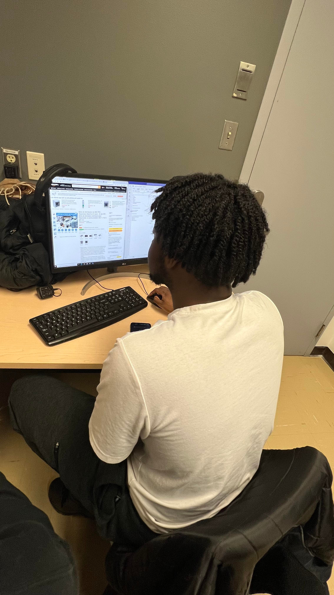
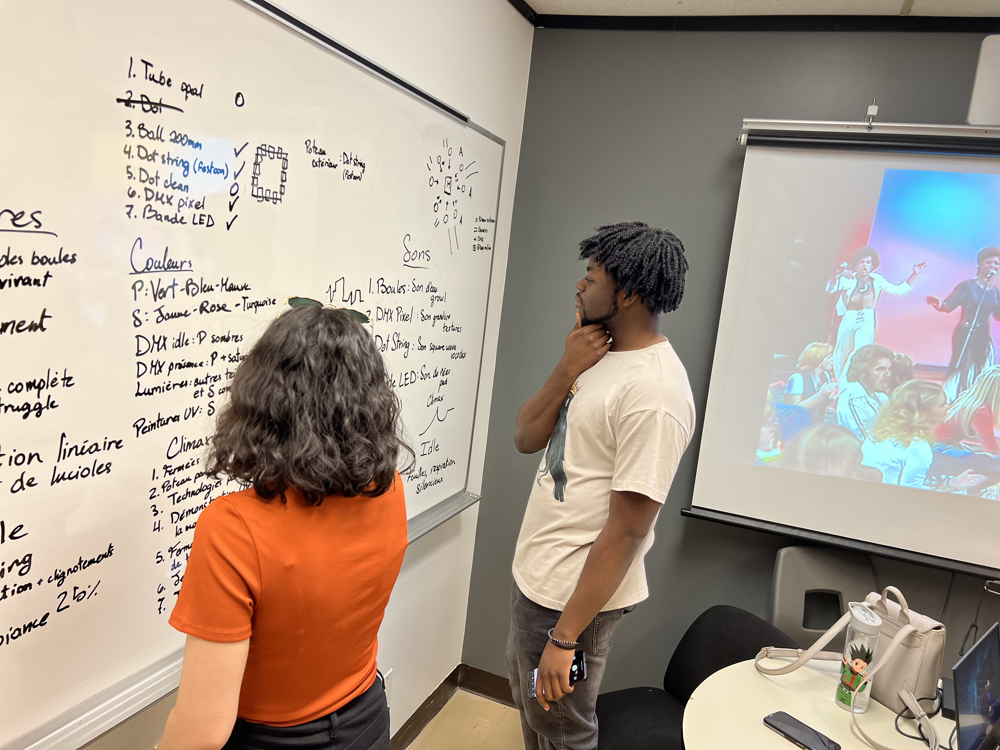
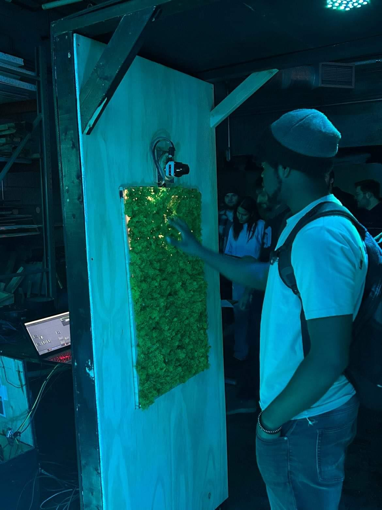
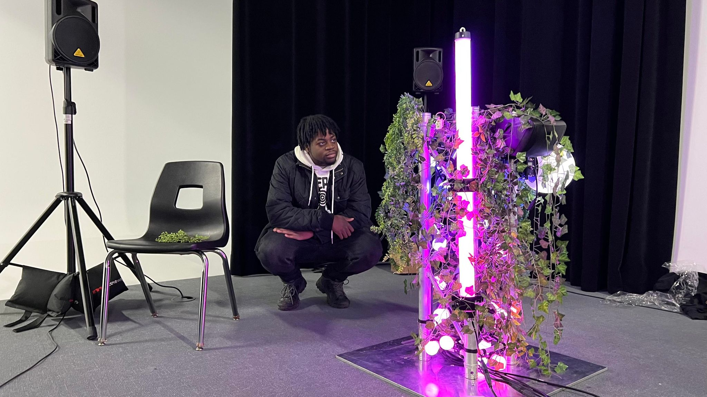
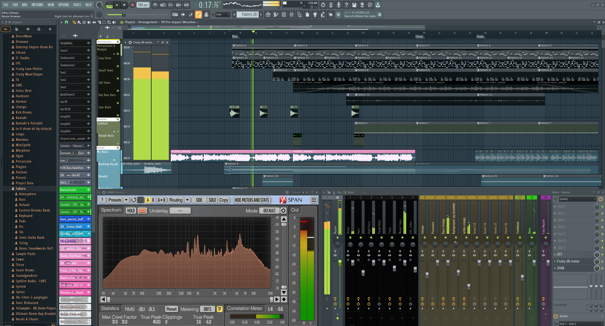
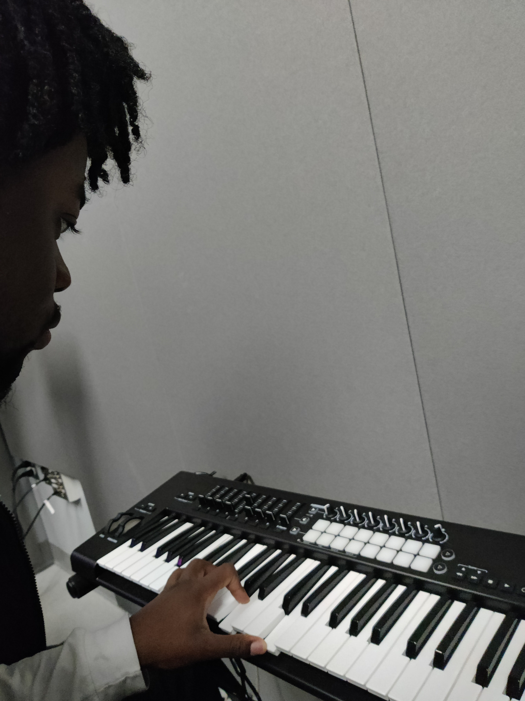
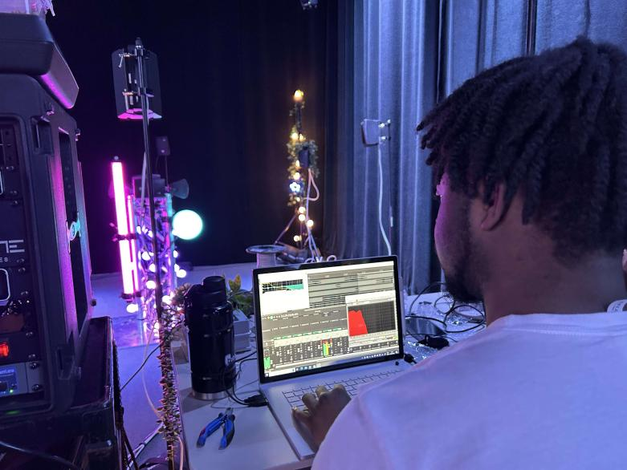
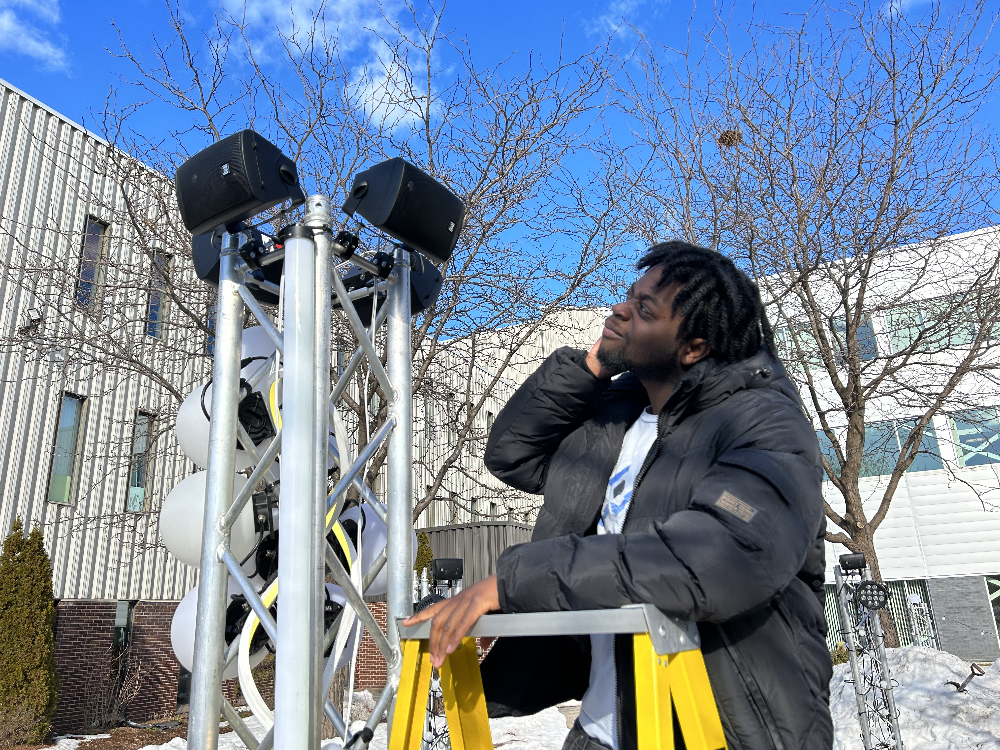

# Journal de "Jean-Christophe Zephir"

* [Semaine 1](#semaine-1)
* [Semaine 2](#semaine-2)
* [Semaine 3](#semaine-3)
* [Semaine 4](#semaine-4)
* [Semaine 5](#semaine-5)
* [Semaine de rattrapage](#semaine-de-rattrapage)
* [Semaine 6](#semaine-6)
* [Semaine 7](#semaine-7)
* [Semaine 8](#semaine-8)
* [Semaine 9](#semaine-9)

## Semaine 1

### Résumé des réalisations effectuées
- J'ai révisé le budget. 
- J'ai fait le nouveau schéma pour les ponts de fils. 
- Révision générale du concept et de la technique utilisé. 

### Image d'une réalisation dont tu es la ou le plus fier

### Est-ce que j'ai accompli l'ensemble des tâches et objectifs que je m'étais fixés pour cette semaine?	
- [X] Complètement
- [ ] Assez
- [ ] Peu
- [ ] Pas du tout

#### Décrivez pourquoi.
Mon but cette semaine était de régler plusieurs problèmes techniques que nous avions. Centraliser les communications était un de mes objectifs et nous avons décidé d'opter pour cette centralisation des communications. Mes objectifs sont donc atteints.

#### S'il y a lieu, qu'allez-vous faire pour remédier à la situation?
Je n'ai pas rencontré de problèmes cette semaine. 

### Mon projet s'est-il réalisé selon l’échéancier prévu?

- [x] Complètement
- [ ] Assez
- [ ] Un peu
- [ ] Pas tout à fait

#### S'il y a des écarts, décrivez-les.
Aucun écart

#### S'il y a lieu, qu'allez-vous faire pour remédier à la situation?
Aucun problème a ce niveau

### Défis pour la prochaine semaine
Les défis de la prochaine semaine seront d'avoir complètement terminé la préproduction. Les shémas de connection, le budget finalisé et envoyé, les listes de produits envoyé a cr34te.

---
## Semaine 2
### Résumé des réalisations effectuées
J'ai effectué la création de certains médias sonores associé aux sons granulaires.
J'ai participé a la scénarisation du projet.
J'ai créé une certaine cohérence entre l'audio visuel.

### Image d'une réalisation dont tu es la ou le plus fier

### Est-ce que j'ai accompli l'ensemble des tâches et objectifs que je m'étais fixés pour cette semaine?

- [ ] Complètement
- [X] Assez
- [ ] Peu
- [ ] Pas du tout

#### Décrivez pourquoi.
 Notre objectif cette semaine était de finir le scénario pour l'audio visuel. Nous avons donc fait le scénario sur le tableau blanc de "la crèshe" pour associer chaque son a une technologie lumineuse (ex. les boules 200mm sont associé a des sons d'eau organiques représenté par des "growls"). J'ai aussi commencé à faire la banque de sons pour aider mes coéquipier à mieux comprendre l'aspect sonore de l'installation multimédia.

#### S'il y a lieu, qu'allez-vous faire pour remédier à la situation?
Je vais faire d'autres sons durant mon temps libre pour que "l'image" ou plutôt les sons soit plus claire auprès de mon équipe.

### Mon projet s'est-il réalisé selon l’échéancier prévu?

- [ ] Complètement
- [X] Assez
- [ ] Un peu
- [ ] Pas tout à fait

#### S'il y a des écarts, décrivez-les.
Nous étions serré en temps, mais nous avons réussi a faire le scénarimage et trouvé/fait des références de sons.

#### S'il y a lieu, qu'allez-vous faire pour remédier à la situation?
Pusique la préproduction est faite, nous ne devrions pas avoir ce problème une seconde fois.

### Défis pour la prochaine semaine
Commencer la création de médias.
Commencer a effectuer des tests (pour ceux qui sont possibles)

---
## Semaine 3 
### Résumé des réalisations effectuées
Pour cette semaine je devais faire des tests avec les speakers et de la création de médias. J'ai effectué ces tests avec Dominic dans le grand studio et j'ai aussi commencé la création de médias pour le mode "éveil" de notre installation dans le but de les envoyer à Meryem et à Gabriel la semaine prochaine.

### Image d'une réalisation dont tu es la ou le plus fier

La visite était à l'UQAM m'a permis de mieux comprendre les concepts sonores et visuels et les discussions avec les étudiants m'ont permis de mieux comprendre comment atteindre ces objectifs.

### Est-ce que j'ai accompli l'ensemble des tâches et objectifs que je m'étais fixés pour cette semaine?

- [ ] Complètement
- [ ] Assez
- [X] Peu
- [ ] Pas du tout

#### Décrivez pourquoi.
Certains de mes deadlines était difficile à respecter. Je suis un peu en retard dans la création de médias, mais ce retard ne devrais pas trop se faire sentir dans le travail des semaines à venir.

#### S'il y a lieu, qu'allez-vous faire pour remédier à la situation?
Je vais continuer de travailler sur les sons durant les soirés et durant les fin de semaines pour ne pas donner de retard à Meryem et à Gabriel.

### Mon projet s'est-il réalisé selon l’échéancier prévu?

- [ ] Complètement
- [ ] Assez
- [X] Un peu
- [ ] Pas tout à fait

#### S'il y a des écarts, décrivez-les.
Les échéanciers qui m'ont été donné cette semaine était extrèmement difficile a respecter puisque je n'avais qu'une seule journée pour faire un des cotés de la bande sonore (Le mode éveil).

#### S'il y a lieu, qu'allez-vous faire pour remédier à la situation?
Je n'aurai pas le choix de travailler durant les fins de semaines sur l'audio pour avoir le temps de terminer mes taches à temps.

### Défis pour la prochaine semaine
Terminer la trame sonore du mode éveil complètement et l'avoir envoyé à Meryem et Gabriel pour le 17 Février.

---
## Semaine 4
### Résumé des réalisations effectuées
Cette semaine j'ai terminé les 4 cotés monophoniques du centre de l'installation interactive. J'ai aussi terminé la création le mixage et le mastering de la trame sonore d'arrière plan qui sera panné en surround durant la semaine 6. J'ai aussi ajouté d'autres références audio au document de scénario lumière/audio. J'ai aussi entamé la création de certains sons "on enter".

### Image d'une réalisation dont tu es la ou le plus fier

### Est-ce que j'ai accompli l'ensemble des tâches et objectifs que je m'étais fixés pour cette semaine?

- [X] Complètement
- [ ] Assez
- [ ] Peu
- [ ] Pas du tout

#### Décrivez pourquoi.
 J'ai réussi à faire toutes mes tâches pour la semaine en atteignant mes deadlines comme prévu.

#### S'il y a lieu, qu'allez-vous faire pour remédier à la situation?
Puisque je suis a jour avec les deadlines, je n'ai qu'à garder le même rythme pour les prochaines semaines.

### Mon projet s'est-il réalisé selon l’échéancier prévu?

- [ ] Complètement
- [X] Assez
- [ ] Un peu
- [ ] Pas tout à fait

#### S'il y a des écarts, décrivez-les.
J'ai été un peu en retard pour l'envoi des médias (la date était dimanche, mais je les ai envoyé lundi vers midi du à certaines modifications de dernière minute)

#### S'il y a lieu, qu'allez-vous faire pour remédier à la situation?
Il n'y aura rien à faire.

### Défis pour la prochaine semaine
Terminer la composition, le mixage et le mastering du climax.

---
## Semaine 5
### Résumé des réalisations effectuées
J'ai composé le clima, j'ai commencé a mixer et masteriser le climax et j'ai avancé sur certains sons "on enter"

### Image d'une réalisation dont tu es la ou le plus fier

### Est-ce que j'ai accompli l'ensemble des tâches et objectifs que je m'étais fixés pour cette semaine?

- [ ] Complètement
- [X] Assez
- [ ] Peu
- [ ] Pas du tout

#### Décrivez pourquoi.
 Je ne suis pas autant en avance que je le voulait, mais je ne suis pas dans un retard qui pourrait être problématique.

#### S'il y a lieu, qu'allez-vous faire pour remédier à la situation?
Comme d'habitude je vais travailler en soirée et durant les fins de semaines.

### Mon projet s'est-il réalisé selon l’échéancier prévu?

- [ ] Complètement
- [ ] Assez
- [ ] Un peu
- [X] Pas tout à fait

#### S'il y a des écarts, décrivez-les.
À cause des visites au studio, je n'ai pas pu être productif pendant la première moitié de la semaine, ce qui m'a nui pour l'aspect de composition du climax

#### S'il y a lieu, qu'allez-vous faire pour remédier à la situation?
Je vais travailler de soir et durant les fins de semaines.

### Défis pour la prochaine semaine
Terminer le Idle pour lundi, modifier certains des sons mono du mode éveil et ajouter quelques sons à l'arrière plan du mode éveil. Je dois aussi terminer les 5 variations de sons "on enter" pour vendredi prochain.

---
## Semaine de rattrapage
### Résumé des réalisations effectuées
Cette semaine, j'ai structuré composé et réalisé le climax. J'ai aussi pris le temps de le mixer et de le masteriser. J'ai aussi révisé l'arrière plan du mode éveil, les sons mono des speakers du centre et j'ai composé les sons qui se déclencheront de manière aléatoire lors de l'entrée d'une personne dans la zone interactive.

### Image d'une réalisation dont tu es la ou le plus fier

### Est-ce que j'ai accompli l'ensemble des tâches et objectifs que je m'étais fixés pour cette semaine?

- [ ] Complètement
- [X] Assez
- [ ] Peu
- [ ] Pas du tout

#### Décrivez pourquoi.
J'ai terminé le climax, le mixage, le master et j'ai effectué certains tests dans le grand studio dans la perspective du surround pour la semaine prochaine. En ayant faire certains tests en grand studio j'ai remarqué certains détails qui m'aideront la semaine prochaine lors du mixage dans l'optique du surround.

### S'il y a lieu, qu'allez-vous faire pour remédier à la situation?
Il ne me reste qu'une somme modeste de tâches. J'assume donc que je n'aurai pas besoin de temps supplémentaire contrairement aux prochaines semaines. Je planifie donc tout finir pour vendredi.

### Mon projet s'est-il réalisé selon l’échéancier prévu?

- [ ] Complètement
- [ ] Assez
- [X] Un peu
- [ ] Pas tout à fait

#### S'il y a des écarts, décrivez-les.
Faire le mix et le master ont chacun présenté leurs propres défis. J'ai eu de la difficulté avec empêcher le mix de "clipper".

#### S'il y a lieu, qu'allez-vous faire pour remédier à la situation?
Il ne me manque que les états "on enter" et de terminer le mode éveil et de terminer le mode "idle".

### Défis pour la prochaine semaine
Commencer la scénarisation et la réalisation du climax du mode éveil et du idle en surround. Il me faudra aussi mixer certains éléments selons les speakers ou ils vont sortir.

---
## Semaine 6
### Résumé des réalisations effectuées
- Cette semaine j'avais comme tâche de faire la bande sonore en surround.
- J'ai aussi fait plusieurs tests durant la semaine avec Loic dans le but de rendre les différentes pistes sonores agréables.
- J'ai examiné les différentes pistes sonores dans le but de les mixer de manière optimale pour la présentation devant les professeurs de vendredi.
- Modifications mineures aux animations lumineuses du poteau central.
- Changements de couleures du poteau central en accord avec les technologies de cr34te.

### Image d'une réalisation dont tu es la ou le plus fier

### Est-ce que j'ai accompli l'ensemble des tâches et objectifs que je m'étais fixés pour cette semaine?

- [X] Complètement
- [ ] Assez
- [ ] Peu
- [ ] Pas du tout

#### Décrivez pourquoi.

#### S'il y a lieu, qu'allez-vous faire pour remédier à la situation?
Il n'y a rien à faire.

### Mon projet s'est-il réalisé selon l’échéancier prévu?

- [X] Complètement
- [ ] Assez
- [ ] Un peu
- [ ] Pas tout à fait

#### S'il y a des écarts, décrivez-les.
Il n'y a eu aucun écarts dans la prduction de médias cette semaine.

#### S'il y a lieu, qu'allez-vous faire pour remédier à la situation?

### Défis pour la prochaine semaine
Revisiter des médias

- Effectuer une dernière vérification des fichiers audio et s'assurer qu'ils sont formatés correctement pour la livraison.

-Finaliser le design sonore et les indices musicaux pour le projet.

---
## Semaine 7
### Résumé des réalisations effectuées
L'installation du projet à l'extérieur :
- Le posage de festoons sur les poteaux extérieurs.
- Le cable management à l'extérieur de la boite centrale
- Vérifier les positionnements des speakers et du subwoofer
- S'assurer que les niveaux de volumes à l'extérieur sont bons
- S'assurer que certaines fréquences ne sont pas trop agressantes
- Modifications de certains sons pour qu'ils marchent mieux avec certaines technologies ou animations.
- Arranger la "loop" du idle.
- Mappage des sons "mono" du poteaux central pour qu'ils sortent au bons endroits.
- Rafraichissage de certains sons.
- Modifications mineures aux animations lumineuses du poteau central durant le climax.
- Modifications du logo
- Mise en ligne sur spotify de la chanson du climax "You and Me (Champions of Edria)"

### Image d'une réalisation dont tu es la ou le plus fier

### Est-ce que j'ai accompli l'ensemble des tâches et objectifs que je m'étais fixés pour cette semaine?

- [X] Complètement
- [ ] Assez
- [ ] Peu
- [ ] Pas du tout

#### Décrivez pourquoi.
 Nous sommes presque complètement prêt pour le lancement final du projet. Il ne me manque que certaines révisions de sons.

#### S'il y a lieu, qu'allez-vous faire pour remédier à la situation?
Il n'y aura rien à faire, tout à été fait en son temps.

### Mon projet s'est-il réalisé selon l’échéancier prévu?

- [X] Complètement
- [ ] Assez
- [ ] Un peu
- [ ] Pas tout à fait

#### S'il y a des écarts, décrivez-les.
Il n'y a pas d'écarts

#### S'il y a lieu, qu'allez-vous faire pour remédier à la situation?

### Défis pour la prochaine semaine
Le tournage du vidéo qui résume le projet avec le tournage de l'installation. Certaines révisions mineures au mixage des volumes et révision de médias

## Semaine 8

## Semaine 9
