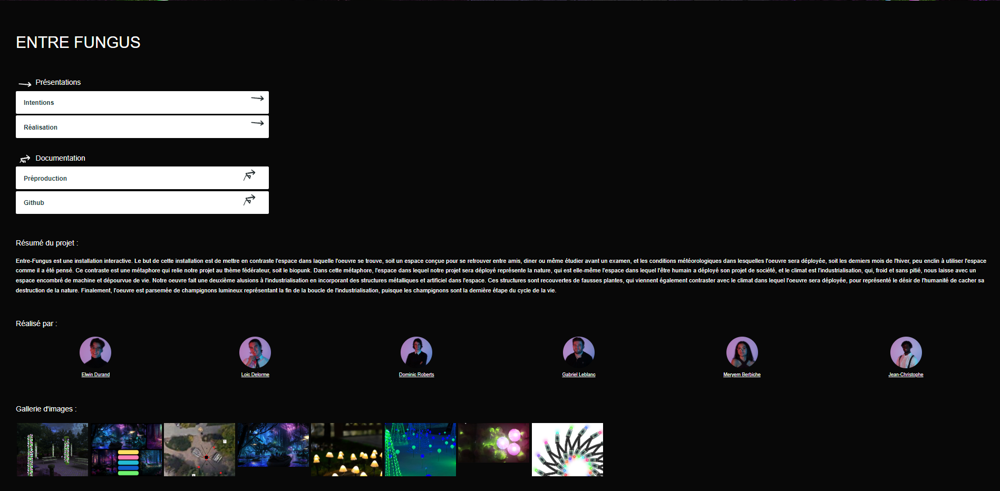
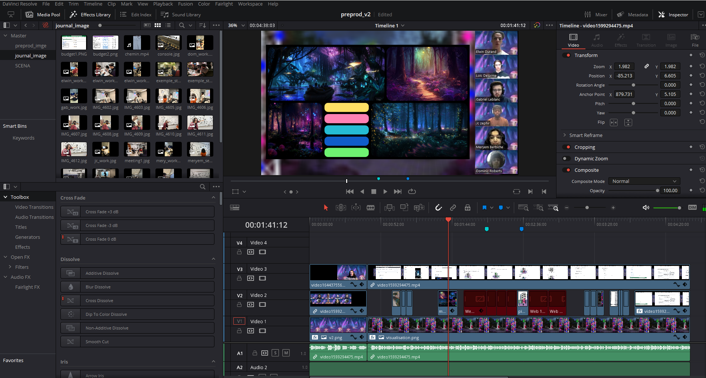
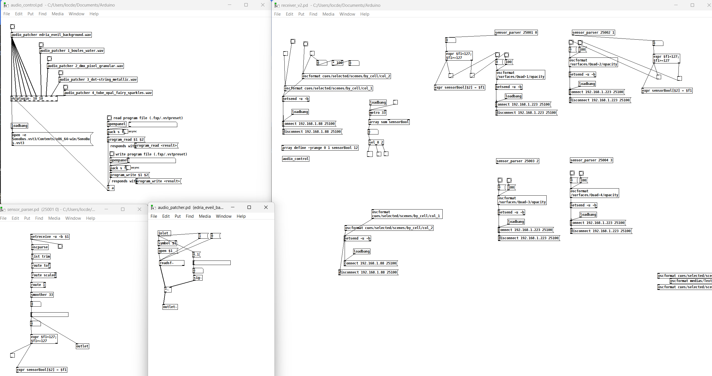
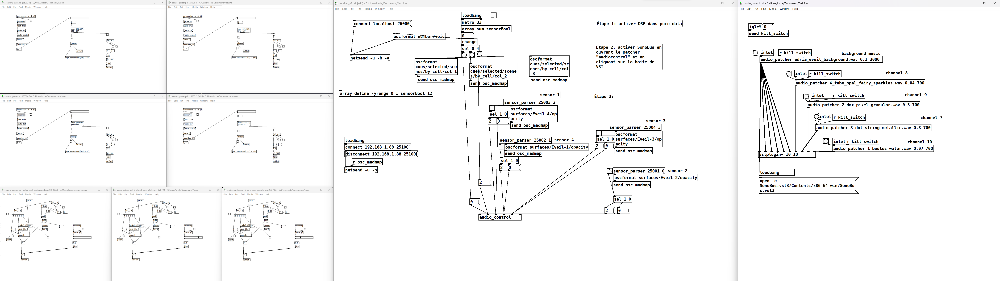

# Journal de "Loic Delorme"

* [Semaine 1](#semaine-1)
* [Semaine 2](#semaine-2)
* [Semaine 3](#semaine-3)
* [Semaine 4](#semaine-4)
* [Semaine 5](#semaine-5)
* [Semaine de rattrapage](#semaine-de-rattrapage)
* [Semaine 6](#semaine-6)
* [Semaine 7](#semaine-7)
* [Semaine 8](#semaine-8)
* [Semaine 9](#semaine-9)

## Semaine 1

### Résumé des réalisations effectuées
- Retravail du concept avec l'équipe. 
- faire du repérage de l'espace à l'extérieur. 
- Réparer le site web
- Trouver et rerogner les photo des membres de l'équipe
- Plusieurs réunion d'équipes
- Rédaction du journal 1

### Image d'une réalisation dont tu es la ou le plus fier

### Est-ce que j'ai accompli l'ensemble des tâches et objectifs que je m'étais fixés pour cette semaine?	
- [x] Complètement
- [ ] Assezz
- [] Peu
- [ ] Pas du tout

#### Décrivez pourquoi.
J'ai réussi a clarifier ma vision des défit technique de mon équipe et nous avons réussi a clarifier notre concept.

### Mon projet s'est-il réalisé selon l’échéancier prévu?

- [ ] Complètement
- [x] Assez
- [ ] Un peu
- [ ] Pas tout à fait

### Défis pour la prochaine semaine
Réalisation de la vidéo de présentation et rédaction de la liste de matériel.

---
## Semaine 2
### Résumé des réalisations effectuées
Cette semaine mon équipe et moi etions toujours dans l'étape de concrétisation du concept de notre projet. Du à cela j'ai fait beaucoup de rencontre d'équipe de maniere a presiser et optimiser notre concept à la situation. J'ai dresser la liste complete du matériel à louer et acheter de plus j'ai fait le montage de notre vidéo explicative. J'ai commencer à travailler sur une nouvelle maquette visuelle sur photoshop pour pouvoir avoir une bonne representation visuelle de notre projet dans l'Espace qui sera à jour avec nos dernier changement et avec nos dernieres idee. Je me suis aussi familiariser avec la programmation de lumiere via arknet et madmapper

### Image d'une réalisation dont tu es la ou le plus fier

### Est-ce que j'ai accompli l'ensemble des tâches et objectifs que je m'étais fixés pour cette semaine?

- [ ] Complètement
- [X] Assez
- [ ] Peu
- [ ] Pas du tout

#### Décrivez pourquoi.
 Bien que j'ai pu avancer autant la préprod que j'avais initiallement prévue, j'aurais aimé mettre plus de temps sur des tache comme le deisgn d'une bannière web, le photoshop et d'autre tâche de se type. Ces tâche n'était pas prioritaire mais vont tout de même devoir être faite lors de la semaine prochaine.

#### S'il y a lieu, qu'allez-vous faire pour remédier à la situation?
Je vais prendre un peu plus de temps dans ma semaine la semaine prochaine pour rattraper le leger retard.

### Mon projet s'est-il réalisé selon l’échéancier prévu?

- [ ] Complètement
- [X] Assez
- [ ] Un peu
- [ ] Pas tout à fait

#### S'il y a des écarts, décrivez-les.
Nous aurions aimé terminer plus rapidement la préproduction pour pouvoir nous mettre plus tôt sur la réalisation de notre vidéo, mais nous avons tout de même réussi à prendre une légère avance au niveau de la réalisation de la liste de matériel et de notre idée de réalisation concrète de projet.

#### S'il y a lieu, qu'allez-vous faire pour remédier à la situation?

### Défis pour la prochaine semaine
pour nous assurer du bon fonctionnement de notre projet. Puisque nous commencer la conception active de notre projet lors de la semaine 4 la semaine prochaine sera particulièrement demandante au niveau de la préparation. De plus, j'aimerais commencer à travailler sur le code arduino qui servira à la captation de présence sur notre structure.

---
## Semaine 3 
### Résumé des réalisations effectuées
Cette semaine, j'ai travaillé sur plusieurs projets différents :

- Tests avec les lumières DMX
  J'ai expérimenté avec différentes configurations et réglages pour trouver les meilleurs résultats.

- Capteurs Arduino
  J'ai effectué plusieurs tests pour comprendre comment ils fonctionnent et comment je peux les utiliser dans mon projet.

- Montage de la vidéo de présentation
  J'ai travaillé dur pour m'assurer que la vidéo soit aussi professionnelle et engageante que possible.

- Correction des problèmes sur GitHub
  J'ai travaillé sur la résolution des bogues et des problèmes de codage pour m'assurer que le projet fonctionne correctement.

- Montage de représentation visuelle de l'espace
  J'ai utilisé des outils visuels pour représenter de manière claire et concise les différents éléments de l'espace.

### Image d'une réalisation dont tu es la ou le plus fier

### Est-ce que j'ai accompli l'ensemble des tâches et objectifs que je m'étais fixés pour cette semaine?

- [ ] Complètement
- [x] Assez
- [ ] Peu
- [ ] Pas du tout

#### Décrivez pourquoi.
 J'ai fait plus que ce que je comptais faire cette semaine sur ceertain aspect. Dû au fait que le code arduino est déja fait en très grnade partie. Les test que j'avais prévu pour la semiane son déja presque fini. Par contre, je n'ai pas fait tout les tests avec maddmapper que javais prévu et nous n'avons pas pu aller chercher le matériel de Cr34te

#### S'il y a lieu, qu'allez-vous faire pour remédier à la situation?
Pour les tests, je vais les terminer aujourd'hui. Pour ce qui est de Cr34te, pusique la situation est hors de mon controle, je n'ai pas d'autre choix que d'attendre.

### Mon projet s'est-il réalisé selon l’échéancier prévu?

- [ ] Complètement
- [x] Assez
- [ ] Un peu
- [ ] Pas tout à fait

#### S'il y a des écarts, décrivez-les.
Comme mentionné plus haut, il n'y a pas eu d'équart particuier à l'exeption de Cr34te, cela fait en sorte que nous n'avons pas pu faire certain des tests qui étaient prévus pour las semaine.

#### S'il y a lieu, qu'allez-vous faire pour remédier à la situation?
Nous allons rattraper les tests manqué en allant chercheer l'équipement en début de semaine prochaine.

### Défis pour la prochaine semaine
Pour la semaine prochaine j'aimerais avoir finis la majortité du code pure data relié au sensors et à la connection avec madmapper, j'aimerais si possible commencer à faire des tets avec l'intégration sonore au patcher.

---
## Semaine 4
### Résumé des réalisations effectuées
Cette semaine j'ai mis la majorité de mon temps sur la première itération de notre prototype. Dans un premier temps j'ai créer un prototype sur roues avec un sensors et 4 DMX de façons à tester l'interactivité entre le sensors et maddmapper. Ses tests m'ont permis de mettre au point un patcher de relais pure data question de faire le liens entre les données captées par le sensors et le logi9.

### Image d'une réalisation dont tu es la ou le plus fier

### Est-ce que j'ai accompli l'ensemble des tâches et objectifs que je m'étais fixés pour cette semaine?

- [ ] Complètement
- [x] Assez
- [ ] Peu
- [ ] Pas du tout

### Décrivez pourquoi.
 Bien que j'ai pu faire plus que ce que je m'avais fixé au niveau du son et de l'installation, je n'ai pu finaliser les patch pure data. Je suis très bien avancé mais il me reste encore plusieurs chose à deboguer et corriger

### S'il y a lieu, qu'allez-vous faire pour remédier à la situation?
Puisque je suis en avance par raport à d'autre tâche du prijet, je pourrais finaliser mes patchs sans prendre de retard

### Mon projet s'est-il réalisé selon l’échéancier prévu?

- [ ] Complètement
- [x] Assez
- [ ] Un peu
- [ ] Pas tout à fait

#### S'il y a des écarts, décrivez-les.
  Noud voulions avoir un prototype complètement viable vendredi. Pour l'instant la plupart des aspects seront pret mais il y a toujours quelque problème avec le liens entre les sensors et les animations 

#### S'il y a lieu, qu'allez-vous faire pour remédier à la situation?
Je vais poser des question et faire de la recherche pour reussir à rentrer dans les deadline le plus possible

### Défis pour la prochaine semaine
Pour la semaine prochaine j'aimerais sourtout pouvoir ajouter 2 capteur à nos prototype sans creer de probleme avec le reste de l'installation.

---
## Semaine 5
### Résumé des réalisations effectuées
j'ai participé a la conception du gantt, jai revu une partie des issues du github, jai ajouter deux capteur a l'installation, regler une partie des problèmes audios et j'ai modifier les photos presente sur le site web.

### Image d'une réalisation dont tu es la ou le plus fier

### Est-ce que j'ai accompli l'ensemble des tâches et objectifs que je m'étais fixés pour cette semaine?

- [x] Complètement
- [ ] Assez
- [ ] Peu
- [ ] Pas du tout

#### Décrivez pourquoi.
 avec l'avance que jai pris la semaine derniere, il m'a ete facile de continuer sans prendre aucum retard.

#### S'il y a lieu, qu'allez-vous faire pour remédier à la situation?
puisque je suis a l'avance je n'ai pas a remedier a la situation.

### Mon projet s'est-il réalisé selon l’échéancier prévu?

- [x] Complètement
- [ ] Assez
- [ ] Un peu
- [ ] Pas tout à fait

#### S'il y a des écarts, décrivez-les.
Puisque j'ai pu prendre de l'avance il n'y a pas d'equart

#### S'il y a lieu, qu'allez-vous faire pour remédier à la situation?
puisque je suis a l'avance je n'ai pas a remedier a la situation.

### Défis pour la prochaine semaine
Faire une banniere pour le site et regler les derniers problème audio 

---
## Semaine de rattrapage
### Résumé des réalisations effectuées

### Image d'une réalisation dont tu es la ou le plus fier

### Est-ce que j'ai accompli l'ensemble des tâches et objectifs que je m'étais fixés pour cette semaine?

- [ ] Complètement
- [ ] Assez
- [ ] Peu
- [ ] Pas du tout

#### Décrivez pourquoi.
 

#### S'il y a lieu, qu'allez-vous faire pour remédier à la situation?

### Mon projet s'est-il réalisé selon l’échéancier prévu?

- [ ] Complètement
- [ ] Assez
- [ ] Un peu
- [ ] Pas tout à fait

#### S'il y a des écarts, décrivez-les.

#### S'il y a lieu, qu'allez-vous faire pour remédier à la situation?

### Défis pour la prochaine semaine

---
## Semaine 6
### Résumé des réalisations effectuées

### Image d'une réalisation dont tu es la ou le plus fier

### Est-ce que j'ai accompli l'ensemble des tâches et objectifs que je m'étais fixés pour cette semaine?

- [ ] Complètement
- [ ] Assez
- [ ] Peu
- [ ] Pas du tout

#### Décrivez pourquoi.
 

#### S'il y a lieu, qu'allez-vous faire pour remédier à la situation?

### Mon projet s'est-il réalisé selon l’échéancier prévu?

- [ ] Complètement
- [ ] Assez
- [ ] Un peu
- [ ] Pas tout à fait

#### S'il y a des écarts, décrivez-les.

#### S'il y a lieu, qu'allez-vous faire pour remédier à la situation?

### Défis pour la prochaine semaine

---
## Semaine 7
### Résumé des réalisations effectuées

### Image d'une réalisation dont tu es la ou le plus fier

### Est-ce que j'ai accompli l'ensemble des tâches et objectifs que je m'étais fixés pour cette semaine?

- [ ] Complètement
- [ ] Assez
- [ ] Peu
- [ ] Pas du tout

#### Décrivez pourquoi.
 

#### S'il y a lieu, qu'allez-vous faire pour remédier à la situation?

### Mon projet s'est-il réalisé selon l’échéancier prévu?

- [ ] Complètement
- [ ] Assez
- [ ] Un peu
- [ ] Pas tout à fait

#### S'il y a des écarts, décrivez-les.

#### S'il y a lieu, qu'allez-vous faire pour remédier à la situation?

### Défis pour la prochaine semaine

## Semaine 8

## Semaine 9
