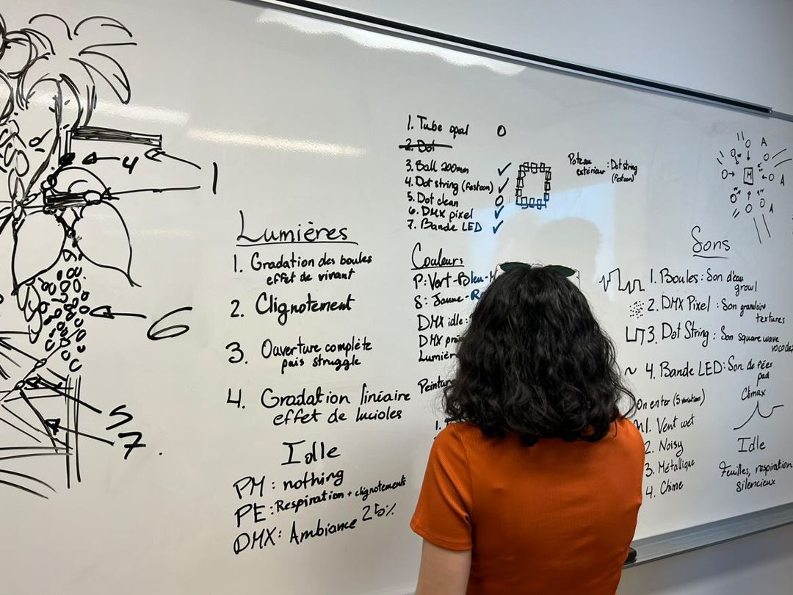
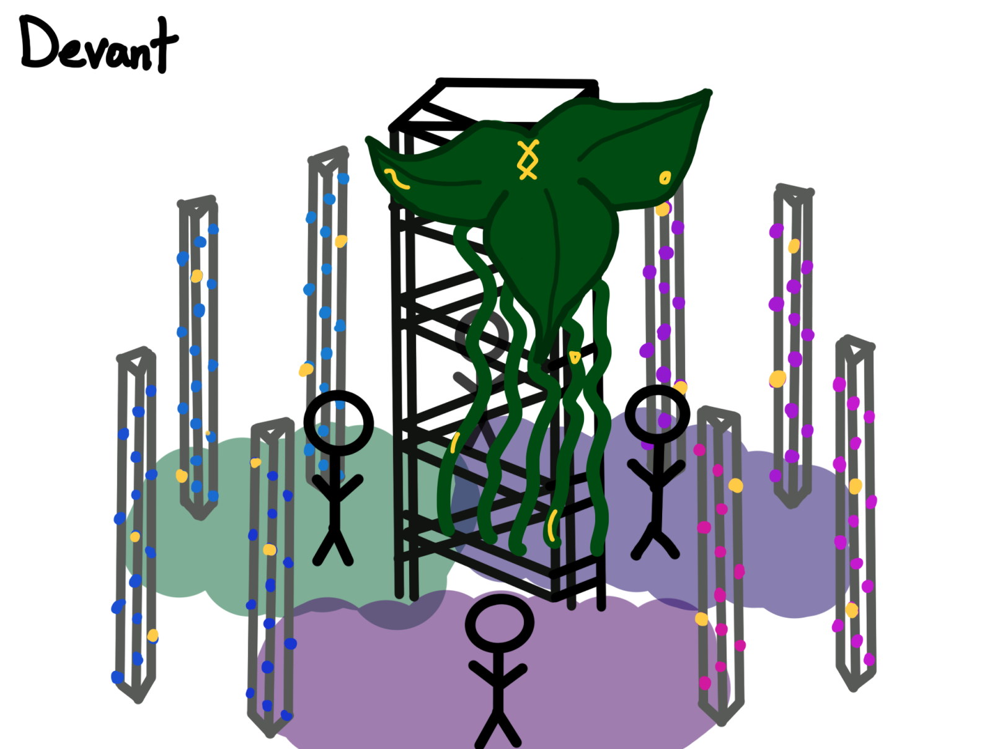
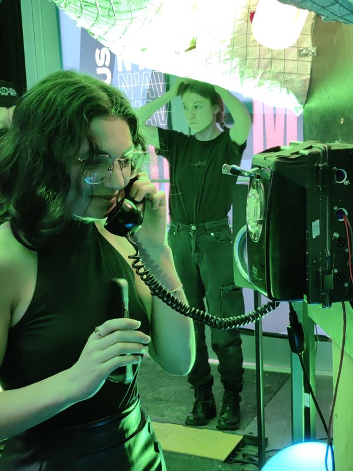

# Journal de Meryem Berbiche

* [Semaine 1](#semaine-1)
* [Semaine 2](#semaine-2)
* [Semaine 3](#semaine-3)
* [Semaine 4](#semaine-4)
* [Semaine 5](#semaine-5)
* [Semaine de rattrapage](#semaine-de-rattrapage)
* [Semaine 6](#semaine-6)
* [Semaine 7](#semaine-7)
* [Semaine 8](#semaine-8)
* [Semaine 9](#semaine-9)

## Semaine 1

### Résumé des réalisations effectuées
-  Rencontre avec Daryl sur le concept
-  Amélioration du concept
-  Amélioration de l'intéractivité
-  Rencontre du comité technique avec Guillaume
-  Meilleure compréhension des emplacements et projets des autres équipes
-  Changement de la plantation électrique
-  Meilleure compréhension de l'intégration par rapport à la centralisation informatique
-  Meilleure compréhension du budget 

### Image d'une réalisation dont tu es la ou le plus fier

### Est-ce que j'ai accompli l'ensemble des tâches et objectifs que je m'étais fixés pour cette semaine?	
- [X] Complètement
- [ ] Assez
- [ ] Peu
- [ ] Pas du tout

#### Décrivez pourquoi.
J'ai commencé le début de semaine avec plusieurs stress et questionnements. Le premier cours m'a donné encore plus de questionnements sur la faisabilité d'être à l'extérieur avec le budget et le temps alloué. Je suis partie voir Guillaume après personnellement pour discuter des projets et lui poser des questions. Nous avons ensuite eu la rencontre avec Daryl, qui nous a questionné sur le concept. Je lui ai posé plusieurs questions par rapport à nos idées et par rapport au concept. Après une bonne rencontre d'équipe, nous avons modifié l'intéractivité afin de mieux faire comprendre notre intention aux intéracteurs. De plus, nous avons eu la rencontre de comité technique avec Guillaume. J'ai posé vraiment beaucoup de questions par rapport à nos connexions électriques. Nous avons dû alors tout changer nos plantations et passer de modulaire à centralisé. Finalement, j'ai demandé à Guillaume d'apporter sa caméra POE afin de faire des tests. J'ai donc terminé la semaine satisfaite des nouvelles informations que j'ai eu, moins stressé et fière que j'ai posé autant de questions. 

### Mon projet s'est-il réalisé selon l’échéancier prévu?

- [X] Complètement
- [ ] Assez
- [ ] Un peu
- [ ] Pas tout à fait

### Défis pour la prochaine semaine
Je vais devoir commencer à mieux comprendre le mapping, afin de ne pas avoir de problèmes dans les prochaines semaines. Le mapping sera très important puisque nous centralisons les informations qui seront relayées aux différentes LEDS que je dois programmer. Aussi, un défi sera de finir la préproduction de façon claire, précise et concise. Finalement, le GitHub devra être complètement à jour et compris par tous.

---
## Semaine 2
### Résumé des réalisations effectuées
- Première renconte du comité communication
- Confirmation de l'intention du projet
- Simplification et confirmation de l'intéractivité du projet
- Rédaction des liens entre la lumière et le son de façon précise
- Rédaction des étapes du scénario
- Rédaction du scénarimage

### Image d'une réalisation dont tu es la ou le plus fier

### Est-ce que j'ai accompli l'ensemble des tâches et objectifs que je m'étais fixés pour cette semaine?

- [ ] Complètement
- [X] Assez
- [ ] Peu
- [ ] Pas du tout

#### Décrivez pourquoi.
 Suite à la rencontre mardi matin, nos professeurs nous ont dit que notre projet était trop ambitieux dans le temps alloué et avec le budget. Guillaume m'a finalement annoncé que la Caméra POE ne pouvait avoir lieu, donc que nous ne pouvions compter le nombre de personne précisément. Il nous donna une solution d'avoir des capteurs sur le poteau du milieu à la place, mais cela ne prendrait pas la zone entière. De plus, Daryl nous avertissait qu'avec le temps, il serait très difficile de faire l'intéractivité sur les poteaux extérieurs. Ces deux enjeux modifiaient complètement notre intéractivité et on devait se tourner de bord. Nous nous sommes rencontrés en équipe et après de longs questionnements, nous avons décidé précisément l'intention de notre projet et l'intéractivité associée à celle-ci. Nous passions d'une intéractivité de la zone entière à seulement le poteau central. Ensuite, le reste de la semaine, l'équipe d'intéractivité devait s'attarder sur chaque étape pour le scénarimage. De longues rencontres sur le questionnement pour le son, les lumières, les liens entre eux, etc. Cette étape était si longue que je n'ai pas pu commencer à voir MadMapper et j'ai été en retard pour faire mon journal.

#### S'il y a lieu, qu'allez-vous faire pour remédier à la situation?
Je vais commencer à voir des vidéos sur Madmapper pendant la fin de semaine. Aussi, pour les prochaines semaines, je vais écrire mon journal au fur et à mesure afin de ne pas être en retard vers la fin de la semaine. 

### Mon projet s'est-il réalisé selon l’échéancier prévu?

- [X] Complètement
- [ ] Assez
- [ ] Un peu
- [ ] Pas tout à fait

Tout de même, je suis fière du gros travail que j'ai accompli cette semaine avec mon équipe. Le projet évolue rapidement, mais nous ne prenons pas de retard sur nos dates limites! 

### Défis pour la prochaine semaine
Ce sera de commencer les tests afin d'évaluer si tout ce que nous voulons faire en intéractivité est possible et réalisable. Il faudra terminer la préproduction ensuite. 

---
## Semaine 3 
### Résumé des réalisations effectuées
- Visite à l'UQAM et présentation de notre projet
- Finition de la préproduction
- Détermination des dates limites
- Comité communication: 1ère idée de texte pour projet
- Comité technique: Détermination de la possibilité d'utiliser le FabLab de la BAnQ
- Premier jet et essais sur Madmapper
- Apprentissage des scènes et transitions sur Madmapper

### Image d'une réalisation dont tu es la ou le plus fier

### Est-ce que j'ai accompli l'ensemble des tâches et objectifs que je m'étais fixés pour cette semaine?

- [ ] Complètement
- [X] Assez
- [ ] Peu
- [ ] Pas du tout

#### Décrivez pourquoi.
 Nous sommes partis voir l'UQAM lundi matin. Mardi matin, nous avons eu la confirmation de notre préproduction avec les professeurs. Ils ont félicités mon travail de scénarimage dont l'organisation et la clarté de celle-ci et j'en étais fière. Cependant, ils ont critiqués le manque de deadlines pour notre projet. Nous avons dû alors faire une grosse rencontre d'équipe, personne par personne avec le chef du projet, afin de déterminer les dates limites. Je me suis rendue compte que j'avais moins de temps que prévu afin d'apprendre et finir Madmapper pour le projet, puisque je dois attendre que l'audio soit terminé pour commencer. De plus, je me suis rendue compte que nous avions moins de temps pour les retouches et les bugs après l'installation. Cela m'a stressé encore plus. J'ai ensuite commencé à apprendre MadMapper et je suis contente de l'avancement que j'ai eu, mais maintenant que les deadlines sont autants limites, je dois avancer plus rapidement.

#### S'il y a lieu, qu'allez-vous faire pour remédier à la situation?
Je vais devoir commencer à prototyper Madmapper sans même avoir de tests ou d'audio disponible.

### Mon projet s'est-il réalisé selon l’échéancier prévu?

- [ ] Complètement
- [X] Assez
- [ ] Un peu
- [ ] Pas tout à fait

#### S'il y a des écarts, décrivez-les.
Mon échéancier a dû être modifié puisque je ne peux pas bouger sans audio.

#### S'il y a lieu, qu'allez-vous faire pour remédier à la situation?
J'ai dû repenser à mon échéancier et je vais devoir terminer mes tests en prototypage avant même d'avoir finis mes médias.

### Défis pour la prochaine semaine
Je dois commencer mes tests avec les échantillons de Cr34te, en ayant des exemples de médias. Je dois aussi comprendre comment je vais séparer mes lumières sur MadMapper.

---
## Semaine 4
### Résumé des réalisations effectuées

### Image d'une réalisation dont tu es la ou le plus fier

### Est-ce que j'ai accompli l'ensemble des tâches et objectifs que je m'étais fixés pour cette semaine?

- [ ] Complètement
- [ ] Assez
- [ ] Peu
- [ ] Pas du tout

#### Décrivez pourquoi.
 

#### S'il y a lieu, qu'allez-vous faire pour remédier à la situation?

### Mon projet s'est-il réalisé selon l’échéancier prévu?

- [ ] Complètement
- [ ] Assez
- [ ] Un peu
- [ ] Pas tout à fait

#### S'il y a des écarts, décrivez-les.

#### S'il y a lieu, qu'allez-vous faire pour remédier à la situation?

### Défis pour la prochaine semaine

---
## Semaine 5
### Résumé des réalisations effectuées

### Image d'une réalisation dont tu es la ou le plus fier

### Est-ce que j'ai accompli l'ensemble des tâches et objectifs que je m'étais fixés pour cette semaine?

- [ ] Complètement
- [ ] Assez
- [ ] Peu
- [ ] Pas du tout

#### Décrivez pourquoi.
 

#### S'il y a lieu, qu'allez-vous faire pour remédier à la situation?

### Mon projet s'est-il réalisé selon l’échéancier prévu?

- [ ] Complètement
- [ ] Assez
- [ ] Un peu
- [ ] Pas tout à fait

#### S'il y a des écarts, décrivez-les.

#### S'il y a lieu, qu'allez-vous faire pour remédier à la situation?

### Défis pour la prochaine semaine

---
## Semaine de rattrapage
### Résumé des réalisations effectuées

### Image d'une réalisation dont tu es la ou le plus fier

### Est-ce que j'ai accompli l'ensemble des tâches et objectifs que je m'étais fixés pour cette semaine?

- [ ] Complètement
- [ ] Assez
- [ ] Peu
- [ ] Pas du tout

#### Décrivez pourquoi.
 

#### S'il y a lieu, qu'allez-vous faire pour remédier à la situation?

### Mon projet s'est-il réalisé selon l’échéancier prévu?

- [ ] Complètement
- [ ] Assez
- [ ] Un peu
- [ ] Pas tout à fait

#### S'il y a des écarts, décrivez-les.

#### S'il y a lieu, qu'allez-vous faire pour remédier à la situation?

### Défis pour la prochaine semaine

---
## Semaine 6
### Résumé des réalisations effectuées

### Image d'une réalisation dont tu es la ou le plus fier

### Est-ce que j'ai accompli l'ensemble des tâches et objectifs que je m'étais fixés pour cette semaine?

- [ ] Complètement
- [ ] Assez
- [ ] Peu
- [ ] Pas du tout

#### Décrivez pourquoi.
 

#### S'il y a lieu, qu'allez-vous faire pour remédier à la situation?

### Mon projet s'est-il réalisé selon l’échéancier prévu?

- [ ] Complètement
- [ ] Assez
- [ ] Un peu
- [ ] Pas tout à fait

#### S'il y a des écarts, décrivez-les.

#### S'il y a lieu, qu'allez-vous faire pour remédier à la situation?

### Défis pour la prochaine semaine

---
## Semaine 7
### Résumé des réalisations effectuées

### Image d'une réalisation dont tu es la ou le plus fier

### Est-ce que j'ai accompli l'ensemble des tâches et objectifs que je m'étais fixés pour cette semaine?

- [ ] Complètement
- [ ] Assez
- [ ] Peu
- [ ] Pas du tout

#### Décrivez pourquoi.
 

#### S'il y a lieu, qu'allez-vous faire pour remédier à la situation?

### Mon projet s'est-il réalisé selon l’échéancier prévu?

- [ ] Complètement
- [ ] Assez
- [ ] Un peu
- [ ] Pas tout à fait

#### S'il y a des écarts, décrivez-les.

#### S'il y a lieu, qu'allez-vous faire pour remédier à la situation?

### Défis pour la prochaine semaine

## Semaine 8

## Semaine 9
