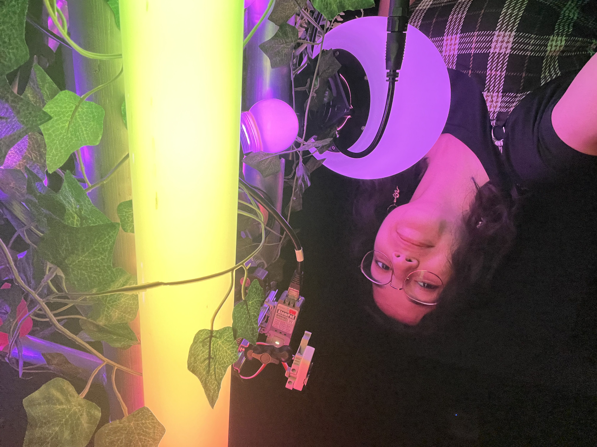
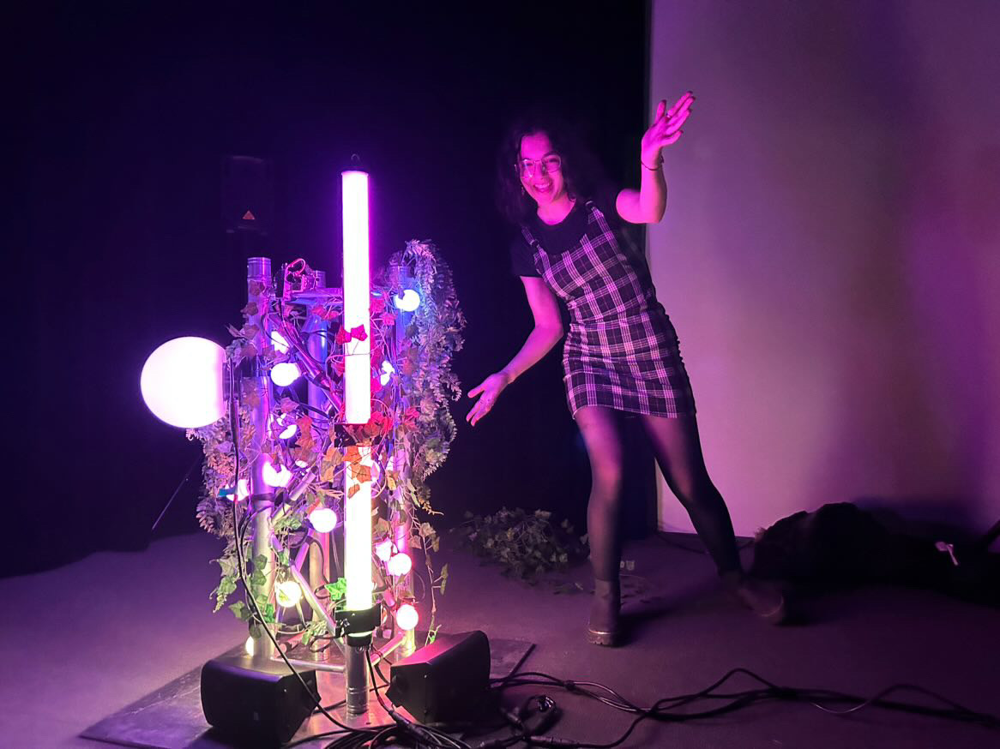
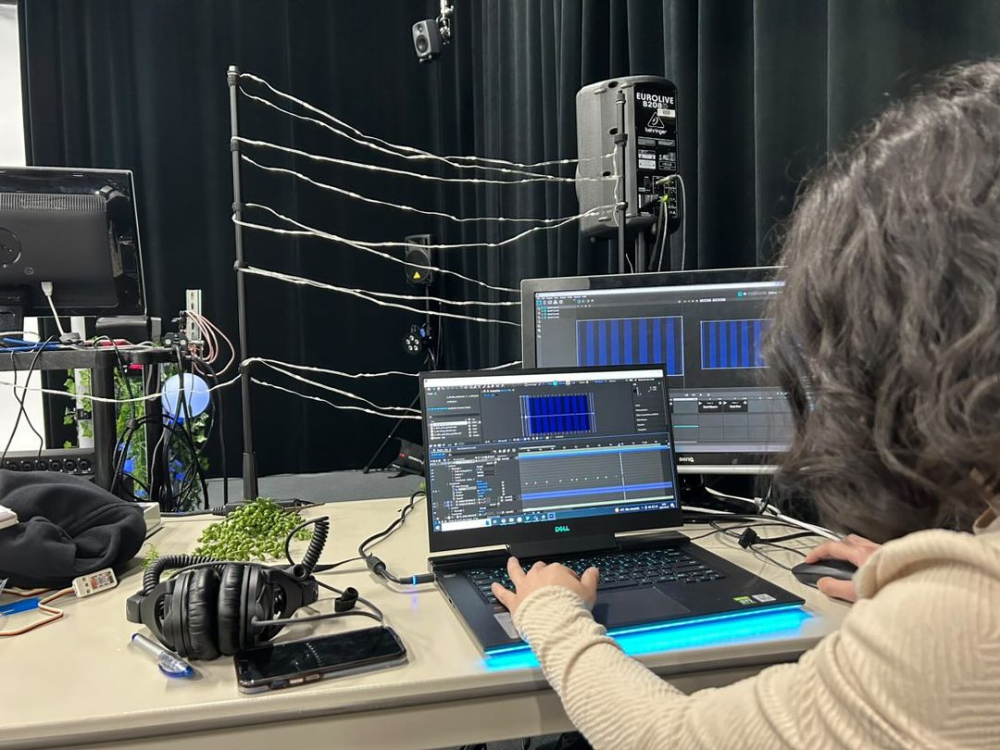
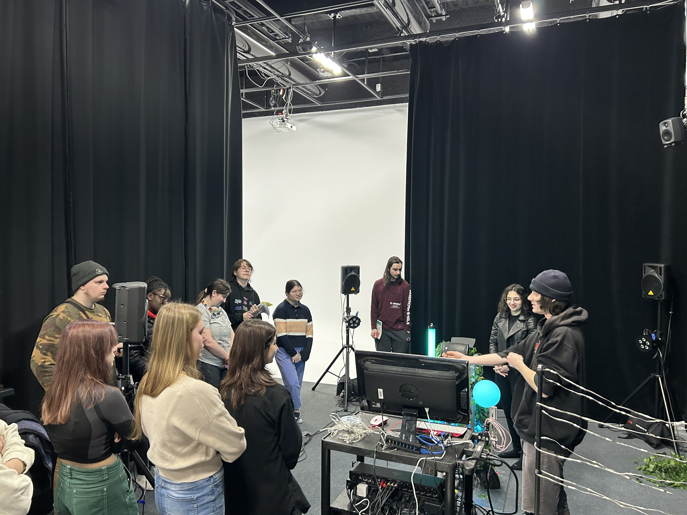
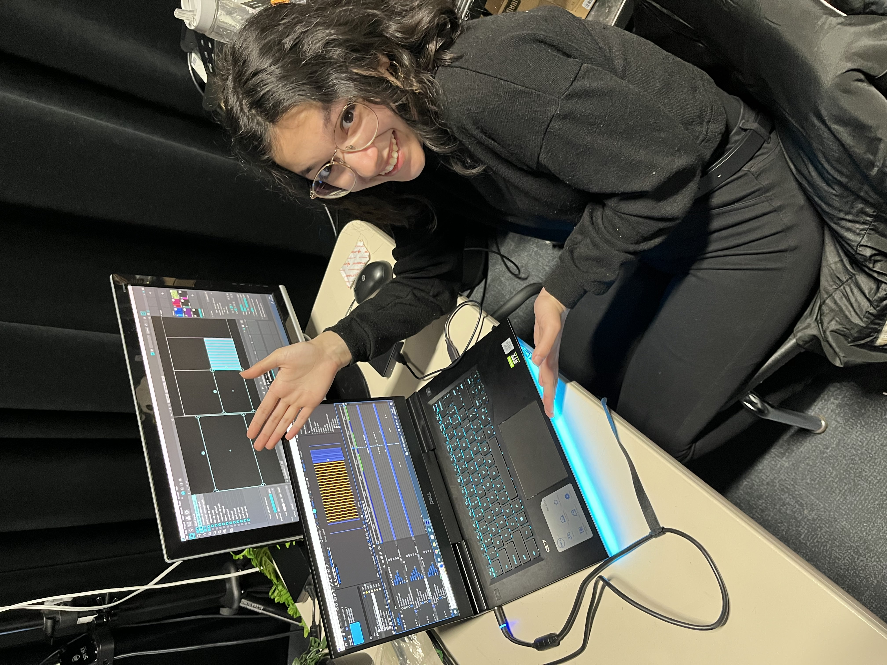
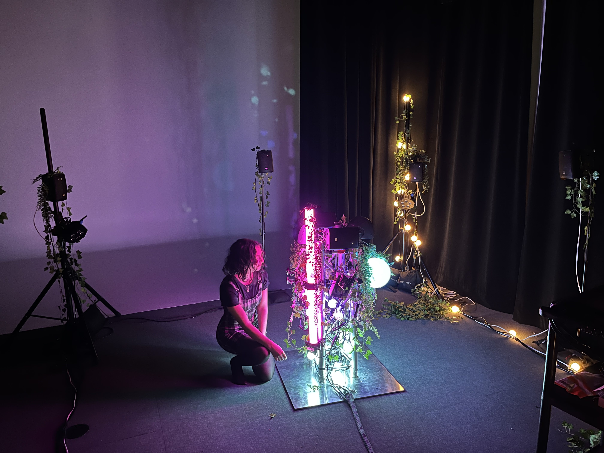
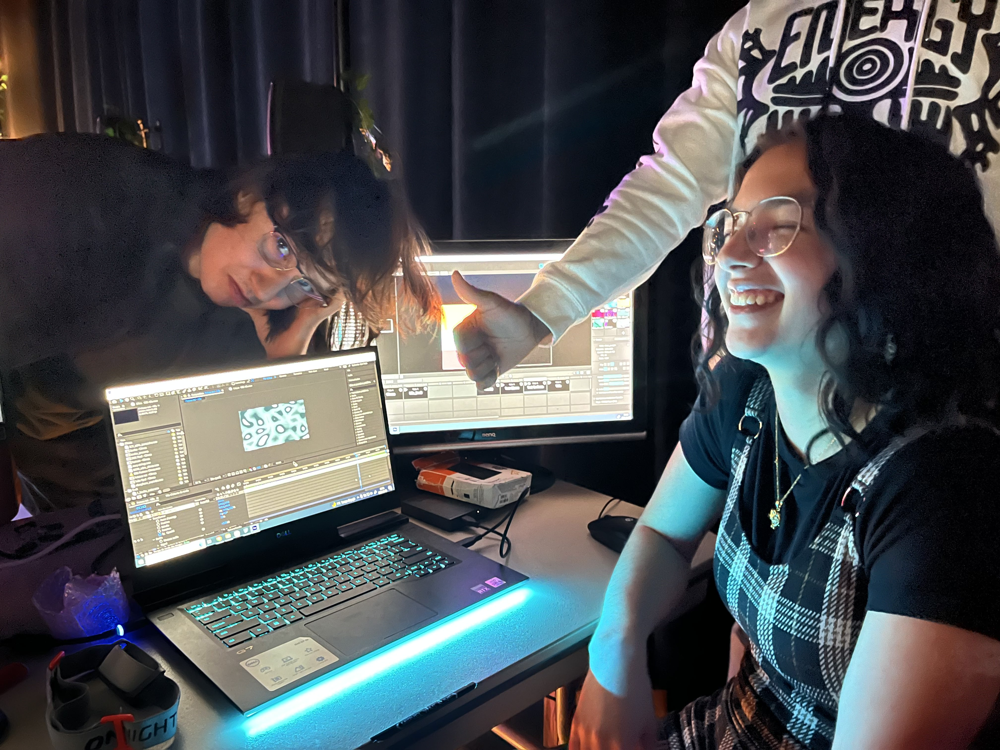
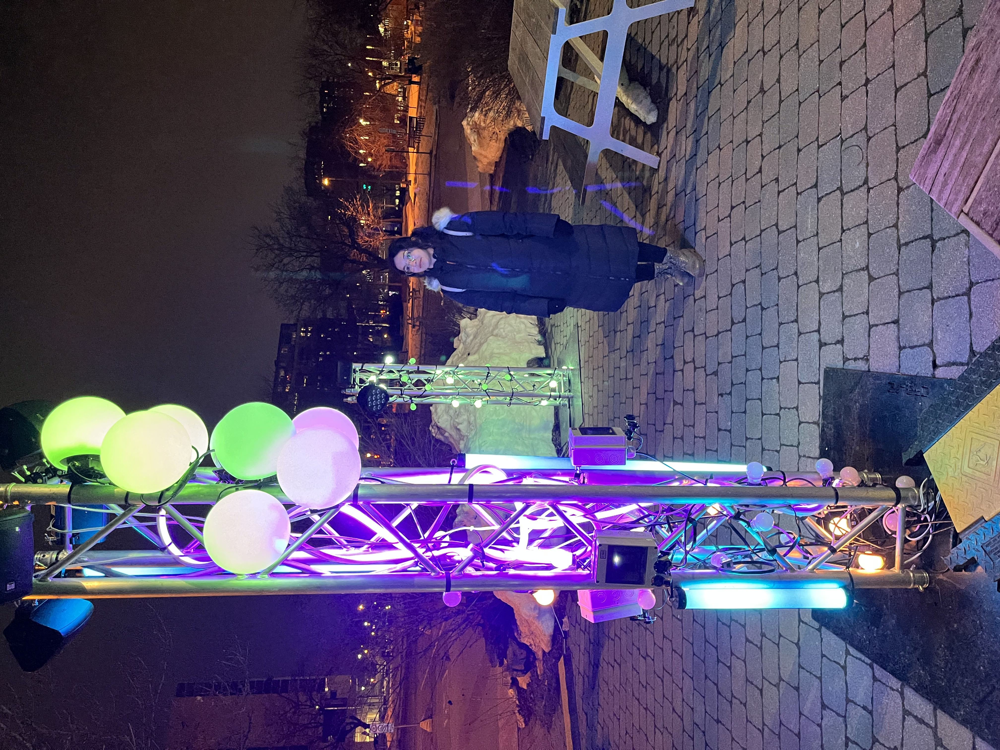

# Journal de Meryem Berbiche

* [Semaine 1](#semaine-1)
* [Semaine 2](#semaine-2)
* [Semaine 3](#semaine-3)
* [Semaine 4](#semaine-4)
* [Semaine 5](#semaine-5)
* [Semaine de rattrapage](#semaine-de-rattrapage)
* [Semaine 6](#semaine-6)
* [Semaine 7](#semaine-7)
* [Semaine 8](#semaine-8)
* [Semaine 9](#semaine-9)

## Semaine 1

### Résumé des réalisations effectuées
-  Rencontre avec Daryl sur le concept
-  Amélioration du concept
-  Amélioration de l'intéractivité
-  Rencontre du comité technique avec Guillaume
-  Meilleure compréhension des emplacements et projets des autres équipes
-  Changement de la plantation électrique
-  Meilleure compréhension de l'intégration par rapport à la centralisation informatique
-  Meilleure compréhension du budget 

### Image d'une réalisation dont tu es la ou le plus fier

### Est-ce que j'ai accompli l'ensemble des tâches et objectifs que je m'étais fixés pour cette semaine?	
- [X] Complètement
- [ ] Assez
- [ ] Peu
- [ ] Pas du tout

#### Décrivez pourquoi.
J'ai commencé le début de semaine avec plusieurs stress et questionnements. Le premier cours m'a donné encore plus de questionnements sur la faisabilité d'être à l'extérieur avec le budget et le temps alloué. Je suis partie voir Guillaume après personnellement pour discuter des projets et lui poser des questions. Nous avons ensuite eu la rencontre avec Daryl, qui nous a questionné sur le concept. Je lui ai posé plusieurs questions par rapport à nos idées et par rapport au concept. Après une bonne rencontre d'équipe, nous avons modifié l'intéractivité afin de mieux faire comprendre notre intention aux intéracteurs. De plus, nous avons eu la rencontre de comité technique avec Guillaume. J'ai posé vraiment beaucoup de questions par rapport à nos connexions électriques. Nous avons dû alors tout changer nos plantations et passer de modulaire à centralisé. Finalement, j'ai demandé à Guillaume d'apporter sa caméra POE afin de faire des tests. J'ai donc terminé la semaine satisfaite des nouvelles informations que j'ai eu, moins stressé et fière que j'ai posé autant de questions. 

### Mon projet s'est-il réalisé selon l’échéancier prévu?

- [X] Complètement
- [ ] Assez
- [ ] Un peu
- [ ] Pas tout à fait

### Défis pour la prochaine semaine
Je vais devoir commencer à mieux comprendre le mapping, afin de ne pas avoir de problèmes dans les prochaines semaines. Le mapping sera très important puisque nous centralisons les informations qui seront relayées aux différentes LEDS que je dois programmer. Aussi, un défi sera de finir la préproduction de façon claire, précise et concise. Finalement, le GitHub devra être complètement à jour et compris par tous.

---
## Semaine 2
### Résumé des réalisations effectuées
- Première renconte du comité communication
- Confirmation de l'intention du projet
- Simplification et confirmation de l'intéractivité du projet
- Rédaction des liens entre la lumière et le son de façon précise
- Rédaction des étapes du scénario
- Rédaction du scénarimage

### Image d'une réalisation dont tu es la ou le plus fier

### Est-ce que j'ai accompli l'ensemble des tâches et objectifs que je m'étais fixés pour cette semaine?

- [ ] Complètement
- [X] Assez
- [ ] Peu
- [ ] Pas du tout

#### Décrivez pourquoi.
 Suite à la rencontre mardi matin, nos professeurs nous ont dit que notre projet était trop ambitieux dans le temps alloué et avec le budget. Guillaume m'a finalement annoncé que la Caméra POE ne pouvait avoir lieu, donc que nous ne pouvions compter le nombre de personne précisément. Il nous donna une solution d'avoir des capteurs sur le poteau du milieu à la place, mais cela ne prendrait pas la zone entière. De plus, Daryl nous avertissait qu'avec le temps, il serait très difficile de faire l'intéractivité sur les poteaux extérieurs. Ces deux enjeux modifiaient complètement notre intéractivité et on devait se tourner de bord. Nous nous sommes rencontrés en équipe et après de longs questionnements, nous avons décidé précisément l'intention de notre projet et l'intéractivité associée à celle-ci. Nous passions d'une intéractivité de la zone entière à seulement le poteau central. Ensuite, le reste de la semaine, l'équipe d'intéractivité devait s'attarder sur chaque étape pour le scénarimage. De longues rencontres sur le questionnement pour le son, les lumières, les liens entre eux, etc. Cette étape était si longue que je n'ai pas pu commencer à voir MadMapper et j'ai été en retard pour faire mon journal.

#### S'il y a lieu, qu'allez-vous faire pour remédier à la situation?
Je vais commencer à voir des vidéos sur Madmapper pendant la fin de semaine. Aussi, pour les prochaines semaines, je vais écrire mon journal au fur et à mesure afin de ne pas être en retard vers la fin de la semaine. 

### Mon projet s'est-il réalisé selon l’échéancier prévu?

- [X] Complètement
- [ ] Assez
- [ ] Un peu
- [ ] Pas tout à fait

Tout de même, je suis fière du gros travail que j'ai accompli cette semaine avec mon équipe. Le projet évolue rapidement, mais nous ne prenons pas de retard sur nos dates limites! 

### Défis pour la prochaine semaine
Ce sera de commencer les tests afin d'évaluer si tout ce que nous voulons faire en intéractivité est possible et réalisable. Il faudra terminer la préproduction ensuite. 

---
## Semaine 3 
### Résumé des réalisations effectuées
- Visite à l'UQAM et présentation de notre projet
- Finition de la préproduction
- Détermination des dates limites
- Comité communication: 1ère idée de texte pour projet
- Comité technique: Détermination de la possibilité d'utiliser le FabLab de la BAnQ
- Premier jet et essais sur Madmapper
- Apprentissage des scènes et transitions sur Madmapper

### Image d'une réalisation dont tu es la ou le plus fier

### Est-ce que j'ai accompli l'ensemble des tâches et objectifs que je m'étais fixés pour cette semaine?

- [ ] Complètement
- [X] Assez
- [ ] Peu
- [ ] Pas du tout

#### Décrivez pourquoi.
 Nous sommes partis voir l'UQAM lundi matin. Mardi matin, nous avons eu la confirmation de notre préproduction avec les professeurs. Ils ont félicités mon travail de scénarimage dont l'organisation et la clarté de celle-ci et j'en étais fière. Cependant, ils ont critiqués le manque de deadlines pour notre projet. Nous avons dû alors faire une grosse rencontre d'équipe, personne par personne avec le chef du projet, afin de déterminer les dates limites. Je me suis rendue compte que j'avais moins de temps que prévu afin d'apprendre et finir Madmapper pour le projet, puisque je dois attendre que l'audio soit terminé pour commencer. De plus, je me suis rendue compte que nous avions moins de temps pour les retouches et les bugs après l'installation. Cela m'a stressé encore plus. J'ai ensuite commencé à apprendre MadMapper et je suis contente de l'avancement que j'ai eu, mais maintenant que les deadlines sont autants limites, je dois avancer plus rapidement.

#### S'il y a lieu, qu'allez-vous faire pour remédier à la situation?
Je vais devoir commencer à prototyper Madmapper sans même avoir de tests ou d'audio disponible.

### Mon projet s'est-il réalisé selon l’échéancier prévu?

- [ ] Complètement
- [X] Assez
- [ ] Un peu
- [ ] Pas tout à fait

#### S'il y a des écarts, décrivez-les.
Mon échéancier a dû être modifié puisque je ne peux pas bouger sans audio.

#### S'il y a lieu, qu'allez-vous faire pour remédier à la situation?
J'ai dû repenser à mon échéancier et je vais devoir terminer mes tests en prototypage avant même d'avoir finis mes médias.

### Défis pour la prochaine semaine
Je dois commencer mes tests avec les échantillons de Cr34te, en ayant des exemples de médias. Je dois aussi comprendre comment je vais séparer mes lumières sur MadMapper.

---
## Semaine 4
### Résumé des réalisations effectuées
- Avancement de MadMapper
- Tests des lumières sur l'installation
- Modification du type de lumières sur l'installation
- Prototype terminé

### Image d'une réalisation dont tu es la ou le plus fier

### Est-ce que j'ai accompli l'ensemble des tâches et objectifs que je m'étais fixés pour cette semaine?

- [ ] Complètement
- [X] Assez
- [ ] Peu
- [ ] Pas du tout

#### Décrivez pourquoi.
Nous avons reçu le matériel de Cr34te au début de la semaine. Nous avons eu la mauvaise nouvelle des professeurs que nous allions devoir remettre le matériel lundi prochain. Nous devions alors finir le prototype pour ce vendredi, les professeurs n'étant pas là les lundis, afin d'avoir l'approbation. Je devais donc laisser la création des vidéos d'animation pour une autre semaine et faire des tests sur les lumières le plus possible puisque je ne pourrais pas le voir en temps réel dans le futur. C'est vers le milieu de la semaine que nous avons remarqué que la façon que nous voulions créer les animations sur MadMapper n'était pas possible. Après un gros coup de stress, nous avons trouvé une solution, et j'ai maintenant une idée plus claire de comment je vais effectuer mes différentes scènes. Vers la fin de la semaine, l'installation du prototype étant terminé, nous avons dû repenser au design du poteau du milieu parce que plusieurs lumières ne marchaient pas esthétiquement. Cela m'a un peu bousculé sur mes animations, mais ce n'est pas au moins une grosse modification. J'ai donc pris toute la semaine pour faire des tests et finir le prototype en apprenant Madmapper, et je suis assez fière de l'amélioration que j'ai effectuée. Cependant, j'aurais aimé commencer mes vidéos afin de pouvoir tester en temps réel.
 

#### S'il y a lieu, qu'allez-vous faire pour remédier à la situation?
Je vais commencer mes vidéos la semaine prochaine, en ayant des lumières d'Amazon pour tester. Ce ne sera pas complètement représentatif, mais ce sera assez.

### Mon projet s'est-il réalisé selon l’échéancier prévu?

- [X] Complètement
- [ ] Assez
- [ ] Un peu
- [ ] Pas tout à fait

Même si je n'ai pas pu commencer mes vidéos, je m'étais fixé comme date limite de mes tests le 23 février. J'ai fini ces tests une semaine d'avance à cause du changement de dates pour le matériel, donc j'ai une semaine de plus pour me concentrer sur les médias que je dois créer.

### Défis pour la prochaine semaine
Ce sera de commencer les vidéos, idéalement, avoir fini les animations des différents côtés du poteau central, ayant maintenant l'audio pour.

---
## Semaine 5
### Résumé des réalisations effectuées
- Interview par 2Square
- Test des différentes animations de lumières 
- Test des différentes couleurs et agencement par rapport au son et aux autres lumières 
- Création des animations d'éveil sur After Effects
- Comité communication: Logo et résumé du projet
- Variations synchronisées d'animations avec le son
- Présentation aux premières années
- Test des différents univers pour les lumières 

### Image d'une réalisation dont tu es la ou le plus fier

### Est-ce que j'ai accompli l'ensemble des tâches et objectifs que je m'étais fixés pour cette semaine?

- [ ] Complètement
- [X] Assez
- [ ] Peu
- [ ] Pas du tout

#### Décrivez pourquoi.
 Je n'ai pas pu commencer mes médias comme voulu au début de la semaine avec l'interview de 2Square et l'incertitude que nous gardions peut-être le matériel. Dès que j'ai eu la bonne nouvelle que le matériel serait gardé, et que nous pouvions garder le prototype comme il était, j'étais extrêmement heureuse! Ça m'a enlevé beaucoup de stress puisque les animations et les couleurs changent beaucoup de lumières en lumières. Il est donc plus facile pour moi de juger avec le son l'animation lorsque je peux tester en même temps sur Madmapper. Je suis donc restée tout le reste de la semaine jusqu'à 10h30 au studio afin de me concentrer à créer mes médias. Avec les présentations des 1ères années me ralentissant puisque je ne pouvais travailler en même temps, j'ai réussi à finir 3 côtés sur 4, mais j'aurais aimé finir les 4 côtés pour ce vendredi. Je considère quand même cette semaine comme une semaine très productive et très amusante avec les différentes présentations et interview, je suis donc assez fière de moi!

#### S'il y a lieu, qu'allez-vous faire pour remédier à la situation?
Je vais essayer de finir mon 4ème côté pendant la fin de semaine.

### Mon projet s'est-il réalisé selon l’échéancier prévu?

- [ ] Complètement
- [X] Assez
- [ ] Un peu
- [ ] Pas tout à fait

#### S'il y a des écarts, décrivez-les.
Pour l'instant, je ne suis pas en retard dans mes médias. Cependant, j'aurais dû finir mes 4 côtés en même temps que Jean-Christophe ait finit le son de climax. J'ai la fin de semaine en plus pour la finir, parce qu'il n'a pas fini son son vendredi comme prévu et prend aussi la fin de semaine.

#### S'il y a lieu, qu'allez-vous faire pour remédier à la situation?
Je vais devoir passer encore plus de temps que prévu à l'école pendant la semaine de relâche afin de finir mes médias de façon plus efficace et rapide. 

### Défis pour la prochaine semaine
Comme il n'y aura aucune rencontre la semaine prochaine avec les professeurs, en plus d'avoir aucune autre chose à effectuer, je vais aller à l'école souvent pendant la semaine pour créer tout le reste de mes médias. Je dois finir tous mes médias, dont la synchronisation avec le son, pour vendredi prochain.
---
## Semaine de rattrapage
### Résumé des réalisations effectuées
- Scénario des lumières au climax par rapport au son
- Test des différentes animations de lumières pour le climax
- Test des différentes couleurs et agencement par rapport au son et aux autres lumières au climax
- Création des animations du climax sur After Effects
- Variations synchronisées d'animations avec la musique du climax
- Test des différents univers pour les lumières en rajoutant le poteau extérieur

### Image d'une réalisation dont tu es la ou le plus fier

### Est-ce que j'ai accompli l'ensemble des tâches et objectifs que je m'étais fixés pour cette semaine?

- [ ] Complètement
- [X] Assez
- [ ] Peu
- [ ] Pas du tout

#### Décrivez pourquoi.
J'avais fini mon 4ème côté pendant la fin de semaine, comme je l'avais prévu. J'ai donc commencé à faire le climax lundi, en venant de recevoir la musique. Je devais commencer à faire mon scénario pour chaque lumière. Cependant, mardi, le courant a coupé. Je ne pouvais pas faire mes tests. J'ai donc dû travailler de la maison à finir mon scénario et faire mon premier média, à l'aveugle. Lorsque je suis venue mercredi en fin d'après-midi, quand Guillaume avant trouvé une solution pour le courant, je devais arranger tout ce que j'avais fait la veille. Cela m'a retardé dans la création de mes médias et je suis restée à chaque jour jusqu'à 11h au studio afin de travailler. Je n'ai pas fini mes médias pour le 3 mars, cependant, j'ai fait de grands progrès et je suis fière de l'avancement que j'ai effectué.

#### S'il y a lieu, qu'allez-vous faire pour remédier à la situation?
Je vais devoir travailler pendant la fin de semaine et le début de la semaine prochaine afin de finir tous mes médias le plus rapidement possible.

### Mon projet s'est-il réalisé selon l’échéancier prévu?

- [ ] Complètement
- [ ] Assez
- [X] Un peu
- [ ] Pas tout à fait

#### S'il y a des écarts, décrivez-les.
Je devais avoir fini mes médias pour aujourd'hui le 3 mars. Je n'ai toujours pas fini le climax et l'état de sommeil n'a toujours pas été commencé, n'ayant même pas reçu le son encore. Je suis donc en retard, mais j'ai fini la majorité de ce que j'avais à faire.

#### S'il y a lieu, qu'allez-vous faire pour remédier à la situation?
Comme écrit en haut, je vais devoir travailler pendant la fin de semaine et le début de la semaine prochaine jusqu'à tard le soir afin de finir tous mes médias le plus rapidement possible.

### Défis pour la prochaine semaine
Il faut que pour vendredi, le projet final soit terminé. Je dois donc finir mes médias et consolider le tout sur Madmapper. Ce sera un gros défi, mais je suis optimiste.

---
## Semaine 6
### Résumé des réalisations effectuées
- Finition du Madmapper complet
- Création des animations du climax sur After Effects
- Création des animations du idle sur After Effects
- Création des animations pour le poteau extérieur sur After Effects dans tous les états
- Modification des couleurs pour l'état d'éveil sur After Effects
- Variations synchronisées de toutes les animations

### Image d'une réalisation dont tu es la ou le plus fier

### Est-ce que j'ai accompli l'ensemble des tâches et objectifs que je m'étais fixés pour cette semaine?

- [X] Complètement
- [ ] Assez
- [ ] Peu
- [ ] Pas du tout

#### Décrivez pourquoi.
 Mon deadline pour cette semaine était de finir le madmapper au complet et mes médias. Je devais aussi finir l'agencement des couleurs dans mes animations. J'ai tout terminé pour vendredi mes objectifs. Cependant, j'ai des modifications sur le climax à faire que je vais effectuer la semaine prochaine pendant que l'équipe d'installation s'occupe de dehors. Le idle et l'éveil sont maintenant complètement terminés. 

#### S'il y a lieu, qu'allez-vous faire pour remédier à la situation?
Je n'ai rien a remédier, j'ai fini mes objectifs comme prévu.

### Mon projet s'est-il réalisé selon l’échéancier prévu?

- [X] Complètement
- [ ] Assez
- [ ] Un peu
- [ ] Pas tout à fait

Comme dit en haut, mon échéancier a été rattrapé en ayant fini mes objectifs. Il me reste cette semaine pour les dernières modifications.

### Défis pour la prochaine semaine
Ce sera de modifier l'animation du climax et de peaufiner le reste de mes animations avec les tests dehors.

---
## Semaine 7
### Résumé des réalisations effectuées
- Installation des lumières, poteaux, hauts-parleurs, etc. 
- Modification des animations du Climax
- Modification du timing pour le Climax
- Modification des couleurs pour le Climax sur After Effects
- Modification des couleurs pour l'éveil sur After Effects

### Image d'une réalisation dont tu es la ou le plus fier

### Est-ce que j'ai accompli l'ensemble des tâches et objectifs que je m'étais fixés pour cette semaine?

- [X] Complètement
- [ ] Assez
- [ ] Peu
- [ ] Pas du tout

#### Décrivez pourquoi.
 J'ai eu la mauvaise nouvelle, à l'installation, que nous allions pas avoir les DMX Pixel. Lora nous a dit d'utiliser la bande LED à la place. Cependant, cela changeait complètement mon organisation de mes animation. J'ai donc dû faire 

#### S'il y a lieu, qu'allez-vous faire pour remédier à la situation?

### Mon projet s'est-il réalisé selon l’échéancier prévu?

- [ ] Complètement
- [ ] Assez
- [ ] Un peu
- [ ] Pas tout à fait

#### S'il y a des écarts, décrivez-les.

#### S'il y a lieu, qu'allez-vous faire pour remédier à la situation?

### Défis pour la prochaine semaine

## Semaine 8

## Semaine 9
