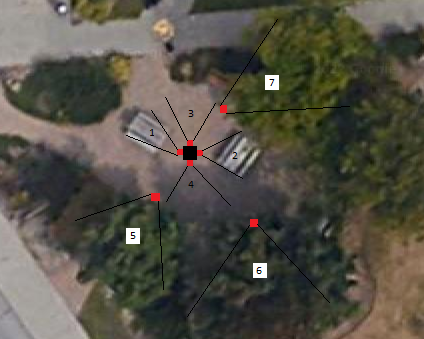
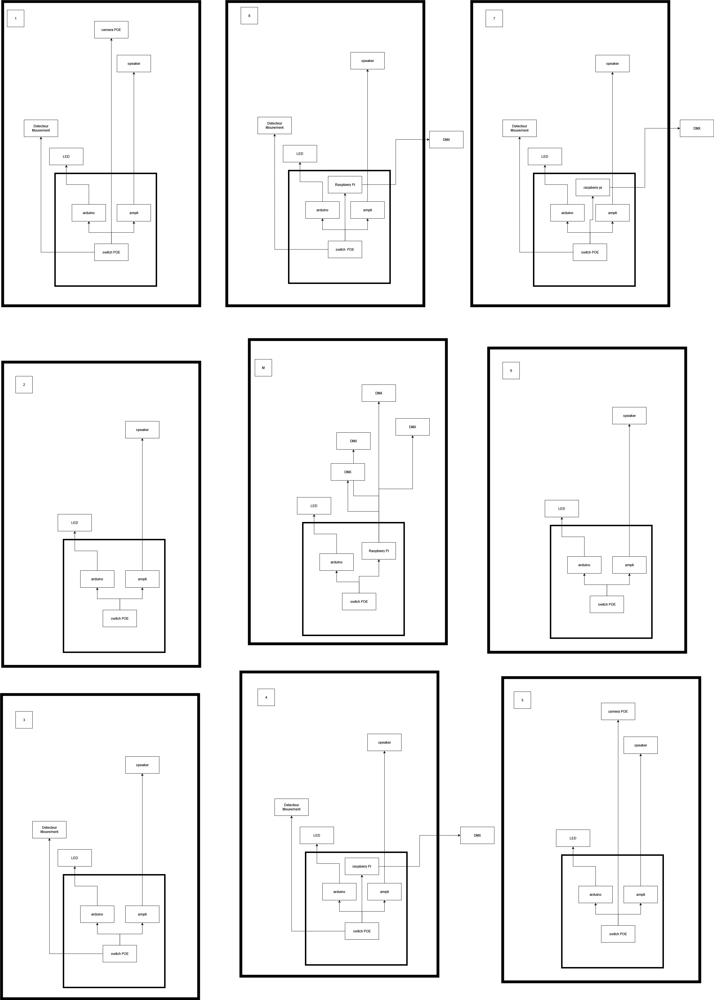

# Préproduction

# Table des matières
1. [Intention ou concept](#Intention-ou-concept)
    - [Cartographie](#Cartographie)
    - [Intention de départ](#Intention-de-départ)
    - [Synopsis](#Synopsis)
    - [Tableau d'ambiance (*moodboard*)](#Tableau-d'ambiance-(*moodboard*))
    - [Scénario, scénarimage ou document audio/visuel](#Scénario,-scénarimage-ou-document-audio/visuel)
2. [Contenu multimédia à intégrer](#Contenu-multimédia-à-intégrer)
    - [Inventaire du contenu multimédia](#Inventaire-du-contenu-multimédia)
    - [Univers artistique des éléments](#Univers-artistique-des-éléments-centraux)
3. [Planification technique d'un prototype (devis technique)](#Planification-technique-(devis-technique))
    - [Schémas ou plans techniques](#Schémas-ou-plans-techniques)
    - [Matériaux requis](#Matériaux-de-scénographie-requis)
    - [Équipements requis](#Équipements-requis)
    - [Logiciels requis](#Logiciels-requis)
    - [Ressources humaines requises](#Ressources-humaines-requises)
    - [Ressources spatiales requises (rangement et locaux)](#Ressources-spatiales-requises-(rangement-et-locaux))
    - [Contraintes techniques et potentiels problèmes de production](#Contraintes-techniques-et-potentiels-problèmes-de-production)
4. [Planification de la production d'un prototype (budget et étapes de réalisation)](#Planification-de-la-production-(budget-et-étapes-de-réalisation))
    - [Budget prévisionnel](#Budget-prévisionnel)
    - [Échéancier global](#Échéancier-global)
    - [Liste des tâches à réaliser](#Liste-des-tâches-à-réaliser)
    - [Rôles et responsabilités des membres de l'équipe](#Rôles-et-responsabilités-des-membres-de-l'équipe)
    - [Moments des rencontres d'équipe](#Moments-des-rencontres-d'équipe)

# Intention ou concept
## Cartographie

### Plan d'éclairage des lumières adressables
  
Carré noir = Poteau central  
Carré rouges = Lumières adressables (7)  
Lignes noires = Angle fictif des lumières adressables  
1 et 2 = Lumières pointant sur les tables  
3 et 4 = Lumières comblant L,espace vide restant  
5, 6 et 7 = Lumières pointant dans les branches des arbres  

## Intention de départ
Dans ce projet, nous souhaitons réaliser une expérience interactive reprenant le thème commun de la classe: le Biopunk. La nature et la technologie sont des idées opposées: Elles représentent une dualité. Notre installation devra ressembler à un environnement relax, dans lequel les utilisateurs pourront explorer et interagir avec ce qu'il se trouve autour d'eux. La nature aura donc une apparence "artificielle", grâce à la présence de diverses technologies aux alentours .

## Synopsis
Traversant un hiver froid et glacial, nos explorateurs arrivent en terre inconnue : Entre Fungus. Des piliers se dressent, et un écosystème hors de ce monde se dévoile sous nos yeux. Des champignons lumineux attirent l’attention des explorateurs. Intrigués, ils rentrent dans cette espace insolite et observent ce qui s’y passe : une ambiance sonore joue, les champignons changent de couleur ainsi que de rythme, et les lumières éclairent la scène. 

## Tableau d'ambiance (*moodboard*)

### Audio
[Référence féérique](https://www.youtube.com/shorts/z6iGZhqrxRY)
[Référence ambiophonique](https://www.youtube.com/shorts/v1o-gKb9cJc)

### Lumières & Champignons

[Moodboard Éclairage](medias/moodboard_ambiance_eclairage.png) 
[Palette de couleurs](https://coolors.co/ffe065-fe81b4-25bcd4-1356b4-71f074) 
[Champignons](https://www.youtube.com/watch?v=GZ8umWHb2j8) 
[Lumièrescdans les arbres](https://www.youtube.com/watch?v=opkbghGGM30) 
[Audioréactivité texture granulaire](https://www.youtube.com/watch?v=HyF5Q9zNhZ0) 
[Ambiance générale](https://www.youtube.com/watch?v=8Nj2O60BJdk) 

## Scénario, scénarimage ou document audio/visuel
L’ambiance sonore est calme lorsqu’il n’y a personne. Quelques champignons scintillent à droite et à gauche doucement. À chaque entrée ou sortie par un chemin, un son de fée se fait entendre, pendant que les champignons sur les poteaux autour de l’entrée s’allument et clignotent et la lumière adressable autour s’ouvre aussi. Lorsqu’une personne entre dans la scène, les lumières au centre s'allument et plus de champignons scintillent, pendant qu’une superposition de sons commence dans l’ambiance sonore. Il y a aussi des changements de couleurs dans les autres lumières adressables. Le nombre de champignons qui s’allument et le nombre de sons se superposant dans l’ambiance sonore augmente graduellement selon le nombre de personnes, donc entre 1 et 3 personnes, dans la scène. Toujours dans la graduation, à 4 personnes, il y a de la texture granulaire qui entre dans l’ambiance sonore. Les champignons allumés et les lumières adressables réagissent avec la texture abstraite. Finalement, nous arrivons à un sommet à 5 personnes et un événement intéractif arrive. Lorsque la 5ème personne rentre dans la scène, tous les champignons et les lumières s’éteignent d’un coup pour quelques secondes pendant que l’on entend des voix coupées et ré arrangées de manière générative. Les champignons s’ouvrent de zone en zone, donc autour des entrées, avec les lumières adressables en suivant le son. Finalement, lorsque tous les champignons et  lumières sont allumés, ils clignotent et changent de couleur tout en s’harmonisant avec l’ambiance sonore. À la fin de ce 20 secondes d’évènement spécial, l’ambiance sonore se calme, tout en entendant encore des voix. Les champignons sont tous allumés, dont certains scintillent doucement et rapidement. Toutes les lumières sont allumées, en réagissant avec des transitions douces de couleurs tout en suivant le son. Le sommet a été atteint et l’ambiance générale est en complète harmonie. Si des personnes quittent la scène, il y a une dégradation contraire à la description ci-dessus.

# Contenu multimédia à intégrer
## Inventaire du contenu multimédia

2 paysages sonores (dont 1 modulable)

4 modules multimédias (captation des données, interprétation des données, contrôle d'éclairage et effets audiovisuels)

## Univers artistique des éléments
[Inventaire du contenu à intégrer](https://cmontmorency365-my.sharepoint.com/:x:/g/personal/2062121_cmontmorency_qc_ca/Ed-9BxbzUDpHkrCtu1kijxwBOhWSUQP5E1gXYZtl-SiaGA)

# Planification technique d'un prototype (devis technique)
## Schémas ou plans techniques

### Plantation 

### Schéma de branchement 

## Matériel de scénographie requis

* Poteaux
    * Abs
    * 12' x 4"
    * Joint ABS 4"
    * Cap ABS 4"
    * Pattes d'éléphant
    * Pied de sapin
    * Cadre en bois

* Poteau du milieu 
    * Pont d'éclairage
    * Base

## Équipements requis

* Audio
    * Haut-Parleurs Yamaha NS-AW194BL (8x)
    * 8 fils RCA de 7' (M->F)
    * Ampli Fosi Audio TB10A
    * 8 fils ethernet to RCA

* Lumières
    * LED ALITOVE DC 12V WS2811 12mm
    * Arduino ATOM PoE kit with W5500
    * Lumières adressables
    * Cable XLR

* Électricité
    * Source ethernet

* Réseau
    * Cables Ethernet de longueurs variées
    * Switch PoE 5 ports

* Ordinateur
    * Raspberry pi

* Interactivité
    * PIR Motion Sensor (AS312)
    * Camera OAK-1 PoE
    

## Logiciels requis

Logiciels:  
FL Studio 
VCV Rack 
TouchDesigner 
Arduino 

## Ressources humaines requises

* TTP, location de matériel
* Designeuse industrielle; Madame Genevieve 
* Les prof du programme TIM

## Ressources spatiales requises (rangement et locaux)

* Lieu Extérieur
    * Déploiement

* Grand Studio
    * Entreposage

* Petit studio
    * Enregistrement audio

## Contraintes techniques et potentiels problèmes de production

| Contrainte ou problème potentiel                 | Solution envisagée                                    | Commentaires                                                                                 |
|--------------------------------------------------|-------------------------------------------------------|----------------------------------------------------------------------------------------------|
| Jamais utilisé la caméra POE. | Faire plusieurs tests et expérimenter de plusieurs façons, demander de l’aide aux professeurs ou TTP et vérifier la documentation en ligne. | Nous n’avons pas d’autres solutions pour des caméras pour l’extérieur, donc il faudra être formé. | 
|Pas beaucoup d’expérience avec TouchDesigner | Formation plus approfondie par le TTP, demander de l’aide aux professeurs ou TTP et vérifier la documentation en ligne. |  Sinon, nous pourrions essayer avec Max/MSP ou MadMapper. |                                          
 | Problème de connexion avec les cartes sonores (interface audio). | Acheter une carte de son qui se connecte avec les 7 speakers. Mettre à jours les logiciels qui ont besoin d’être mis à jour et tous leurs drivers. | Ce genre de problème empêcherait VCV Rack (et tout autre logiciel qui utilise de l’audio) de pouvoir jouer de l’audio dans les speakers. |
 |  Problème avec les envois d’informations en OSC/UDP aux logiciels réceptacles. |  Vérifier que chaque étape a bien été faite, vérifier si les informations envoyées peuvent être reçu par les logiciels réceptacles, vérifier les pares-feux. |  Ce problème enlèvera toute possibilité de communication entre les divers logiciels qui créent l’interactivité. |
 | Nous n'avons jamais fais des lumières adressables dans TouchDesigner. | Faire des recherches en regardant des vidéos en ligne, demander de l'aide aux professeurs ou aux TTPs | Sinon, on pourrais laisser tomber TouchDesigner et faire les lumières avec QLC+ |
 |  Faire la programmation de l'audio réactivité dans touch designer (connectique entre plusieurs logiciels complexe) |  Faire encore des recherches ou demander d'autre aide. |  Sinon, on pourrait laisser tomber l'audio réactivité et faire plutôt des patterns de lumière | 
 | Faire tenir les poteaux extérieurs à la verticale | Nous avons dévellopé une base qui nous semble assez robuste et qui pourra résister au intempérit, mais un être humain mal intentionné pourrait tout de même les faire tomber | C'est une partie relativement importante de notre projet alors il sera difficile de l'enlever |
 |Construction des poteaux extérieur; cette partie demande une série de technique qui est dans un autre domaine complètement de ce que nous avons vue dans la technique | Garder la structure le plus simple possible | Les plans que nous avons fait pour cette structure ne sont pas excessivement compliqué, mais ils demande des connaissance assez précise des matériaux utilisés. | 
 |  Trouver un poteau de scène qu'il serait possible de louer et qui va correspondre à nos besoins.  |  S'assurer de se prendre d'avance et de contacter un grand nombre d'entreprises afin d'être sur de ne pas être pris a faire des recherches à la dernière minute. | Ce genre de problème nous empêcherait d'avancer sur le projet puisque ce poteau est le point central de notre exposition.  |
 | Manquer d'effectif ou de temps lors de la conception des centaines de champignons. | Bien planifier et tester les étapes de la conception des champignons afin de pouvoir s'assurer d'avoir un nombre minimum de problème et que tous les gens impliqués dans la conception soient disponible dans la période de temps déterminée. |  Ce problème ferait en sorte que nous perdrions une grande partie de l'ambiance du projet puisque les champignons sont les éléments visuels principaux.|
 | Il est possible que les deadlines ne soient pas respectées, retardant les contraintes imposées. | Se prendre le plus tôt possible en prévision de chaque problème important qui pourrait venir dans notre direction. | C'est une contrainte qui dépend des membres de l'équipe, donc cela pourrait être sous contrôle avec de la prévision. |

# Planification de la production d'un prototype (budget et étapes de réalisation)
## Budget prévisionnel

[Lien vers document](https://cmontmorency365.sharepoint.com/:x:/s/TIM-58266B-Expriencemultimdiainteractive-Enseignants/ERS3zx4iKAlLn03N_0h3cyQBOV_nxNuKvrKnqmrXGcgDYg?e=Rjq9Uc)

## Échéancier global
Étapes importantes du projet visualisé dans GitHub (*milestones*):  
https://github.com/F-C-A/ENTRE-FUNGUS/milestones

*Dates importantes :*
- Première itération : lundi x novembre
- Prototype finale : lundi x décembre
- Présentation des projets devant public : jeudi 25 mars (soir)

## Liste des tâches à réaliser
Visualisation des tâches à réaliser dans GitHub selon la méthode Kanban:  
https://github.com/orgs/F-C-A/projects/1

Inventaire des tâches à réaliser dans GitHub selon le répertoire d'*issues*:  
https://github.com/F-C-A/ENTRE-FUNGUS/issues

## Rôles et responsabilités des membres de l'équipe

**Mirvel**
- Installation de la pièce centrale;
- Installation des poteaux extérieur;

Liste des tâches dans Git Hub:  
https://github.com/F-C-A/ENTRE-FUNGUS/issues/9 
https://github.com/F-C-A/ENTRE-FUNGUS/issues/10

**Gabriel**
- Création des différentes transitions de 
ères qui seront jouées par rapport au nombre de personnes détectées.
- Création d'une animation de lumières d'environ 10-20 secondes au climax (lorsqu'il y a 5 personnes de détectées).
- Programmation de l'audio réactivité dans TouchDesigner des lumières lorsque des textures granulaires jouent.

Liste des tâches dans Git Hub:
https://github.com/F-C-A/ENTRE-FUNGUS/issues/11
https://github.com/F-C-A/ENTRE-FUNGUS/issues/12
https://github.com/F-C-A/ENTRE-FUNGUS/issues/13

**Elwin**
- Coordination générale du projet (coordination de l'échéancier, du budget, suivi de la liste des tâches à réaliser, s'assurer de la répartition du rôle et des responsabilités des membres de l'équipe);
- Coordination technique de l'équipe d'installation et d'intégration
- documentation du déploiement du projet.

Liste des tâches dans Git Hub:  
https://github.com/tim-montmorency/66B-modele_de_projet/issues/assigned/DarylMomo  
https://github.com/tim-montmorency/66B-modele_de_projet/projects/2?card_filter_query=assignee%3Adarylmomo

**Jean-Christophe**
- Création des différentes atmosphères audios qui seront jouées par rapport au nombre de personnes détectées dans la zone interactive 
- Création des paysages sonores sonores;
- Création d'une atmosphère sonore spéciale d'environ 10-20 secondes au climax (lorsqu'il y a 5 personnes de détectées).
- Programmation de l'audio réactivité dans TouchDesigner des lumières lorsque des textures granulaires jouent.

Liste des tâches dans Git Hub:  
https://github.com/tim-montmorency/66B-modele_de_projet/issues/assigned/gllmAR
https://github.com/tim-montmorency/66B-modele_de_projet/projects/2?card_filter_query=assignee%3Agllmar

**Loic**
- Installation de la pièce centrale;
- Installation des LEDs et champignons;
- Coordination de la création et de l'integration champignons;

Liste des tâches dans Git Hub:  
https://github.com/tim-montmorency/66B-modele_de_projet/issues/assigned/DarylMomo  
https://github.com/tim-montmorency/66B-modele_de_projet/projects/2?card_filter_query=assignee%3Adarylmomo

**Meryem**
- Coordination de l'équipe d'intégration
- Création des différentes atmosphères et zones de champignons 
- Création d'une animation de lumières des champignons d'environ 10-20 secondes au climax (5 personnes)
- Programmation de l'audio réactivité des lumières des champignons lorsque les textures granulaires jouent
- Progammation de la réactivité des lumières des champignons à l'entrée et à la une sortie d'une personne
- Programmation de la réactivité du nombres de champignons allumés selon le nombre de personnes (entre 1 et 5)

Liste des tâches dans Git Hub:  
https://github.com/tim-montmorency/66B-modele_de_projet/issues/assigned/gllmAR
https://github.com/tim-montmorency/66B-modele_de_projet/projects/2?card_filter_query=assignee%3Agllmar

**Dominic**
- Coordination de l'équipe d'installation;
- Installation des poteaux ;
- Programmation du module Max d'éclairage;
- Programmation du module Max de contrôle de la navigation utilisateur & des différents sous-modules.

Liste des tâches dans Git Hub:  
https://github.com/tim-montmorency/66B-modele_de_projet/issues/assigned/DarylMomo  
https://github.com/tim-montmorency/66B-modele_de_projet/projects/2?card_filter_query=assignee%3Adarylmomo

**Tâches pas encore attribuées**  
https://github.com/tim-montmorency/66B-modele_de_projet/issues?q=is%3Aopen+is%3Aissue+no%3Aassignee

## Moments des rencontres d'équipe
Hebdomadaire
- **Lundi 10h (1h-2h)** : Rencontre de suivi de projet.
- **Jeudi 10h (1h-2h)** : Rencontre de suivi de projet.

Autre: 
- **À chaque jalon (milestone)** : Rencontre de suivi de projet.
- **Quand l'installation est terminée** : Rencontre de suivi de projet.
- **Quand l'interactivité est terminée** : Rencontre de suivi de projet.
