# Elwin
## Pésentation:

### 1 : Entre Fungus (Meryem, Jean-Christophe, Mirvel, Dominic, Elwin, Gabriel, Loïc) 

-  Espace communautaire pour se détendre le temps d’une pause dans une ambiance post biologique. Nous allons parsemer les structures scéniques de fausses plantes et incorporer des appareils de chauffage (si possible) pour simuler un climat plus clément. 	 

- Structure scénique interactive au-dessus des tables. Le concept consiste à démontrer l’évolution éventuelle de notre société avec des structures en forme de champignons modifiés par la technologie. L'espace sera composé d’une structure entourant l’espace extérieur des tables, cette structure sera métallique et recouverte de gazon synthétique ainsi que de champignons lumineux de tailles variées. Les tables présentes sous la grande structure seront interactives. Elles détecteront la présence de visiteurs et déclencheront une série de lumières et de sons qui tourneront autour du visiteur. 
 

# Meryem
## [Structure](https://docs.google.com/document/d/1coBJng0cZosF5NbB20PPtKtSOkWaeV5PFCrxWh3B_VY/edit?usp=sharing)
Ambiance générale:  Peu de champignons sont ouverts quand il y a personne. Quand des personnes rentrent, il y a de plus en plus de champignons qui s'illuminent. Il y a de faibles clignotements aléatoires sur les champignons allumés.

Sommet de l'ambiance: Lorsqu'il y a 5 personnes dans la zone, tous les champignons se ferment puis s'ouvrent zone par zone jusqu'à qu'ils sont tous allumés. Ensuite, certains clignotent rapidement, puis finissent doucement.

Lorsqu'une personne rentre ou sort: Les champignons sur les poteaux autour de l'entrée clignotent
 
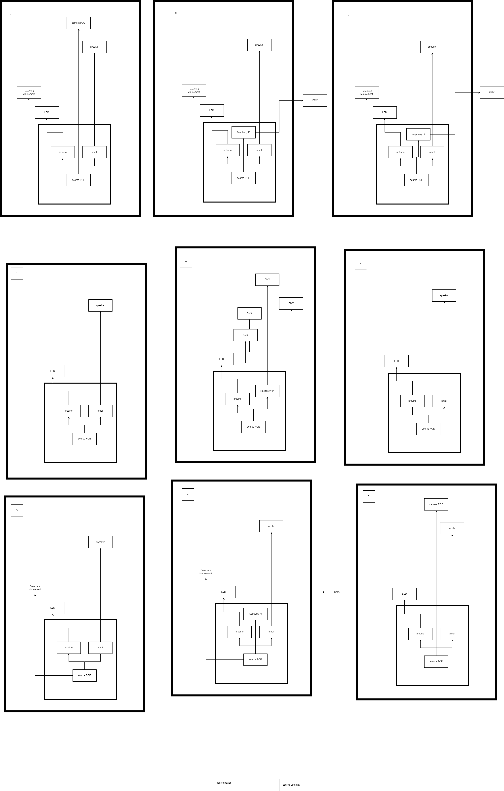
 

# JC
## Interactivité champignons texte détecteur de mouvements et progression maximum

## Ambiance générale : 
À chaque personne qui s’ajoute. les sons se superpose. À noter que les sons seront fait avec de la synthèse granulaire (ce ne sera pas des samples qui vont jouer)
* 1 Personne : Vent
* 2 Personnes : Eau
* 3 Personnes : Feuilles
* 4 Personnes : Textures Granulaires abstraites
Lorsque 5 personnes sont dans l’espace intéractif, une bande sonore spéciale de 10-20 secondes joue pour récompenser les intéracteurs.
À la suite de la bande sonore spéciale, l’atmosphère générale va changer notamment, il y aura des sons de voix coupé et réarrangé de manière
générative par VCV Rack

## Quand quelqu'un rentre/sort : 
Son de fée qui semble accueillir l’intéracteur qui sonne comme un “ringtone”  <em>(Voir sono references “river_spirit_on-enter-exit)</em>

 

# Gab

Ambiance Générale :

Il y a 7 DMX en tout. Les 2 DMX pointant sur les tables restent ouvertes en permanence (Sauf à l’entrée de la première personne et la sortie de la dernière personne) 1-3 Personnes : Il y a des transitions douces en fade où les 5 autres DMX passe à une couleur différente. 4 Personnes : Audio réactif aux textures granulaires abstraites.

Sommet de l'ambiance :

5 Personnes (Peak) : Toutes les DMX clignotent et changent de couleur en alternance incluant les 2 pointant vers les tables.

Quand la 1ère personne entre :

Fade-in lent (durée du son d’entrée)

Quand la dernière personne sort :

Fade-out lent s’il y a personne (durée du son de sortie)

[Audio Réactivité Texture](https://youtu.be/HyF5Q9zNhZ0) 
[DMX Arbres](https://youtu.be/opkbghGGM30) 

 

 
 

# Loïc

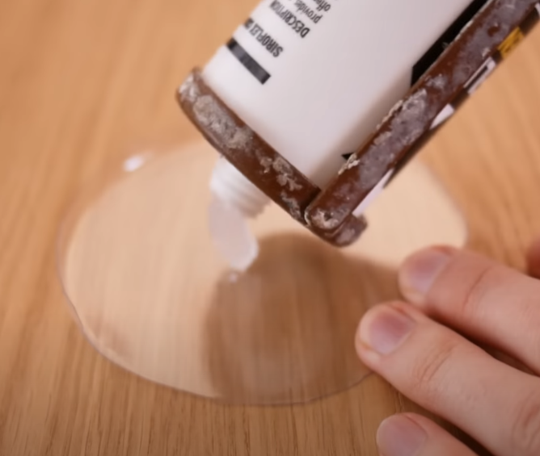
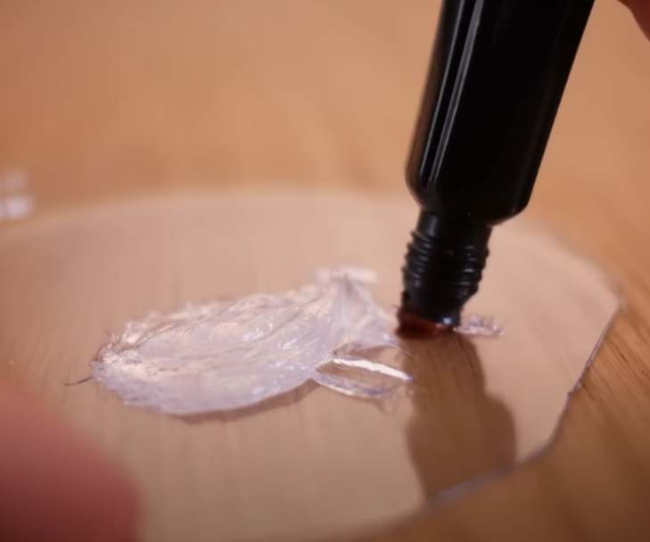
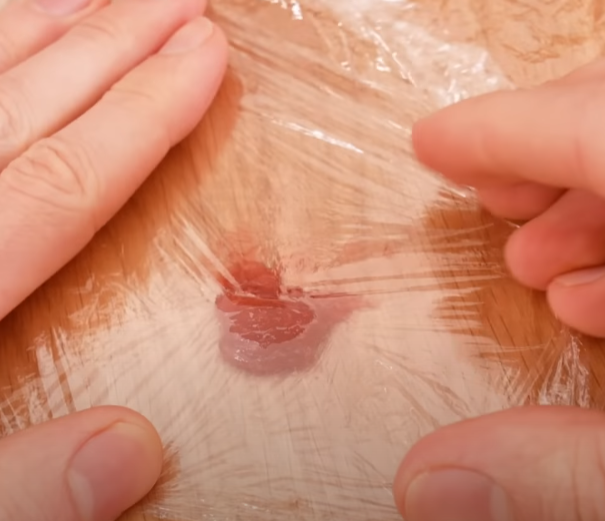
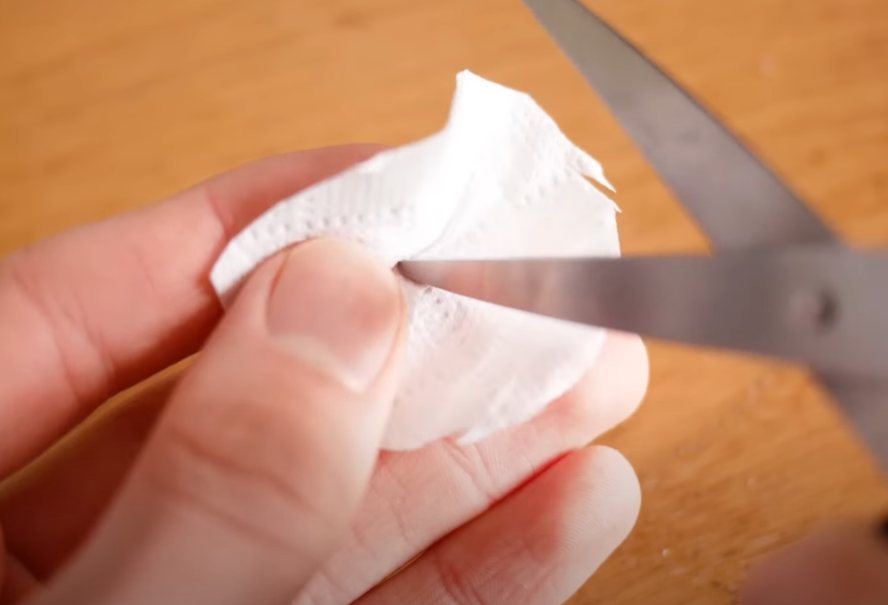

 

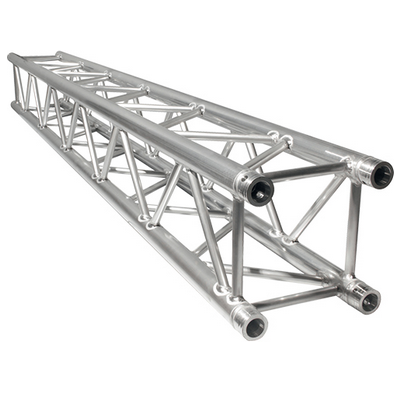

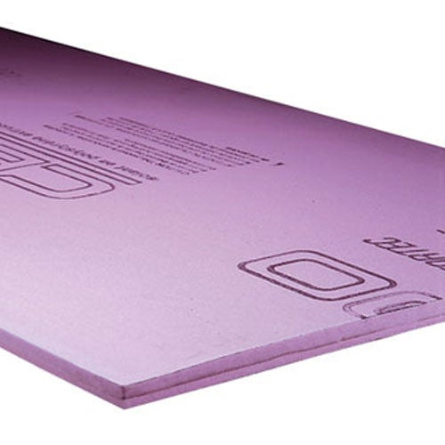

 

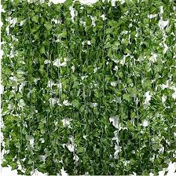

 

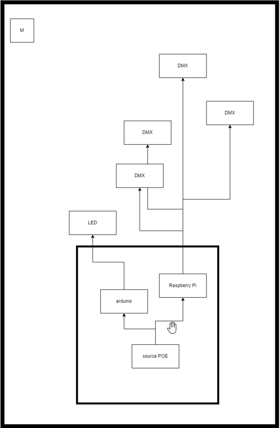

 

# Mirvel

- Processus de construction des champignons
- Prototype de champignons fait à partir de silicone transparent et de colorant alimentaire (peu) pour pouvoir avoir de la lumière visible et de la transparence
- Attaché grâce à des collets/bolts autour des poteaux de ABS
- LED redressable
- System de drainage; en bas du poteau, à environ 1 pied pour que l’eau passe dans un trou qui passe du poteau ABS et du pied de ciment
- Fausse plante/verdure autour du poteau pour embellir

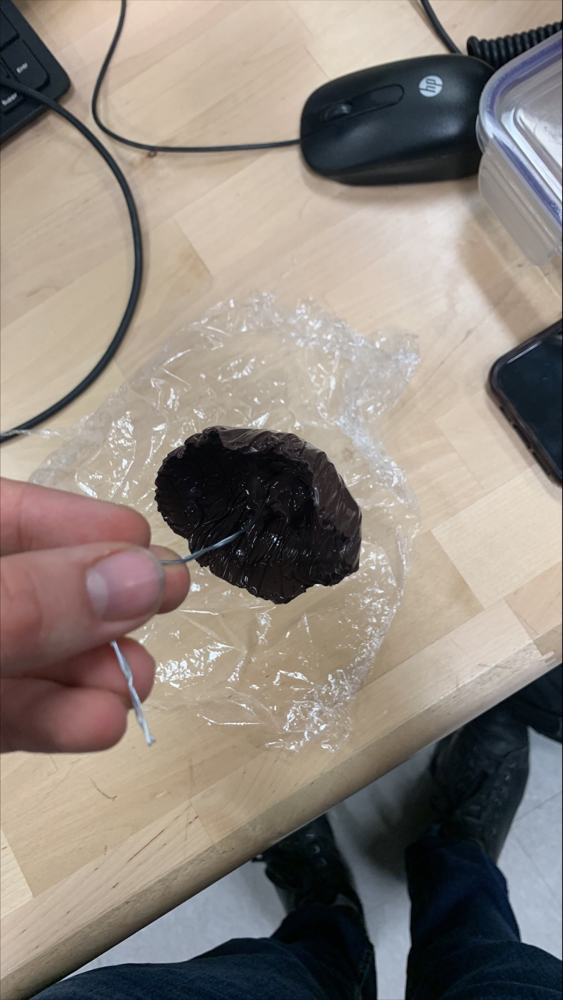

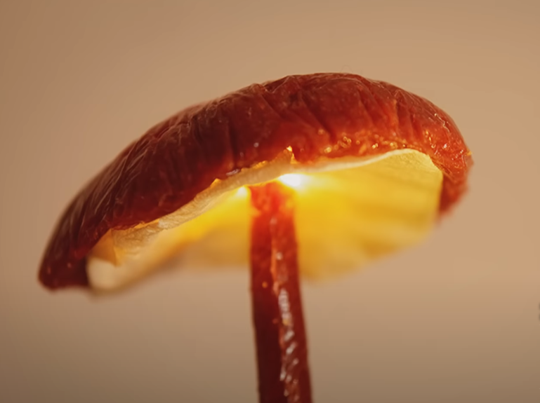
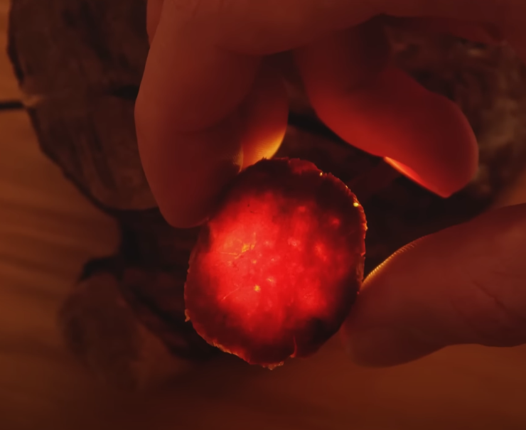
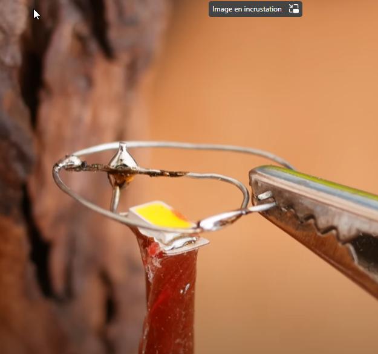

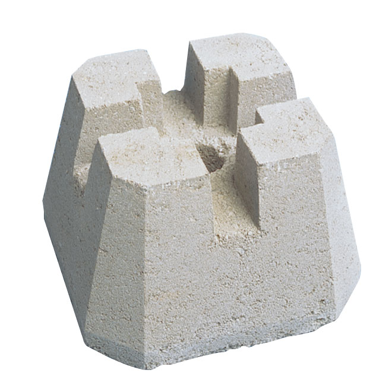

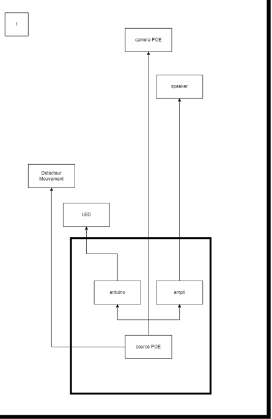
 

