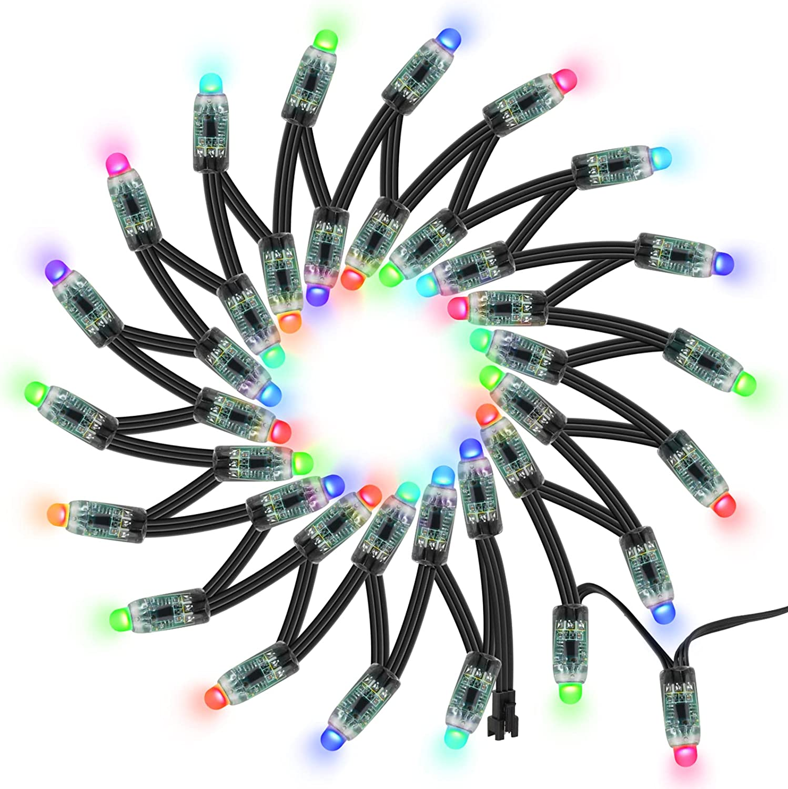
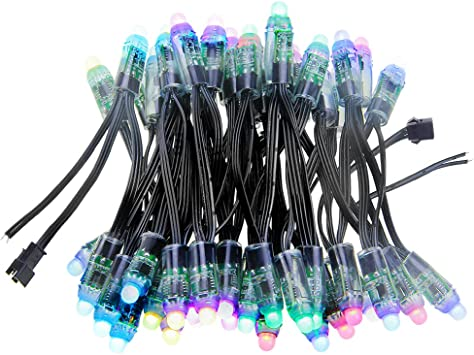

# Elwin
## Pésentation:
 

# Meryem
## [Structure](https://docs.google.com/document/d/1coBJng0cZosF5NbB20PPtKtSOkWaeV5PFCrxWh3B_VY/edit?usp=sharing)
Ambiance générale:  Peu de champignons sont ouverts quand il y a personne. Quand des personnes rentrent, il y a de plus en plus de champignons qui s'illuminent. Il y a de faibles clignotements aléatoires sur les champignons allumés.

Sommet de l'ambiance: Lorsqu'il y a 5 personnes dans la zone, tous les champignons se ferment puis s'ouvrent zone par zone jusqu'à qu'ils sont tous allumés. Ensuite, certains clignotent rapidement, puis finissent doucement.

Lorsqu'une personne rentre ou sort: Les champignons sur les poteaux autour de l'entrée clignotent

 

# JC
## Interactivité champignons texte détecteur de mouvements et progression maximum

## Ambiance générale : 
À chaque personne qui s’ajoute. les sons se superpose. À noter que les sons seront fait avec de la synthèse granulaire (ce ne sera pas des samples qui vont jouer)
* 1 Personne : Vent
* 2 Personnes : Eau
* 3 Personnes : Feuilles
* 4 Personnes : Textures Granulaires abstraites
Lorsque 5 personnes sont dans l’espace intéractif, une bande sonore spéciale de 10-20 secondes joue pour récompenser les intéracteurs.
À la suite de la bande sonore spéciale, l’atmosphère générale va changer notamment, il y aura des sons de voix coupé et réarrangé de manière
générative par VCV Rack

## Quand quelqu'un rentre/sort : 
Son de fée qui semble accueillir l’intéracteur qui sonne comme un “ringtone”  <em>(Voir sono references “river_spirit_on-enter-exit)</em>

[neet](n33t_example.mp3)

 

# Gab
[Audio Réactivité Texture](https://youtu.be/HyF5Q9zNhZ0) 
[DMX Arbres](https://youtu.be/opkbghGGM30)

 

# Loîc

 

# Mirvel

 

